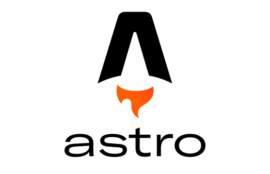

# Astro

Astro es un framework web todo en uno para crear páginas web rápidas y enfocadas en el contenido.

Astro aprovecha el renderizado del lado del servidor por encima del renderizado del lado del cliente tanto como sea posible. Este es el mismo enfoque que los frameworks tradicionales del lado del servidor (PHP, WordPress, Laravel, Ruby on Rails, etc.) han estado usando durante décadas. Pero no necesitas aprender un segundo lenguaje del lado del servidor para lograrlo. Con Astro, todo sigue siendo solo HTML, CSS y JavaScript (o TypeScript, si lo prefieres).

Astro es un framework web todo en uno que viene con todo lo que necesitas para construir un sitio web. Astro incluye sintaxis de componentes, enrutamiento basado en archivos, manejo de archivos estáticos (imágenes, fuentes), proceso de compilación, empaquetado, optimizaciones, obtención de datos y más. Puedes crear excelentes sitios web sin tener que salir del conjunto de funciones principales de Astro.

Si necesitas más control, puedes extender Astro con más de 100 integraciones como `React, Svelte, Vue, Tailwind CSS, MDX y más`. Conecta tu CMS favorito o despliega en tu host favorito con un solo comando.