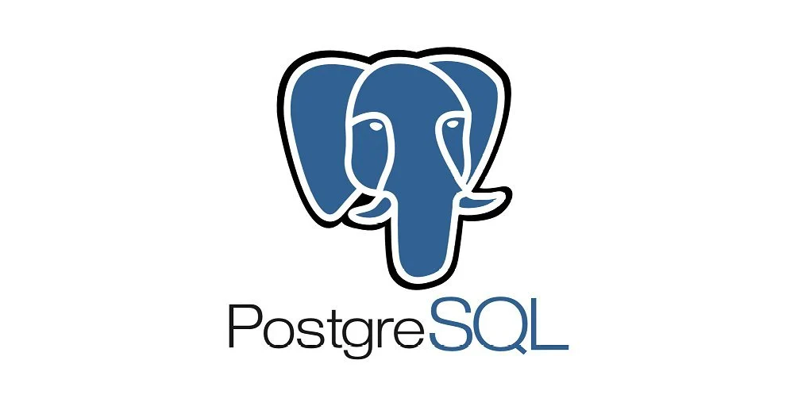

# PostgreSQL

> ## *"La base de datos relacional de código abierto más avanzada del mundo"*

PostgreSQL es un potente sistema de base de datos relacional de objetos de código abierto que utiliza y amplía el lenguaje SQL combinado con muchas funciones que almacenan y escalan de forma segura las cargas de trabajo de datos más complicadas. Los orígenes de PostgreSQL se remontan a 1986 como parte del proyecto POSTGRES de la Universidad de California en Berkeley y cuenta con más de 35 años de desarrollo activo en la plataforma central.

Si manejamos bases de datos pequeñas probablemente nos daremos cuenta de que usar PostgreSQL no presenta ninguna diferencia en comparación con las demás base de datos, sin embargo, cuando se trata de manejar bases de datos con alto volumen de información Postgres se saca un «A- en rendimiento. Gracias al método de Control de Concurrencias Multiversión (o por sus siglas en inglés MVCC), ayuda a tener una mejor performance cuando hay muchos movimientos en la base datos. El principal objetivo de este método es que permite leer y escribir de forma simultánea, es decir, sin que ninguna de las dos operaciones bloquee a la otra.

## **Algunas de sus principales características son:**

- **Alta concurrencia**
    Es capaz de atender a muchos clientes al mismo tiempo y entregar la misma información de sus tablas, sin bloqueos.

- **Soporte para múltiples tipos de datos de manera nativa**
    Ofrece los tipos de datos habituales en los sistemas gestores, pero además muchos otros que no están disponibles en otros competidores, como direcciones IP, direcciones MAC, Arrays, números decimales con precisión configurable, figuras geométricas, etc.

- **Soporte a triggers**
    Permite definir eventos y generar acciones cuando estos se disparan.

- **Trabajo con vistas**
    Esto quiere decir que pueden consultar los datos de manera diferente al modo en el que se almacenan.

- **Objeto-relacional**
    Otra de sus principales características, que permite trabajar con sus datos como si fueran objetos y ofrece mecanismos de la orientación a objetos, como herencia de tablas.

- **Soporte para bases de datos distribuidas**
    Donde el trabajo con transacciones asegura que estas tendrán éxito cuando han podido realizarse en todos los sistemas involucrados.

- **Soporte para gran cantidad de lenguajes**
    PostgreSQL es capaz de trabajar con funciones internas, que se ejecutan en el servidor, escritas en diversos lenguajes como C, C++, Java, PHP o Python. Además, ofrece interfaces para ODBC y JDBC, así como interfaces de programación para infinidad de lenguajes de programación.

Todas las anteriores características y muchas otras convierten a PostgreSQL en una elección ideal para la mayoría de proyectos, en los que su funcionalidad, la seguridad o la integridad referencial nos resultan de gran importancia.