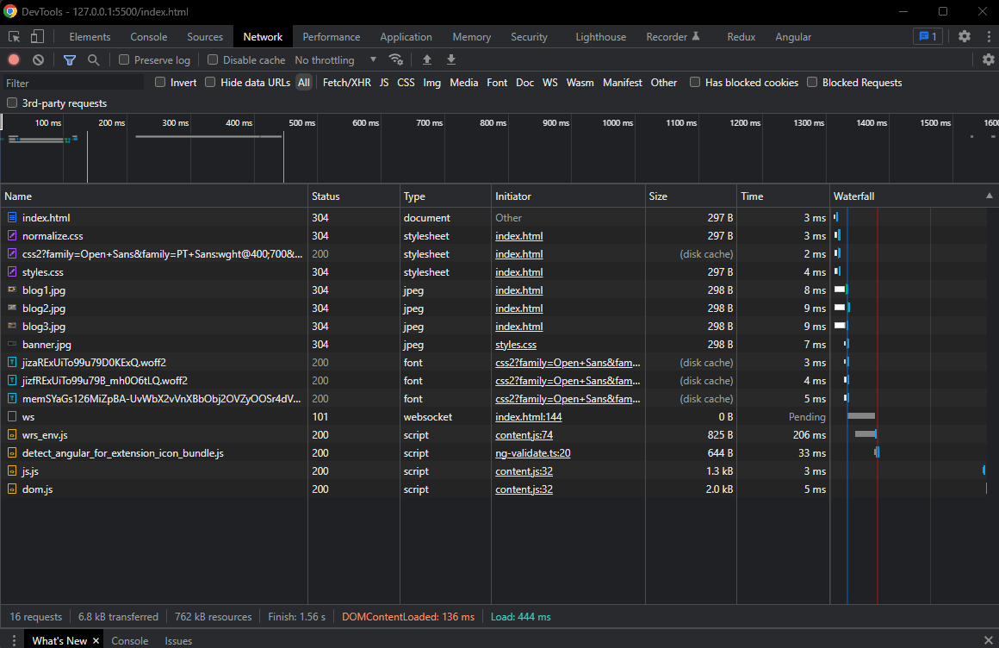
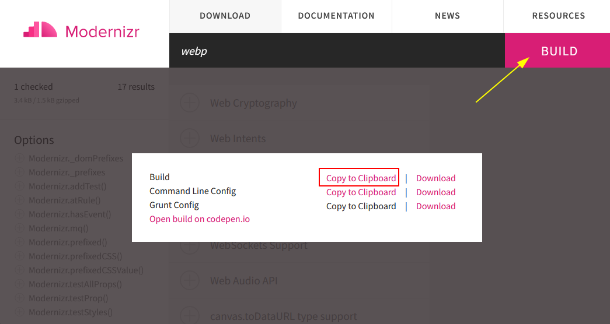
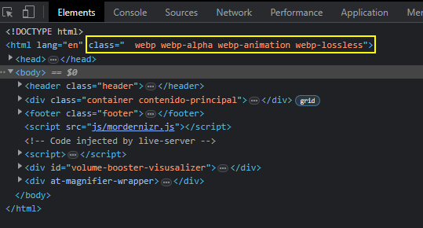
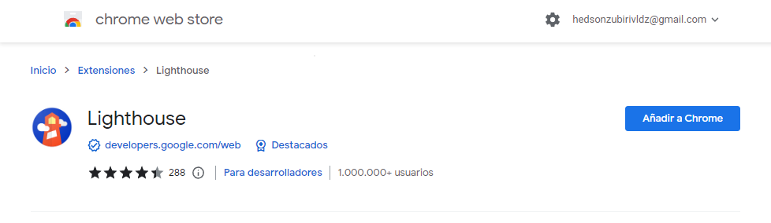
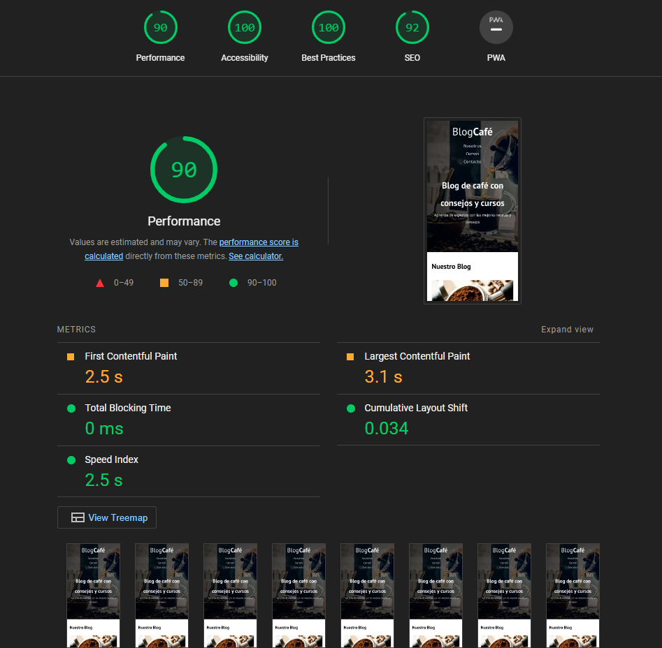

# Optimization

Existen distintas técnicas para mejorar la experiencia y el performance de una página

## Preload y Prefetch

> **Preload** es como decirle al navegador, “oye descarga esto pronto porque el usuario lo va a necesitar de inmediato” y el navegador inicia su descarga aún cuanto este leyendo el HTML.

> **Prefetch** es como decirle al navegador, “oye descarga esto pero no tiene tanta prioridad”, de pronto el usuario lo va a necesitar el recurso en algún punto y el navegador decide cuando es el mejor momento para descargarlo. Si el usuario cambia de vista aún así la descarga va a continuar en paralelo.


**Recuerda, es importante que no uses esto para cargar todos los recursos de tu sitio. Un gran poder requiere una gran responsabilidad.**

```html
  <head>
    <title>BlogCafé</title>
   
    <link rel="preconnect" href="https://fonts.googleapis.com">
    <link rel="preconnect" href="https://fonts.gstatic.com" crossorigin>
    <link href="https://fonts.googleapis.com/css2?family=Open+Sans&family=PT+Sans:wght@400;700&display=swap" rel="stylesheet">
    
    <!-- preloads -->
    <link rel="preload" href="css/normalize.css" as="style">
    <link rel="stylesheet" href="css/normalize.css">

    <link rel="preload" href="css/styles.css" as="style">
    <link rel="stylesheet" href="css/styles.css">

    <link rel="preload" href="img/blog1.jpg" as="image">
    
    </head>
  <body>
    <script src="app.js"></script>
  </body>
```

```html
    <!-- prefetch -->
    <link rel="prefetch" href="nosotros.html" as="document">
```

> Con el uso de *prefetch* se puede ir cargando la siguiente página a visitar para que al momento de navegar a ésta, la experiencia se vuelve más rápida.
> La idea es solo cargar poco y necesario para mejorar la experiencia, pierde sentido cargar todas las páginas

## Lazy Loading

Cargar los elementos hasta que sean visibles. 

Cuando se carga una página por defecto carga todos los elementos que se ocuparán y esto puede ser visualizado en la pestaña Network de las devtools del navegador:



Al tener una carga mayor de imagenes el performance se ve afectado por lo que se puede agregar

```html
 
```

> Cargará las imagenes hasta que se lleguen a necesitar durante la navegación de la página


## Formato de Imágenes

Las imagenes pueden llegar a tener un peso considerable lo que afecta la carga del sitio. Existe un formato exclusivo para WEB ligero sin perder calidad

### Webp

No tiene un 100% de compatibilidad por lo que se debe tener el respaldo de la imagén en formato original

```html
<picture>
    <source loading="lazy"  srcset="img/blog1.webp" type="image/webp">
    
</picture>
```

> Decide el formato compatible por el navegador pero priorizando el formato webp


> *Para cargar webp con css utilizar Modernizr*


## Modernizr

Modernizr es una librería de Javascript que indica que características de Javascript, HTML y CSS tiene el navegador del usuario para ofrecer.

[Descarga Modernizr](https://modernizr.com/)

- Se indica que se quiere [detectar](https://modernizr.com/download?setclasses) (En este caso webp)
- Se genera el Build y se copia el contenido

    

- El contenido se coloca en `./js/mordernizr.js`
- Se coloca la referencia antes de terminar el body 
    ```html    
        <script src="js/mordernizr.js"></script>
    </body>
    ```

Con lo anterior modernizr agrega clases al html para indicar que tecnologías tiene el navegador:



*De la siguiente forma se utiliza el formato webp si está disponible:*

```css
.webp .header{
    background-image: url(../img/banner.webp);
}

.no-webp .header{
    background-image: url(../img/banner.jpg);
}

.header{
    height: 60rem;
    background-size: cover;
    background-repeat: no-repeat;
    background-position: center center;
}
```

## CEO y Meta tags

```html
    <meta charset="UTF-8">
    <meta http-equiv="X-UA-Compatible" content="IE=edge">
    <meta name="viewport" content="width=device-width, initial-scale=1.0">
    <title>BlogCafé</title>
    <meta name="description" content="Página web de blog sobre café">
```

Mejorar la información de los enlaces

```html title="Antes"
<a href="entrada.html" class="button button--secundary">
    Más información
</a>
```

```html title="Despúes"
<a href="entrada.html" class="button button--secundary">
    Más información sobre nuestros cursos
</a>
```

## Auditar Sitio 

Con la siguiente extensión de google se puede tener una retroalimentación del sitio web



