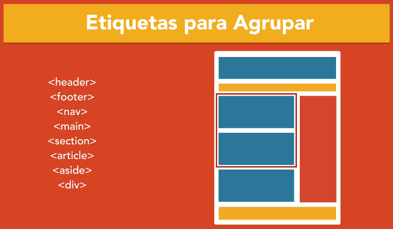
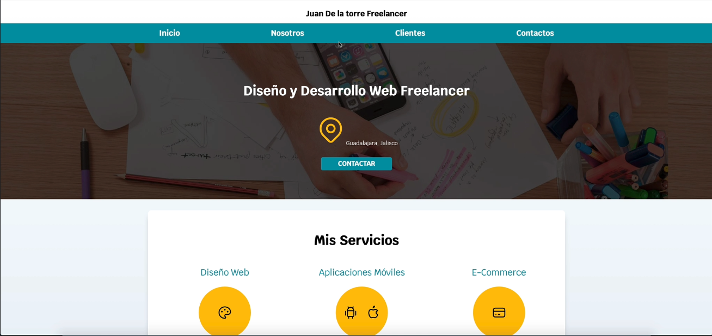

# Notas Importantes sobre HTML

## Etiquetas para Heading

```html
<h1></h1>
<h2></h2>
<h3></h3>
<h4></h4>
<h5></h5>
<h6></h6>
```

- Solo se utiliza un H1 como encabezado principal de toda la página, el resto se puede repetir
- Los `<h2></h2>` Pueden ser los encabezados para separar secciones.

## Etiquetas para agrupar



- Si es el contenido principal se agrupa mediante un `<main></main>`
- Si el primer elemento hijo es un heading se utiliza un `<section></section>` para agruparlo siempre y cuando no sea el contenido principal


Diseño base:



Ejemplo plano:

```html
<body>
    <h1>Developer Leo Zubiri</h1>
    <h2>Full Stack Software Developer</h2>

    <p>Tampico,Tamaulipas</p>

    <!--H2 Divide seccion-->
    <h2>Mis Servicios</h2>

    <h3>Backend Development</h3>
    <p>Lorem ipsum dolor sit amet consectetur adipisicing elit. Maxime accusamus aut harum dignissimos similique! </p>

    <h3>Frontend Development</h3>
    <p>Lorem ipsum dolor sit amet consectetur adipisicing elit. Maxime accusamus aut harum dignissimos similique! </p>

    <h3>FullStack Development</h3>
    <p>Lorem ipsum dolor sit amet consectetur adipisicing elit. Maxime accusamus aut harum dignissimos similique! </p>

    <!--H2 Divide seccion-->
    <h2>Contacto</h2>

    <p>Todos los derechos reservados. Leo Zubiri</p>
</body>
```

Ejemplo estructurado:

```html
<body>  
    <header>
        <h1>Developer Leo Zubiri</h1>
    </header>

    <nav>
        <a href="#">Inicio</a>
        <a href="#">Sobre mi</a>
        <a href="#">Clientes</a>
        <a href="#">Contacto</a>
    </nav>

    <section>
        <h2>Full Stack Software Developer</h2>
        <p>Tampico,Tamaulipas</p>
        <a href="#">Contactar</a>
    </section>
   

    <main>
        <!--H2 Divide seccion-->
        <h2>Mis Servicios</h2>
    
        <section>
            <h3>Backend Development</h3>
            <p>Lorem ipsum dolor sit amet consectetur adipisicing elit. Maxime accusamus aut harum dignissimos similique! </p>    
        </section>
        
        <section>
            <h3>Frontend Development</h3>
            <p>Lorem ipsum dolor sit amet consectetur adipisicing elit. Maxime accusamus aut harum dignissimos similique! </p>
        </section>
    
        <section>
            <h3>FullStack Development</h3>
            <p>Lorem ipsum dolor sit amet consectetur adipisicing elit. Maxime accusamus aut harum dignissimos similique! </p>            
        </section>
    </main>

    <section>
        <!--H2 Divide seccion-->
        <h2>Contacto</h2>
    </section>

    <footer>
        <p>Todos los derechos reservados. Leo Zubiri</p>
    </footer>
</body>
```