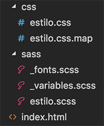

# SASS 

## Syntactically Awesome Style Sheets

> Existen dos tipos de sintaxis para escribir su código:

- **Sintaxis Sass**: Esta sintaxis te evita colocar puntos y coma al final de los valores de propiedades. Además, las llaves no se usan y en su lugar se realizan identados.  

- **Sintaxis SCSS**: Es una sintaxis bastante similar a la sintaxis del propio CSS Podríamos decir que SCSS es código CSS con algunas cosas extra.

> En la práctica, aunque podría ser más rápido escribir con sintaxis Sass, es menos recomendable, porque te aleja más del propio lenguaje CSS.
---
<br/>

## Como usar SASS
### Alternativas

1. **Preprocesar con alguna herramienta de interfaz gráfica**, como el caso de Prepros, CodeKit o Scout-App. 
2. **Usar la línea de comandos para preprocesar**. Permite personalizar completamente el comportamiento del preprocesador.
3. **Usar herramientas de automatización**. Como tercera opción es muy común también usar herramientas que permiten automatizar el flujo de trabajo frontend, compilando archivos CSS, Javascript, optimizando imágenes, etc. Paquetes como Gulp, Grunt o Webpack (aunque este último es más un empaquetador).

---
<br/>

## Instalar SASS

### **Si se utiliza NodeJS para instalar globalmente**
```
npm install -g sass
```

### **Una vez instalado Sass, podemos ver si realmente está disponible, usando el siguiente comando:**
```
sass --version
```

---
<br/>

## Compilación
### **Compilar SCSS y generar CSS estandar**
```
sass estilos_sass.scss estandar-compilado.css
```

### **Compilar Sass de manera automática con un "watcher"**
> Tener un vigilante "watcher" se encarga de compilar automáticamente el fichero cada vez que guardes el archivo original.

```
sass --watch estilos_sass.scss estandar-compilado.css
```     

### **Compilar toda una carpeta con un "watcher"**
> **El watch nos permite observar un archivo en concreto, o todos los archivos de una carpeta.**
> Se recomienda crear una carpeta "sass" donde colocarás tu código fuente, con archivos de extensión ".scss". Otra llamada "css", donde se colocará el código compilado. 

```java
sass --watch carpetaorigen:carpetadestino

// Se puede establecer las rutas de los directorios
sass --watch app/sass:public/stylesheets
```

---
<br/>

## **Guía de uso**
## Variables
```SCSS
//Variable
$color-primario: #55A;
$color-secundario: #6B6;
$color-texto: #666;

$espaciado-estandar: 10px;
$espaciado-doble: 20px;

$fuente-normal: 1em;
$fuente-pequena: 0.8em;
$fuente-grande: 1.4em;

$tipografia-general: arial, verdana, sans-serif;
$tipografia-alternativa: 'Times New Roman', Times, serif;

$color-fondos: #F55;

h1 {
  background-color: $color-fondos;
}
```
> Nota: Hoy CSS ya incorpora variables, aunque se usa otra sintaxis. El problema es que no están disponibles todavía en todos los navegadores, por lo que no es totalmente seguro usarlas, a no ser que implementes PostCSS con CSS Next

---
<br/>

## Anidación de selectores (Nesting)
### **HTML de ejemplo**
```Html
<div class="cajadestacada">
  <header>Este es el encabezado <a href="#">Enlace encabezado</a> </header>
  <p>Lorem ipsum...</p>
</div>
```

### **CSS estandar**

```css
.cajadestacada {
  background-color: red;
}

.cajadestacada header {
  background-color: black;
  color: #fff;
}

.cajadestacada header a {
  color: #ff6;
}
```

### **SASS Nesting**
```scss
.cajadestacada {
  background-color: red;

  header {
    background-color: black;
    color: #fff;  

    a {
      color: #ff6;
    }
  }
}
```

> **La regla, no escrita, es que no debes de definir estilos CSS a selectores que aniden más de tres elementos.**
 Usar selectores complejos, en los que se apliquen varios niveles de anidación puede llegar a ser contraproducente. En lugar de anidar a veces es preferible por ejemplo usar clases. 


---
<br/>

## Referencia al selector padre ('&')
>Esto nos sirve para que, al definir código anidado, podamos continuar en el uso del selector sobre el que estamos trabajando, a fin de no repetirlo de nuevo. 

<br/>

**Este código de CSS, hace uso del selector padre para definir un estilo para el enlace cuando está en estado "hover".**
```scss
a.dinamico {
  color: red;
  &:hover {
    background-color: #ff6;
  }
}
```

### **BEM y SCSS**
> En estos casos haces nombres de clases como "form--black" o "form__submit", o incluso cosas más complejas como "form__submit--desactivado". 

**El resultado sería algo como:**
```scss
.form {
  margin: 10px;
  padding: 15px;
  &--black {
    color: #fff;
    background-color: #000;
  }
  &__submit {
    color: red;
    &--desactivado {
      color: #999;
    }
  }
}
```

---
<br/>

## Propiedades anidadas
**Estandar CSS**
```CSS 
h2 {
  color: #666;
  font-family: verdana;
  font-weight: bold;
  font-size: 0.9em; }
```

**SCSS**
 ```SCSS
 h2 {
  color: #666;
  font: {
     family: verdana;
     weight: bold;
     size: 0.9em;
  }
}
```

---
<br/>

## Módulos de código
**Sass te ofrece la posibilidad de dividir el código CSS en varios archivos**, dividir el código CSS de tu aplicación en múltiples ficheros, facilitará enormemente el mantenimiento

### **Para que SASS no compile un módulo por separado** se coloca como **'_modulo.scss'**

>Así pues, todos los archivos que comiencen por un "_" no generarán nuevos archivos .css




### **Importar módulos**
Esto se consigue con la sentencia @import, a continuación del nombre del módulo a importar, sin el guión bajo y sin la extensión. 
```scss
@import 'modulo';
```

### Recomendacion de division de modulos
- Colores
- Fuentes
- Espaciados
- Reset o normalize 
- Botones
- Capas modales
- Paneles
- Tooltips
- Cabecera
- Pie

---

## Mixins (Funciones)
Este mixin simplemente define dos propiedades de CSS, que serán incluidas allí donde se invoque:
```scss
@mixin color-invertido {
  background-color: #111;
  color: #eee;
}
```

Invocacion del mixin:
```scss
h1.invertido {
  font-size: 1.3em;
  padding: 15px;
  @include color-invertido;
}
```

Parametros en mixin:
```scss
@mixin transformar($propiedad) {
  -webkit-transform: $propiedad;
  -ms-transform: $propiedad;
  transform: $propiedad;
}

....

.escalada {
  @include transformar(scale(2, 3))
}

h1 {
  color: blue;
  @include transformar(rotate(22deg))
}

....

@mixin encabezados($tamano) {
  h1 {
    font-size: $tamano;
  }
  h2 {
    font-size: $tamano - 0.2;
  }
  h3 {
    font-size: $tamano - 0.5;
  }
}
```

---
## **Herencia**(Inheritance)
La herencia, un mecanismo por el cual un selector puede recibir estilos CSS que nos llegan de declaraciones realizadas con anterioridad con la directiva @extend y las denominadas "placeholder class"(%).

```scss
%heading {
  background-color: blanchedalmond;
  color: brown;
  font-family: 'Times New Roman', Times, serif;
}

/*Esta declaración indica un estilo de base para nuestros encabezados y nos sirve para poder agregarla en donde la necesitemos. */


....
h1 {
  @extend %heading;
  font-size: 2em;
}

h2 {
  @extend %heading;
  font-size: 1.5em;
}

/*Ambos encabezados usarán los mismos estilos base, con la única diferencia que sus tamaños de fuente serán distintos.*/
```

---

## **Operadores**
Sass tiene operadores matemáticos estandar (+, -, *, math.div(), %)
```scss
@use "sass:math";

.container {
  display: flex;
}

article[role="main"] {
  width: math.div(600px, 960px) * 100%;
}

aside[role="complementary"] {
  width: math.div(300px, 960px) * 100%;
  margin-left: auto;
}

```