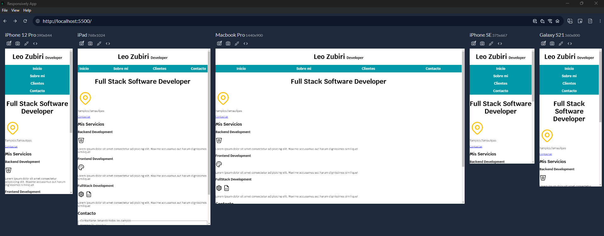
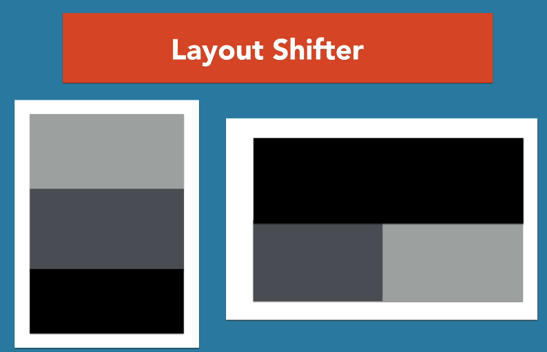
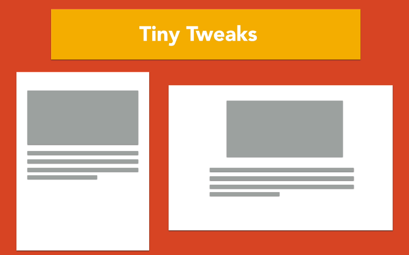

# Responsive Web Design

## Media Querys comunes

```css
@media(min-width: 480px){
    /* Desde un celular a una pantalla mas grande*/
}
@media(min-width: 768px){
    /* Desde una tablet a una pantalla mas grande*/
}
@media(min-width: 1140px){
    /* Desde una laptop a una pantalla mas grande*/
}
@media(min-width: 1400px){
    /* Desde una laptop a una pantalla mas grande*/
}
```

## Probar el responsive design 

Una alternativa a las developer tools de los navegadores es utilizar la aplicación de **responsively**:

[**Descargar aplicación ->**](https://responsively.app/download)

- Solo se coloca la url local o de producción de la app.



---

## Patrones de diseño RWD

Existen distintos patrones de responsive web design que pueden ser implementados tanto con grid como flexbox.


### Columnas Iguales 

#### GRID

```css
.dos-columnas{
    display: grid;
    grid-template-columns: repeat(2,1fr);
    gap: 1rem;
}
```

#### FLEX

```css title="Opcion mas moderna" 
.dos-columnas{
    display: flex;
    gap: 1rem;
}
```

```css title="Opcion mas soportada"
.dos-columnas{
    display: flex;
    justify-content: space-between;
}

.entrada-blog{
    /* flex: 0 0 calc(50% - 1rem) */
    flex-basis: calc(50% - 1rem);
}
```

### Columnas distintas

#### GRID

```css title="Posicionando sidebar/main/sidebar"
.contenedor-grid{
    display: grid;
    grid-template-columns: 1fr 3fr 1fr;
    gap: 1rem;
    grid-auto-flow: column;
}

.contenido-principal{
    grid-column: 2/3;
}

.sidebar-1{
    grid-column: 1/2;
}
```

```css title="Solucion con grid area"
.contenedor-grid{
    display: grid;
    grid-template-areas: "izq cont der";
    grid-template-columns: 1fr 3fr 1fr;
    gap: 1rem;
    grid-auto-flow: column;
}

.contenido-principal{
    grid-area: cont;
}

.sidebar-1{
    grid-area: izq;
}
```

#### FLEX

```css title="Posicionando sidebar/main/sidebar"
.contenedor-flex{
    display: flex;
    justify-content: space-between;
}

.contenido-principal{
    flex-basis: calc(60% - 1rem);
}

.sidebar{
    flex-basis: calc(20% - 1rem);
}

.sidebar-1{
    order: -1;
}
```

### Column Drop

#### GRID

Colocación de columnas según el espacio disponible:

```css

@media (min-width: 480px){
    .column-drop{
        display: grid;
        grid-template-columns:  repeat(2,1fr);
        gap: 2rem;
    }

    .sidebar2{
        grid-column: 1/3;
    }
}

@media (min-width: 768px){
    .column-drop{
        grid-template-columns: repeat(3,1fr);
    }

    .sidebar2{
        grid-column: auto;
    }
}
```

#### FLEX

```css
@media (min-width: 480px){
    .column-drop-flex{
        display: flex;
        justify-content: space-between;
        flex-wrap: wrap;
    }

    .contenido-principal,
    .sidebar1{
        flex-basis: calc(50% - 1rem);
    }
}

@media (min-width: 768px){
    .contenido-principal,
    .sidebar1,
    .sidebar2{
        flex-basis: calc(33.3% - 1rem);
    }
}
```

### Sidebar y Contenido Principal

#### GRID

```css

@media(min-width: 768px){
    .con-sidebar{
        display: grid;
        grid-template-columns: 1fr 3fr;
        column-gap: 4rem;
    }

    aside{
        grid-column: 1/2;
        grid-row: 1/2;
    }
}
```

O bien:

```css title="Utilizando grid-auto-flow"
@media(min-width: 768px){
    .con-sidebar{
        display: grid;
        grid-template-columns: 1fr 3fr;
        column-gap: 4rem;
        grid-auto-flow: column;
    }

    aside{
        grid-column: 1/2;
    }
}
```

#### FLEX

```css
@media(min-width: 768px){
    .con-sidebar{
        display: flex;
        justify-content: space-between;
        gap: 2rem;
    }

    aside{
       flex: 1; /* Crecimiento de 1 */
    }

    article{
        flex: 3; /* Crecimiento de 3 */
    }
}
```

### Layout Shifter

El contenido apilado en un dispositivo móvil se coloca en forma inversa en pantallas de mayor tamaño.



#### GRID

```css
@media(min-width: 768px){
    .layout-shifter{
        display: grid;
        grid-template-areas: "cont"
                             "inf";
        column-gap: 2rem;
    }

    .sidebar{
        grid-area: inf;
    }

    .contenido-principal{
        grid-area: cont;

        display: grid;
        grid-template-areas: "entrada1 entrada2";
        grid-template-columns: repeat(2,1fr);
        column-gap: 3rem;
    }
}

@media(min-width: 992px){
    .layout-shifter{
        grid-template-areas: "cont sidebar";
    }

    .sidebar{
        grid-area: sidebar;
    }

    .contenido-principal{
        grid-area: cont;

        grid-template-columns: unset;
        grid-template-areas: "entrada1"
                             "entrada2";         
    }
}
```

#### FLEX

```css
@media(min-width: 768px){
    .layout-shifter{
        display: flex ;
        flex-direction: column-reverse;
    }

    .contenido-principal{
        display: flex;
        gap: 2rem;
    }
}

@media(min-width: 992px){
    .layout-shifter{
        flex-direction: row;
        justify-content: space-between;
    }

    .contenido-principal{
        flex: 0 0 calc(66.6% - 2rem);
        flex-wrap: wrap;
    }

    .sidebar{
        flex: 0 0 calc(33.3% - 2rem);
        order: 2;
    }

    .entrada-blog{
        flex: 0 0 100%;
    }
}
```

---

### Tiny tweaks



Pequeños ajustes en ciertos elementos según el tamaño de la pantalla

```css
h1{
    text-align: center;
    font-size: 3rem;
}

@media(min-width: 768px){
    h1{
        font-size: 6rem;
        text-align: left;
    }
}
```

### Mostly Fluid

El contenido fluye por el espacio disponible y lo único que cambia es el margen de izquierda y derecha.

```css
.contenedor{
    max-width: 120rem;
    width: 95%;
    margin: 0 auto;
}

img{
    max-width: 100%;
}
```

Opcionalmente se pueden agregar mediaqueries:

```css
@media(min-width: 768px){
    .contenedor{
        width: 80%;
    }
}

@media(min-width: 992px){
    .contenedor{
        width: 65%;
    }
}
```