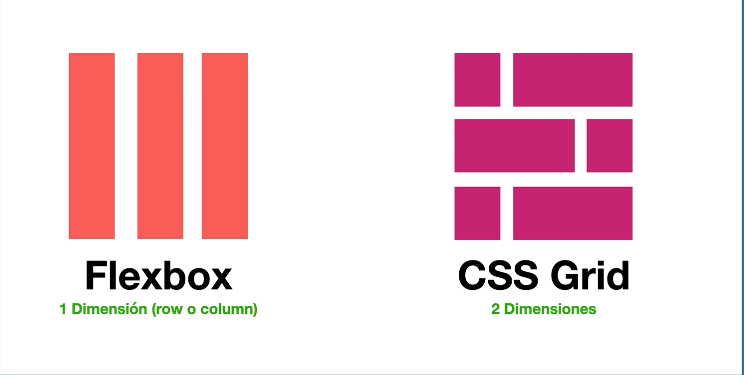
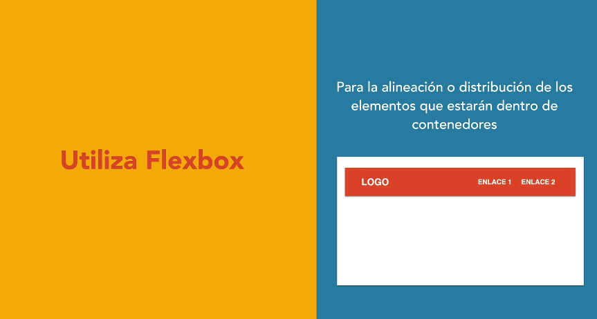
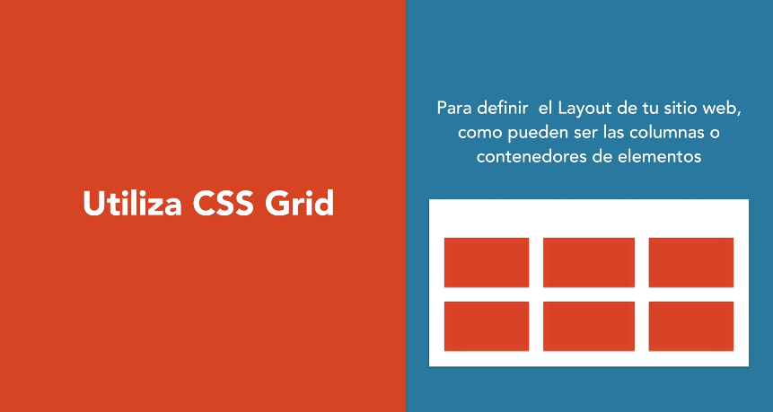

# Degradados - Gradient

Para utilizar esta propiedad se tiene que utilizar un `background-image` y en un `linear-gradient` indicar la dirección, los colores y el porcentaje en donde iniciarán o terminarán:

```css
    {background-image: linear-gradient(to top,var(--gris-claro) 0%, var(--blanco) 100%);}
```

---

# Flexbox y Grid




```css
.clase {
    display: grid;
    grid-template-columns: repeat(3,1fr); /* 3 Columnas del mismo tamaño*/
    grid-template-columns: 1fr 200px; 
    grid-template-rows: 500px; /* Una fila de 500px */
}
```

## Cuando usar Flexbox



## Cuando usar Grid

