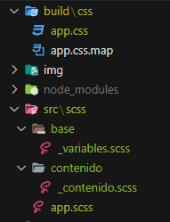
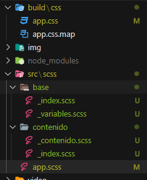

# Proyecto Festival Música

## [Visitar Código-->](https://github.com/Leo-Zubiri/FestivalMusica)


## Primeros pasos

### Inicializar NPM

Desde la ruta del directorio del proyecto sencillo se ejecuta desde la terminal:

```npm init```

### SASS

```npm install sass --save-dev```

- Crear directorio `./src/scss/app.scss`
- Crear comando para compilar en el package.json:
  
  ```json
  {
    "scripts": {
    "sass": "sass --watch src/scss:build/css"
  }
  ```

- `npm run sass` para generar el compilado css


#### Con GULP

- ```npm i -D gulp```
- ```npm i -D gulp-sass```

- Crear `./gulpfile.js`
    ```js title="gulpfile.js"
    const {src,dest,watch} = require("gulp");
    const sass = require('gulp-sass')(require('sass'));

    function css(done){

        src('src/scss/**/*.scss') // Identificar el archivo de SASS
            .pipe( sass() )     // Compilar
            .pipe(dest('build/css'));    // Almacenar

        done();
    }

    function dev(done){
        watch('src/scss/**/*.scss',css);
        done();
    }

    exports.css = css;
    exports.dev = dev;
    ```

    ```json
      "scripts": {
        "sass": "sass --watch src/scss:build/css",
        "dev": "gulp dev"
       },
    ```
- `npm run dev `


### SASS Setup

#### Antigua sintaxis



App.scss utilizando vieja sintaxis import

```scss title="app.scss"
@import 'base/variables';
@import 'contenido/contenido';

body{
    background-color: $rojo;
}
```

#### Nueva Sintaxis



La nueva sintaxis utiliza index para simplemente apuntar al nombre del directorio

```scss title="app.scss"
@use 'base';
@use 'contenido';
```

```scss title="base/_index.scss"
@forward 'variables';
@forward 'otroarchivo';
```

```scss title="base/_variables.scss"
$color: black;
```

<br/>


```scss title="contenido/_index.scss"
@forward 'contenido';
@forward 'otroarchivo';
```

````scss title="contenido/_contenido.scss"
@use 'base/variables' as vars;

h1{
    color: vars.$rojo;
}
````

### Next Steps

- Agregar variables scss
- Agregar normalize directamente en `./scss/base/_normalize.scss`

### Plumber

Cuando se genera un error en el código sass se detiene la ejecución de la tarea en consola. 
Para evitar lo anterior se recomienda instalar plumber:

```npm i -D gulp-plumber```