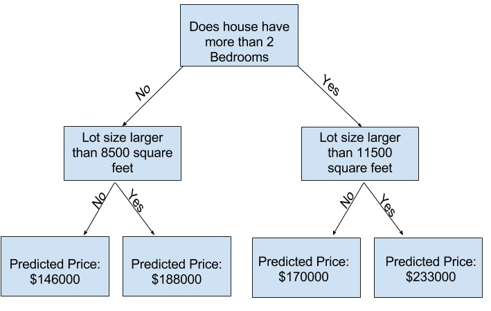

# Machine Learning

El machine learning, o aprendizaje automático, es un campo de la inteligencia artificial (IA) que permite a las computadoras aprender de los datos y mejorar con la experiencia sin ser programadas explícitamente. 

El machine learning se basa en el desarrollo de algoritmos y modelos estadísticos que permiten a las computadoras realizar tareas basándose en patrones e inferencias. Los modelos aprenden utilizando métodos iterativos para ajustar los parámetros y mejorar su rendimiento con el tiempo. 

El machine learning se utiliza en una gran variedad de ámbitos, como: Reconocimiento facial, Detección de spam, Reconocimiento de voz, Segmentación de clientes. 


## How Models Work

Considerando el siguiente caso:

> Su primo ha hecho millones de dólares especulando en bienes raíces. Se ha ofrecido a convertirse en socios de negocios contigo por tu interés en la ciencia de datos. Suministrará el dinero, y suministrarás modelos que predicen cuánto valen varias casas. Le preguntas a tu primo cómo ha predicho valores inmobiliarios en el pasado, y dice que es sólo una intuición. Pero más cuestionamientos revelan que ha identificado patrones de precios de casas que ha visto en el pasado, y usa esos patrones para hacer predicciones para nuevas casas que está considerando.

Para comenzar con un modelo simple se puede utilizar un arbol de decision.


**Decision tree.** Un árbol de decisiones es una herramienta visual que se utiliza para tomar decisiones de manera estructurada, al representar los posibles resultados y consecuencias de una serie de decisiones. Se le llama así por su similitud con un árbol con muchas ramas.

**fitting or training the model**. Se refiere a la captura de datos para capturar patrones. Los datos utilizados para esto, reciben el nombre de **training data**

> El siguiente es un ejemplo de un arbol de decision, se recorre el arbol segun las caracteristicas y se obtiene el resultado hasta llegar a la parte final del arbol. El punto final de la rama es conocida como hoja (**leaf**)
> 
> 

El primer paso es familiarizarse con los datos, para esto en python existe una libreria llamada Pandas para explorar y manipular los datos. El tipo de datos **dataframe** de esta libreria representa los datos como una tabla. Es similar al relacionarlo con una hoja en excel o una tabla dentro de una base de datos SQL. 

---

**Utilizando pandas**

Uso de **describe** para mostrar informacion general sobre determinados datos leidos de un conjunto de datos 

[**Descarga dataset melb_data.csv**](./kaggle/01_basic_data_exploration/melb_data.csv)

```py
import pandas as pd 

# save filepath to variable for easier access
melbourne_file_path = './01_basic_data_exploration/melb_data.csv'

# read the data and store data in DataFrame titled melbourne_data
melbourne_data = pd.read_csv(melbourne_file_path) 

# print a summary of the data in Melbourne data
melbourne_data.describe()
print(melbourne_data.describe())

# print dataset columns
print(melbourne_data.columns)

# drop not available values in the dataset  axis 0 = rows  1 = columns
melbourne_data = melbourne_data.dropna(axis=0)

# Extract a column from the dataframe
y = melbourne_data.Price

# Extract features from dataframe (its like a subset)
melbourne_features = ['Rooms', 'Bathroom', 'Landsize', 'Lattitude', 'Longtitude']
X = melbourne_data[melbourne_features]
print(X.describe())

```


### Building a model

> **scikit-learn** its a library to create models using the types of data stored in dataframes.
>
> **The steps to building models**
> 1. Define. The type of model
> 2. Fit. Capture patterns from provided data
> 3. Predict. 
> 4. Evaluate. Accurate of the model predictions.


**Decision tree with scikit-learn**

```py
from sklearn.tree import DecisionTreeRegressor
import pandas as pd 

# save filepath to variable for easier access
melbourne_file_path = './01_basic_data_exploration/melb_data.csv'

# read the data and store data in DataFrame titled melbourne_data
melbourne_data = pd.read_csv(melbourne_file_path) 

# Extract a column to predict
Y = melbourne_data.Price

# Extract features from dataframe (its like a subset)
melbourne_features = ['Rooms', 'Bathroom', 'Landsize', 'Lattitude', 'Longtitude']
X = melbourne_data[melbourne_features]

# Define model. Specify a number for random_state to ensure same results each run
melbourne_model = DecisionTreeRegressor(random_state=1)

# Fit model
melbourne_model.fit(X, Y)

# Predict
print("Making predictions for the following 5 houses:")
print(X.head())
print("The predictions are")
print(melbourne_model.predict(X.head()))
```

