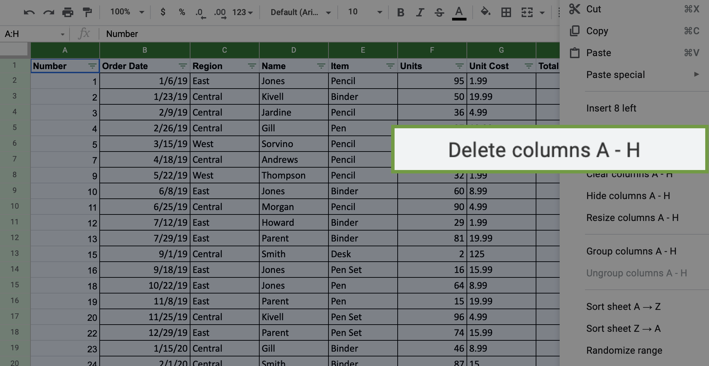

# 3. Process

---

## Proceso de datos sucios a datos limpios

1. Garantizar la integridad de los datos. Cuando los datos son insuficientes, tamaño de la muestra, evitar el sesgo de la muestra y usar muestras aleatorias.
2. Comprender la limpieza de datos. Técnicas de limpieza de datos en hojas de cálculo y otras herramientas
3. Limpiar datos usando SQL. Usar consultas y funciones.
4. Verificar e informar los resultados de limpieza de datos. 

### Data Integrity

The accuracy, completeness, consistency, and trustworthiness of data troughout its lifecycle

### Data replication

The process of storing data in multiple locations

### Data transfer

The process of copying data from storage device to memory, or from one computer to another.

### Data manipulation

The process of changing data to make it more organized and easier to read.

### Other threats to data integrity

- Human error
- Viruses
- Malware
- Hacking
- System failures

---

## Insufficient Data

### Types of insufficient data

- Data from only one source
- Data that keeps updating
- Outdated data
- Geographically-limited data

### Ways to address insufficient data

- Identify trends with the available data
- Wait for more data if time allows
- Talk with stakeholders and adjust your objective
- Look for a new dataset

---

## Sample

Un subconjunto de tu población. Al igual que una muestra de comida, se la llama muestra porque es solo una porción.

### Population

All possible data values in a certain dataset

### Sample Bias

A sample isn't representative of the population as a whole

### Random Sampling

A way of selecting a sample from a population so that every possible type of the sample has an equal chance of being chosen

### Términos

    Población 	
    El grupo completo que te interesa para tu estudio. Por ejemplo, si estás haciendo una encuesta a las personas de tu empresa, la población serían todos los empleados de tu empresa.

    Muestra 
    Un subconjunto de tu población. Al igual que una muestra de comida, se la llama muestra porque es solo una porción. Por lo tanto, si tu empresa es demasiado grande como para poder consultar a todas las personas, puedes consultar a una muestra representativa de tu población.

    Margen de error
        
    Dado que se utiliza una muestra para representar a la población, los resultados de la muestra deberían ser diferentes a los resultados que se hubieran obtenido si hubieras consultado a toda la población. Esta diferencia se llama margen de error. Cuando menor sea el margen de error, más cerca estarán los resultados de la muestra a los que hubieran surgido si hubieras consultado a toda la población. 

    Nivel de confianza
    Muestra tu grado de confianza en los resultados de la encuesta. Por ejemplo, un grado de confianza del 95% significa que si realizaras la misma encuesta 100 veces, obtendrías los mismos resultados 95 veces de esas 100. El nivel de confianza se especifica antes de que comiences tu estudio porque afectará qué tan grande será tu margen de error al finalizar tu estudio. 

    Intervalo de confianza
    El rango de valores posibles del resultado de la población respecto del nivel de confianza del estudio. Este rango es el resultado de la muestra +/- el margen de error.

    Significancia estadística
    La determinación sobre la posibilidad de que tu resultado pueda estar basado en posibilidades aleatorias. A mayor significancia, la posibilidad es menor.

### Sample Size / Tamaño de muestra

    A part of a population that is representative of the population.

Al planificar el tamaño de una muestra, hay algunos puntos para tener en cuenta:

  - No utilizar muestras menores de 30. Está probado estadísticamente que 30 es el tamaño mínimo de muestra a partir del cual el resultado promedio de la muestra comienza a representar el resultado promedio de la población.

  - El nivel de confianza comúnmente utilizado es 95%, pero 90% puede funcionar en algunos casos. 

Aumentar el tamaño de la muestra para cumplir con ciertas necesidades del proyecto:

  - Para un mayor nivel de confianza, utilizar un tamaño de muestra más grande

  - Para disminuir el margen de error, utilizar un tamaño de muestra más grande

  - Para una mayor significancia estadística, utilizar un tamaño de muestra más grande

> Nota: Las calculadoras de tamaños de las muestras utilizan fórmulas estadísticas para determinar el tamaño de una muestra

### Muestra mínima de 30

Esta recomendación está basada en el Teorema del límite central (TLC) del campo de probabilidades y estadísticas. A medida que aumenta el tamaño de la muestra, los resultados se asemejan más a la distribución normal (en forma de campana) de una gran cantidad de muestras. El mínimo de la muestra es 30 para que el teorema TLC sea válido. Los investigadores que se basan en el análisis de regresión (métodos estadísticos para determinar las relaciones entre variables controladas y dependientes) también prefieren un mínimo de muestra de 30.

### Determinar el tamaño de la muestra

Para usar una calculadora de tamaño de muestras, necesitas conocer el tamaño de la población, el nivel de confianza y el margen de error aceptable que se definió para poder ingresar esa información en la herramienta.

Considerando el siguiente ejemplo:

    Population Size: 500
    Confidence level: 95%
    Margin of error: 5%

--- 

*Herramienta en Hoja de Cálculo*

Se puede calcular el tamaño de la muestra utilizando una hoja de cálculo o alguna herramienta en internet.

[Hoja de calculo ->](./storage/Sample%20Size%20Calculator.xlsx)


*Herramienta Online*

[- Calculadora de tamaño de muestras de surveymonkey.com](https://www.surveymonkey.com/mp/sample-size-calculator/)

[- Calculadora de tamaño de muestras de raosoft.com](http://www.raosoft.com/samplesize.html)
 
> Después de que hayas cargado la información en alguna de estas calculadoras, aparecerá el tamaño de muestra sugerido. Recuerda que el tamaño de muestra calculado es el número mínimo que debes utilizar para alcanzar lo que cargaste como nivel de confianza y margen de error esperado. Si estás trabajando con una encuesta, también deberás pensar cuál es la tasa de respuesta estimada para definir cuántas encuestas necesitas enviar. Por ejemplo, si necesitas un tamaño de muestra de 100 personas y tu tasa de respuesta estimada es del 10%, necesitarás enviar tu encuesta a 1,000 personas para alcanzar las 100 respuestas que necesitas para tu análisis. 


## Margin of error

The maximum amount that the sample results are expected to differ from those of the actual population.

### Calcular Margen de Error

Todo lo que necesitas es el tamaño de la población, el nivel de confianza y el tamaño de la muestra. 

- Population Size
- Sample Size
- Confidence level

Considerando el siguiente ejemplo:

    Sample size: 500
    Population: 80,000,000
    Confidence level: 99%

---

*Herramienta en Hoja de Cálculo*

[Hoja de calculo ->](./storage/Margin%20of%20Error%20Calculator.xlsx)


*Herramienta Online*

[- Calculadora de margen de error de Good Calculators (calculadoras en línea gratuitas)](https://goodcalculators.com/margin-of-error-calculator/)

[- Calculadora de margen de error de CheckMarket](https://www.checkmarket.com/sample-size-calculator/#sample-size-margin-of-error-calculator)


---

## Data Validation
  A tool for checking acurracy and quality of data before adding or importing it.

### Herramientas

Desde la herramienta de hojas de cálculo se puede empezar a limpiar:

    - Valores duplicados
    - Valores nulos
    - Errores de Tipeado
    - Errores de formato
    - Capitalizacion Inconsistente
    - Espacios en blanco innecesarios


- [`Las diez mejores formas de limpiar tus datos:`](https://support.microsoft.com/en-us/office/top-ten-ways-to-clean-your-data-2844b620-677c-47a7-ac3e-c2e157d1db19)

- [`10 consejos de Google Workspace para limpiar datos: `](https://support.google.com/a/users/answer/9604139?hl=en#zippy=)

### Pasos

`Quitar filas que les faltan datos`
1. Seleccionar las columnas a aplicar filtro
2. Click en datos/crear un filtro
3. Por cada columna ir aplicando una a la vez Filter by condition / is Empty
4. Eliminar las filas correspondientes

<br/>  

`Transponer datos`

En algunos casos se necesita transponer los datos para su procesamiento:

1. Seleccionar y copiar todo el rango
2. Sobre la celda que se desea empezar click derecho/pegado especial/transponer



Transpose:


<br/>

`Quitar espacios extra`

1. Seleccionar el rango de datos
2. Pestaña datos/Borrado de datos/Recortar espacios en blanco


<br/>

`Formato de Mayúscula/Minúscula/tamaño apropiado del texto`

Para el Google sheets

1. Haz clic en la opción Complementos, en la parte superior de Google Sheets.
2. Haz clic en Obtener complementos.
3. Busca Cambiar mayúsculas y minúsculas/ChangeCase.  
4. Seleccionar rango y acceder a las opciones de la extension.

`VLOOKUP`

Vertical Lookup. Function that searches for a certain value in a column to return a corresponding piece of information.

### Data Mapping

The process of matching fields from one data source to another

### Schema

A way of describing how something is organized

---

## Clean Data With SQL

SQL = Structured Query Language


### SENTENCES

DISTINCT - Remove duplicate data

```sql
SELECT 
  DISTINCT user_id
FROM 
  table_name
```

LENGTH

```sql
SELECT 
  LENGTH(column_with_String) AS number_of_letters
FROM 
  table_name
```

SUBSTR

```sql
SELECT 
  SUBSTR(column_with_String,1,2) 
FROM 
  table_name
```

TRIM - Delete extra spaces

```sql
SELECT 
  TRIM(column_with_String) 
FROM 
  table_name
```

MAX-MIN VALUE

```sql
SELECT 
  MIN(numeric_field) AS min_length, 
  MAX(numeric_field) AS max_length 
FROM `formulas-proyecto.cars.car_info` 
```

UPDATE

```sql
UPDATE cars.car_info 
SET num_of_doors = "four" 
WHERE make = "dodge" 
  AND fuel_type = "gas" 
  AND body_style = "sedan";
```

COUNT

```SQL
SELECT

COUNT(*) AS num_of_rows_to_delete

FROM

cars.car_info

WHERE

compression_ratio = 70;
```

CAST - Convert one data type to another

```sql
SELECT
  CAST(fieldName AS FLOAT64)
FROM
  tableName
ORDER BY
  CAST(fieldName AS FLOAT64) DESC 
```

CONCAT

```SQL
SELECT 
  CONCAT(col1,col2) as new_column
FROM
  tableName

```

COALESCE - return non-null values in a result

```sql
SELECT
  COALESCE(product,product_code)
FROM
  tableName
```

CASE

```SQL
SELECT
  user_id,
  CASE 
    WHEN first_name = 'Tnoy' THEN 'Tony'
    ELSE first_name
    END AS cleaned_name
FROM
  tableName
```

## Verification

A procces to confirm that a data-cleaning effort was well-executed

See the big picture when verifying data-cleaning:

1. Consider the business problem
2. Consider the goal
3. Consider the data

### Changelog

A file containing a chronologically ordered list of modifications made to a project

---

## Corregir los problemas más comunes

Asegúrate de haber identificado y corregido los problemas más comunes, que incluyen:

    Fuentes de errores: ¿Utilizaste las herramientas y las funciones correctas para encontrar la fuente de los errores en tu conjunto de datos?

    Datos nulos: ¿Buscaste DATOS NULOS utilizando el formato condicional y los filtros?

    Palabras mal escritas: ¿Localizaste todas las palabras mal escritas?

    Números mal escritos: ¿Revisaste dos veces que tus datos numéricos hayan sido ingresados correctamente?

    Espacios y caracteres extra: ¿Eliminaste los espacios y caracteres extra utilizando la función TRIM?

    Duplicados: ¿Eliminaste los duplicados en las hojas de cálculo utilizando la función Quitar duplicados o DISTINCT en SQL?

    Error de coincidencia de tipos de datos: ¿Revisaste que los datos numéricos, las fechas y las cadenas de datos tengan el tipo correcto?

    Cadenas desordenadas (incoherentes): ¿Te aseguraste de que todas tus cadenas sean coherentes y significativas?

    Formatos de fecha desordenados (incoherentes): ¿Diste formato a las fechas de forma uniforme en todo el conjunto de datos?

    Etiquetas engañosas de variables (columnas): ¿Asignaste nombres significativos a tus columnas?

    Datos truncados: ¿Comprobaste si había datos truncados o faltantes que debieran ser corregidos?

    Lógica de negocios: ¿Comprobaste si los datos tienen sentido dados tus conocimientos del negocio

---

## Funciones avanzadas limpieza de datos

