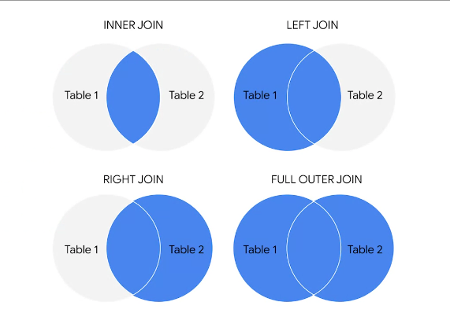

# 4. Analyze

The process used to make sense of the data collected

## Goal

The goal of analysis is to identify trends and relationships within data so you can accurately answer the question you are asking

## Phases

The 4 phases of analysis:

1. Organize data
2. Format and adjust data
3. Get input from others
4. Transform data

### Sorting

When you arrange data into a meaningful order to make it easier to understand, analyze, and visualize

### Filtering

Showing only the data that meets a specific criteria while hiding the rest

---

## Ejercicio Practico SQL

Los meteorólogos con los que trabajas te han pedido que obtengas la temperatura, la velocidad del viento y las precipitaciones para las estaciones de La Guardia y JFK, en cada día de 2020, por orden descendiente de fecha y por orden ascendente de ID de Estación. 

```SQL
SELECT stn, date,
-- Usa la función IF para reemplazar los valores 9999.9, que la descripción del conjunto de datos explica que es el valor predeterminado cuando falta la temperatura, por NULLs en su lugar. 
IF(temp=9999.9, NULL, temp) AS temperature,

-- Usa la función IF para reemplazar los valores 999.9, que la descripción del conjunto de datos explica que es el valor predeterminado cuando falta la temperatura, por NULLs en su lugar. 
IF(wdsp="999.9", NULL, CAST(wdsp AS Float64)) AS wind_speed,

-- Usa la función IF para reemplazar los valores 99.99, que la descripción del conjunto de datos explica que es el valor predeterminado cuando falta la temperatura, por NULLs en su lugar. 
IF( prcp=99.99, 0, prcp) AS precipitation 

FROM `bigquery-public-data.noaa_gsod.gsod2020` 

WHERE stn="725030" -- La Guardia
  OR stn="744860" -- JFK 

ORDER BY 
  date DESC, 
  stn ASC
```

---

Los meteorólogos también te hicieron algunas preguntas cuando se preparaban para el noticiero de la noche: Quieren la temperatura promedio en junio de 2020 y la velocidad promedio del viento en diciembre de 2020.

```sql
SELECT

AVG(temperature)

FROM

`formulas-proyecto.weather_data.nyc_weather` 

--recuerda cambiar el nombre del proyecto a tu proyecto, antes de ejecutar esta consulta

WHERE

date BETWEEN '2020-06-01' AND '2020-06-30'
```
---

## Data validation

Allows you to control what can and can't be entered in your worksheet.

1. Add dropdown lists with predetermined options
2. Create custom checkboxes
3. Protect structured data and formulas


## Data Validation Process

Checking and rechecking the quality of your data so that it is complete,accurate,secure and consistent

## Tipos de validación de datos

Los primeros cinco son tipos de validación asociados con los datos (tipo, rango, limitación, coherencia y estructura) y el sexto tipo se centra en la validación del código de aplicación que se utiliza para aceptar los datos a partir del aporte del usuario. 

Como analista de datos junior, es posible que no tengas que realizar todas estas validaciones. Pero podrías consultar si los datos se validaron y de qué manera antes de comenzar a trabajar con un conjunto de datos. La validación de datos ayuda a garantizar la integridad de los datos. Además, te proporciona confianza en cuanto a que los datos que estás utilizando están limpios. La siguiente lista describe los seis tipos de validación de datos y el propósito de cada uno e incluye ejemplos y limitaciones.

### 1. Tipos de datos 

    Propósito: Comprobar que los datos coincidan con el tipo de datos definido para un campo.

    Ejemplo: Los valores de los datos para los grados escolares de 1 a 12 deben ser del tipo de datos numéricos.

    Limitaciones: El valor de datos 13 pasaría la validación del tipo de datos pero sería un valor inaceptable. En este caso, la validación del rango de datos también es necesaria.

### 2. Rango de datos

    Propósito: Comprobar que los datos se ubiquen dentro de un rango de valores aceptable definido por el campo.

    Ejemplo: Los valores de datos para los grados escolares deben ser valores entre 1 y 12.

    Limitaciones: El valor de datos 11.5 estaría dentro del rango de datos y también sería aceptable como un tipo de dato numérico. Sin embargo, no sería aceptable porque no existen medios grados. En este caso, la validación de la limitación de datos también es necesaria.

### 3. Limitaciones de datos

    Propósito: Comprobar que los datos cumplan con ciertas condiciones o criterios para un campo. Esto incluye el tipo de datos ingresados además de otros atributos del campo como, por ejemplo, el número de caracteres.

    Ejemplo: Restricción del contenido: Los valores de los datos para los grados escolares de 1 a 12 deben ser números enteros.

    Limitaciones: El valor de datos 13 es un número entero y pasaría la validación de restricción de contenido. Sin embargo, no sería aceptable dado que 13 no es un grado escolar reconocido. En este caso, la validación del rango de datos también es necesaria.

### 4. Coherencia de los datos

    Propósito: Comprobar que los datos tienen sentido en el contexto de otros datos relacionados.

    Ejemplo: Los valores de los datos para las fechas de envío del producto no pueden ser anteriores a las fechas de producción del producto.

    Limitaciones: Los datos podrían ser coherentes pero son incorrectos o poco precisos. Una fecha de envío podría ser posterior a una fecha de producción y aun así ser incorrecta.

### 5. Estructura de los datos

    Propósito: Comprobar que los datos siguen o se ajustan a una estructura establecida.

    Ejemplo: Las páginas web deben seguir una estructura prescrita para que se muestren adecuadamente.

    Limitaciones: Una estructura de datos podría ser correcta siendo los datos incorrectos o poco precisos. El contenido de una página web podría mostrarse adecuadamente y aun así contener información incorrecta.

### 6. Validación del código

    Propósito: Comprobar que el código de aplicación realice sistemáticamente cualquiera de las validaciones antes mencionadas durante el ingreso de datos del usuario.

    Ejemplo: Los siguientes son problemas comunes que se descubren durante la validación del código: más de un tipo de datos permitido, comprobación del rango de datos no realizada o finalización de cadenas de texto que no están bien definidas.

    Limitaciones: La validación del código podría no validar todas las posibles variaciones con el ingreso de datos. 

---

## Aggregation

Collectingor gathering many separate pieces into a whole.

### Data Aggregation

The process of gathering data from multiple sources in order to combine it into a single summarized collection.

## JOIN SQL

A SQL clause that is used to combine rows from two or more tables based on a related column

`Common JOINs`

- INNER
- LEFT
- RIGHT
- OUTER




`INNER JOIN`

INNER es opcional en esta consulta SQL porque es la opción predeterminada, así como la operación de JOIN más usada. Puedes verlo como JOIN a secas. INNER JOIN devuelve registros si los datos están dentro de ambas tablas. Por ejemplo, si usas INNER JOIN para las tablas de 'customers' y 'orders' y asocias los datos usando la clave customer_id, combinarás los datos de cada customer_id que existen en ambas tablas. Si una customer_id existe en la tabla de clientes, pero no en la tabla de pedidos, los datos de esa customer_id no se asocian ni son devueltos por la consulta


`LEFT JOIN`

Quizás veas esto como LEFT OUTER JOIN, pero la mayoría de los usuarios prefieren LEFT JOIN. Ambas opciones son sintaxis correcta. LEFT JOIN devuelve todos los registros de la tabla izquierda y solo los registros coincidentes de la tabla derecha. Usa LEFT JOIN cuando necesites los datos de toda la primera tabla y los valores de la segunda tabla, si existen. Por ejemplo, en la consulta que aparece debajo, LEFT JOIN devolverá customer_name con el sales_rep correspondiente, de estar disponible. Si existe un cliente que no interactuó con un representante de ventas, de todos modos aparecerá el cliente en los resultados de la consulta, pero con un valor NULL para sales_rep.


`RIGHT JOIN`

Quizás te aparezca como RIGHT OUTER JOIN o RIGHT JOIN. RIGHT JOIN devuelve todos los registros de la tabla derecha y solo los registros correspondientes de la tabla izquierda. A nivel práctico, raras veces se usa RIGHT JOIN. La mayoría de las personas simplemente cambia las tablas y sigue usando LEFT JOIN.


`FULL OUTER JOIN`

Quizás a veces te aparezca como FULL JOIN. FULL OUTER JOIN devuelve todos los registros de las tablas especificadas. Puedes combinar las tablas de esta manera, pero recuerda que como resultado puede ser potencialmente una gran extracción de datos. FULL OUTER JOIN devuelve todos los registros de ambas tablas aun si los datos no se rellenaron en una de las tablas. 

--- 

¿Cuál es la cantidad promedio de dinero gastado por región en educación?

```sql
SELECT  AVG(edu.value) average_value, summary.region
FROM  `bigquery-public-data.world_bank_intl_education.international_education` AS edu
INNER JOIN  `bigquery-public-data.world_bank_intl_education.country_summary` AS summary
ON edu.country_code = summary.country_code
WHERE summary.region IS NOT null
GROUP BY summary.region
ORDER BY average_value DESC  
```

---

## COUNT 

### in spreadsheets

Can be used to count the total number of numerical values within a specific range in spreadsheets

### in SQL

A query that returns the number of rows in a specified range

## COUNT DISTINCT

A query that only returns the distinct values in a specified range.

---

## SUBQUERIES

A SQL query that is nested inside a larger query

Existen algunas reglas que deben seguir las subconsultas:

    Las subconsultas tienen que estar dentro de paréntesis

    Una subconsulta puede tener una sola columna especificada en la cláusula SELECT. Si quieres que una subconsulta compare varias columnas, esas columnas deben haberse seleccionado en la consulta principal.

    Las subconsultas que devuelven más de una fila solo pueden usarse con múltiples operadores de valor, tales como el operador IN que permite especificar múltiples valores en una cláusula WHERE.

    Una subconsulta no puede estar anidada en un comando SET. El comando SET se usa con UPDATE para especificar qué columnas (y valores) se deben actualizar en una tabla.

### Having

Allows you to add a filter to your query instead of the underlying table that can only be used with aggregate functions

## Extract command

Lets us pull one part of a given date to use

```sql
SELECT
  EXTRACT(YEAR FROM startime) AS year,
  COUNT(*) AS number_of_items,
FROM 
  Ttable
GROUP BY
  year
ORDER BY 
  year
```

---

## Temporary Table

A database table that is created and exists temporarily on a database server.

### WITH

The WITH clause is a type of temporary table that you can query from multiple times

```sql
WITH table_temp AS (
  SELECT * FROM _table
)

## Temporary table
```

```sql
WITH 
  longest_used_bike AS (
    SELECT 
        bikeid,
        SUM(duration_minutes) AS trip_duration
    FROM
        bigquery-public-data.austin_bikeshare.bikeshare_trips
    GROUP BY
      bikeid
    ORDER BY
      trip_duration DESC
    LIMIT 1
  )

## FIND STATION AT WHICH LONGEST BIKESHARE RIDE STARTED

SELECT
  trips.start_station_id,
  COUNT(*) AS trip_ct
FROM
  longest_used_bike AS longest
INNER JOIN  
  `bigquery-public-data.austin_bikeshare.bikeshare_trips` AS trips
ON longest.bikeid = trips.bikeid
GROUP BY
  trips.start_station_id
ORDER BY
  trip_ct DESC
LIMIT 1
```

## SELECT INTO

> BigQuery no admite el siguiente método, pero la mayoría de las demás versiones de las bases de datos de SQL lo admiten, incluido SQL Server y mySQL.

```sql
SELECT *
INTO AfricaSales 
FROM GlobalSales 
WHERE Region = "Africa"
```


## CREATE TABLE AS

```sql
CREATE tableName AS (  
  SELECT *
  FROM GlobalSales 
  WHERE Region = "Africa"
)
```