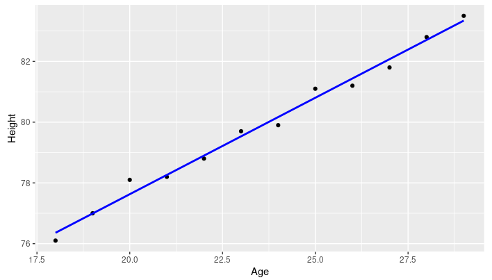

# What is Data Science

- Data Science is the process of using data to understand different things. 
- When you translate data into a story to generate insight then you can make strategic choices for a company or institution
- The study of data to understand the world

> Data -> Stories -> insights

Data analysis isn't new. What is new is the vast quantity of data available from massively varied sources:

- Log files
- Email
- Social media
- Sales data
- Patient information files
- Sports performance data
- Sensor data
- Security cameras
- Many more besides

**Can help organizations**

- Understand their environments
- Analyze existing issues
- Reveal previously hidden opportunities

> The good **data scientists** are curious people who ask questions to clarify the business need.
> - What data do we need to solve the problem?
> - Where will that data come from?

**An exceptional data acientist**
Its a blend of
- Curiosity
- Computer scientist
- Software engineer
- Statistician
- Storytelling

**The process of gleaning isights from data**

- Clarify the problem
- Data collection
- Analysis
- Pattern recognition
- Storytelling
- Visualization

**Glossary**

- **Algorithms**  A set of step-by-step instructions to solve a problem or complete a task. 	
- **Model**  A representation of the relationships and patterns found in data to make predictions or analyze complex systems retaining essential elements needed for analysis. 	
- **Outliers** 	When a data point or points occur significantly outside of most of the other data in a data set, potentially indicating anomalies, errors, or unique phenomena that could impact statistical analysis or modeling. 
- **Quantitative analysis**	A systematic approach using mathematical and statistical analysis is used to interpret numerical data. 	Many Paths to Data Science
**Structured data** Data is organized and formatted into a predictable schema, usually related tables with rows and columns.
- **Unstructured data**  Unorganized data that lacks a predefined data model or organization makes it harder to analyze using traditional methods. This data type often includes text, images, videos, and other content that doesn’t fit neatly into rows and columns like structured data.

---

## Regression

Regression data analysis is a statistical method that examines the relationship between a dependent variable and one or more independent variables
Regression captures the correlation between variables observed in a data set and quantifies whether those correlations are statistically significant or not. 

**Example**: we can say that age and height can be described using a linear regression model. Since a person's height increases as age increases, they have a linear relationship

---

## Cloud

Delivery of on-demand computing resources
- Networks
- Servers
- Storage
- Applications
- Services
- Data centers
Over the Internet on a pay-for-use basis

### What is Cloud computing

Applications and data that users access over the Internet rather than locally
- Online web apps
- Secure online business applications
- Storing personal files
  - Google drive
  - OneDrive
  - Dropbox

**Benefits**
- No need to purchase applications and install them on local computer
- Use online versions and pay a monthly subscription
- More cost-effective
- Access most current software versions
- Save local storage space
- Work collaboratively in real time

**Essential characteristics**
- on-demand self-service
- broad network access
- resource pooling
- rapid elasticity
- meseaured service

**Deployment models**
- public
- private
- hybrid

**Cloud Service models**
- **IaaS**. Infrastructure as a Service. You can access the infrastructure and physical computing resources such as servers, networking, storage, and data center space without the need to manage or operate them.
- **PaaS**. Platform as a Service. You can access the platform that comprises the hardware and software tools that are usually needed to develop and deploy applications to users over the internet
- **SaaS**. Software as a Service. Software licensing and delivery model in which software and applications are centrally hosted and licensed on a subscription basis.

---

## Big Data

Big Data refers to the dynamic, large and disparate volumes of data being created by people, tools, and machines.

The big data requires new, innovative, and scalable technology to collect, host, and analytically process the vast amount of data gathered in order to derive real-time business insights that relate to consumers, risk, profit, performance, productivity management, and enhanced shareholder value.

**The V's of Big Data**

Some elements that are common related with big data:

- Velocity
- Volume
- Variety
- Veracity
- Value

### Processing tools

The Big Data processing technologies provide ways to work with large sets of structured, semi-structured, and unstructured data so that value can be derived from big data.
Exists open source technologies to deal with big data analytics
- Apache Hadoop. Collection of tools that provides distributed storage and processing of big data
- Apache Hive. Data warehouse for data query and analysis
- Apache Spark. Distributed analytics framework for complex, real-time data analytics

### Data mining goals

- **Selecting data**. Identifying the right kind of data needed for data mining that could answer the questions at reasonable costs is critical.
- **Preprocessing data**. Often raw data are messy, containing erroneous or irrelevant data. In addition, even with relevant data, information is sometimes missing. In the preprocessing stage, you identify the irrelevant attributes of data and expunge such attributes from further consideration.
- **Transforming data**. The next step is to determine the appropriate format in which data must be stored. An important consideration in data mining is to reduce the number of attributes needed to explain the phenomena. Often you need to transform variables from one type to another. It may be prudent to transform the continuous variable for income into a categorical variable
- **Storing data**. It is important to store data on servers or storage media that keeps the data secure and also prevents the data mining algorithm from unnecessarily searching for pieces of data scattered on different servers or storage media. Data safety and privacy should be a prime concern for storing data.
- **Mining data**. This step covers data analysis methods, including parametric and non-parametric methods, and machine-learning algorithms. A good starting point for data mining is data visualization. Multidimensional views of the data using the advanced graphing capabilities of data mining software are very helpful in developing a preliminary understanding of the trends hidden in the data set.
- **Evaluating mining results**. Formal evaluation could include testing the predictive capabilities of the models on observed data to see how effective and efficient the algorithms have been in reproducing data. In addition, the results are shared with the key stakeholders for feedback, which is then incorporated in the later iterations of data mining to improve the process.

### Glossary

**Big data clusters**. A distributed computing environment comprising thousands or tens of thousands of interconnected computers that collectively store and process large datasets.

**Data replication**. A strategy in which data is duplicated across multiple nodes in a cluster to ensure data durability and availability, reducing the risk of data loss due to hardware failures

**Distributed data**. The practice of dividing data into smaller chunks and distributing them across multiple computers within a cluster enables parallel processing for data analysis

**Resource pooling**. A cloud characteristic where computing resources are shared and dynamically assigned to multiple consumers, promoting economies of scale and cost-efficiency.

## Deep Learning and Machine learning

**Data Science**. Is the process and method for extracting knowledge and insights from large volumes of disparate data. It could use machine learning algorithms and deep learning models. It is the entire data processing methodology

**Artificial intelligence(AI)**. Includes everything that allows computers to learn how to solve problems and make intelligent decisions

**Deep learning**. A specialized subset of Machine Learning that uses layered neural networks to simulate human decision-making

**Neuronal networks**. It is a collection of small computing units called neurons that take incoming data and learn to make decisions over time

### Generative AI

Is a subset of artificial intelligence that focuses on producing new data rather than just analyzing existing data. It allows machines to create content:
- images
- music
- language
- computer code
- and more.

**How does Generative AI work?**
- Generative adversarial networks (GANs)
- Variational auto-encoders (VAEs)

**Synthetic data**
Data sets may not have enough data to build a model. Data scientist can augment their data sets using generative AI to create synthetic data based on real data. 