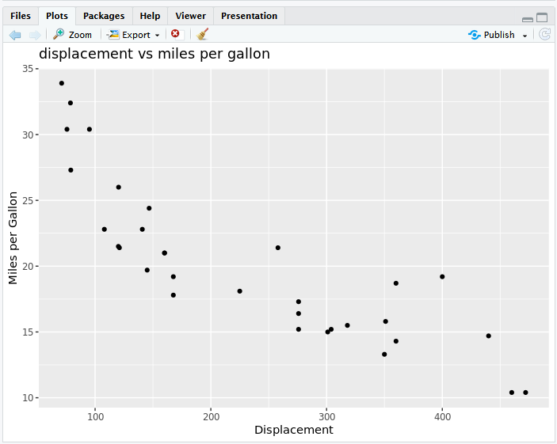
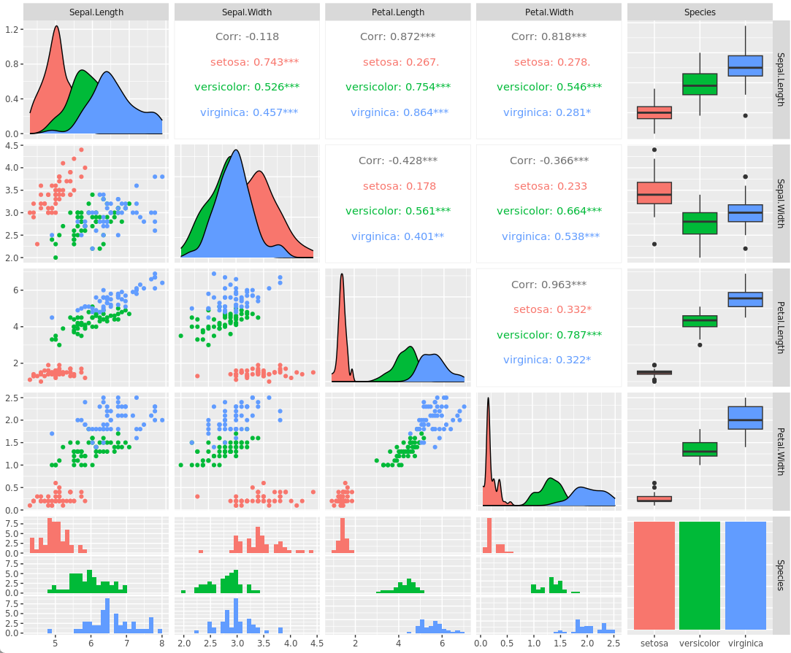

# Introduction to R and RStudio

**R**. Statistical programming language used for data processing and manipulation. 

R is used most by academics, healthcare and the government for statistical, data analysis and machine learning.

Capabilities

- It is easy to use compared to other data science tools
- Great tool for visualization
- Basic data analysis doesn't require installing packages

**RStudio** is an integrated development environment(IDE) for R language

Popular libraries for data science:

- dplyr. Data Manipulation
- stringr. String manipulation
- ggplot. Data Visualization
- caret. Machine learning

## Visualizations

As a data scientist you will produce insights using visualizations.

R has different packages for data visualizations that you can use based on your requirement. To install these packages in your R environment use commands:

> To install packages use the `install.packages` and the `<package_name>`

`install.packages <package name>`

Packages are:
- ggplot: Histograms, bar chartsm scatterplots
- plotly; Web-based data visualizations
- Lattice: Complex, multi-variable data sets. 
- Leaflet: Interactive plots

**Using the plot function**

```R
# Define a vector
cars<- c(1,3,7,23,10)
# Graph the vector with defaults
plot(cars,type="o")
# Create a title
title(main="Title")
```

**Using ggplot**

It’s hard to succinctly describe how ggplot2 works because it embodies a deep philosophy of visualisation. However, in most cases you start with `ggplot()`, supply a dataset and aesthetic mapping (with `aes()`). You then add on layers (like `geom_point()` or `geom_histogram()`), scales (like `scale_colour_brewer()`), faceting specifications (like `facet_wrap()`) and coordinate systems (like `coord_flip()`).

```R
library(ggplot2)

ggplot(mpg, aes(displ, hwy, colour = class)) + geom_point()
```

> **GGally**. Extends ggplot by adding several functions to reduce the complexity of combining geometric objects with transformed data.

## Creating data visualizations using ggplot

Using the inbuilt dataset in R called `mtcars`. In a new R script:

```R
library(datasets)
#Load Data
data(mtcars)
#View first 5 rows
head(mtcars, 5)

# Print information about the dataset and variables 
?mtcars


#load ggplot package
library(ggplot2)
#create a scatterplot of displacement (disp) and miles per gallon (mpg)
ggplot(aes(x=disp,y=mpg,),data=mtcars) +geom_point()+ggtitle("Displacement vs miles per gallon")
# Add name of each axis x,y
ggplot(aes(x=disp,y=mpg,),data=mtcars)+geom_point()+ggtitle("displacement vs miles per gallon") + labs(x = "Displacement", y = "Miles per Gallon")

# Create a histogram of weight `wt`
ggplot(aes(x=wt),data=mtcars) + geom_histogram(binwidth=0.5)

```



### ggplot and GGally

`GGally` is an extension of `ggplot2`

To ensure GGally is installed run the following code in a console:

```bash
install.packages("https://cran.r-project.org/src/contrib/Archive/patchwork/patchwork_1.1.0.tar.gz", repos = NULL, type = "source", dependencies = TRUE)

install.packages("https://cran.r-project.org/src/contrib/Archive/broom.helpers/broom.helpers_1.4.0.tar.gz", repos = NULL, type = "source", dependencies = TRUE)

install.packages("https://cran.r-project.org/src/contrib/Archive/ggstats/ggstats_0.5.0.tar.gz", repos = NULL, type = "source", dependencies = TRUE)
```

Using the iris dataset:

```R
library(datasets)
data(iris)

library(GGally)
ggpairs(iris, mapping=ggplot2::aes(colour = Species))
```

