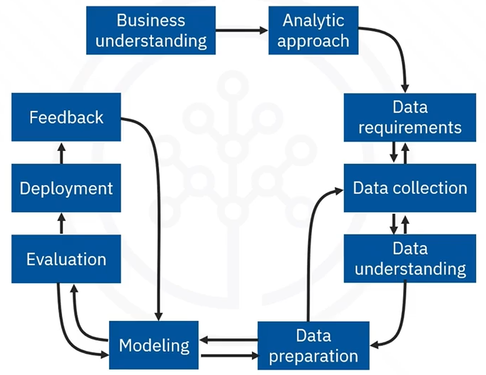

# Methodology

> Data Science combines statistics, technology  and domain expertise to extract insights from vast data. We need a methodology to resolve some important issues:
> - Resolve the problems of Misunderstanding of the business questions
> - Not knowing how to apply the data to resolve the business problem correctly

A methodology is: 

- A system of methods
- A guideline for decision-making during the scientific process

Data Science Methodology guides data scientists in solving complex problems with data

## Data Science Methodology by John Rollins

John Rollins, a seasoned IBM Senior Data Scientist.

**Data methodology stages**

- Business understanding
- Analytic approach
- Data Requirements
- Data Collection
- Data understanding
- Data preparation
- Modeling
- Evaluation
- Deployment
- Feedback

**Data science methodology questions**

1. Define the issue and approach
   1. What is the problem that you are trying to solve?
   2. How can you use data to answer the business question?
2. Get organized around the data
   1. What data do you need to answer the question
   2. Where is the data sourced from, and how will you receive the data?
   3. Does the data you collected represent the problem to be solved?
   4. What additonal work is required to manipulate and work with the data?
3. Validate your approach and the final design of the data
   1. When you apply data visualizations, do you see answers that adress the business problem?
   2. Does thje data model answer the initial business question, or must you adjust the data?
   3. Can you put the model into practice?
   4. Can you get constructive feedback from the data and the stakeholder to answer the business question?

---

### Business understanding

The initial phase of data science methodology involves seeking clarification and understanding the goals, objectives, and requirements of a given task or problem.

### Analytic approach

The process of selecting the appropriate method or path to address a specific data science question or problem.

## Data understanding and Data preparation

**Data understanding** encompasses all activities related to constructing the data set.

**Data preparation** is the most time-consuming phase of a data science project. We need to address missing or invalid values and remove duplicates

**Feature engineering** is the process of using domain knowledge of the data to create features that make the machine learning algorithms work. A feature is a characteristic that might help when solving a problem. 

- The Data Understanding stage encompasses all activities related to constructing the data set and answers the question as to whether the data you collected represents the problem to be solved.
- During the Data Understanding stage, scientists might use descriptive statistics, predictive statistics, or both.
- Data scientists commonly apply Hurst, univariates, and other statistics on each variable, such as mean, median, minimum, maximum, standard deviation, pairwise correlation, and histograms.
- Data scientists also use univariates, statistics, and histograms to assess data quality.
- During the Data Preparation stage, data scientists must address missing or invalid values, remove duplicates, and validate that the data is properly formatted.
- Feature engineering, also part of the Data Preparation stage, uses domain knowledge of the data to create features that make the machine learning algorithms work.
- Text analysis during the Data Preparation stage is critical for validating that the proper groupings are set and that the programming is not overlooking hidden data.

