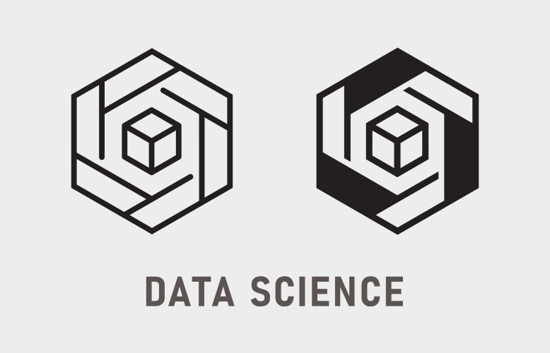

# Data Science

El Data Science se encarga de estudiar de dónde viene la información, qué representa y cómo se puede convertir en un recurso valioso en la creación de negocios y estrategias. Para ello, busca extraer grandes cantidades de datos para identificar patrones para ayudar a una organización a controlar los costes, aumentar la eficiencia, reconocer nuevas oportunidades de mercado y aumentar la ventaja competitiva de la organización.

El Data Science emplea las disciplinas de las matemáticas, estadística y las ciencias de la computación. Además, se incorporación de técnicas como el machine learning(aprendizaje automático), cluster analysis(análisis de grupos), Data Mining(extracción de datos) y la visualización.

## Data Scientist

**¿Qué hace un data scientist?**

Los data scientists determinan las preguntas que debe plantear su equipo y descubren cómo responder a esas preguntas utilizando datos. A menudo desarrollan modelos predictivos para teorizar y hacer previsiones.

Un data scientist puede realizar las siguientes tareas en el día a día:
- Encontrar patrones y tendencias en los conjuntos de datos para descubrir ideas
- Crear algoritmos y modelos de datos para predecir resultados
- Utilizar técnicas de aprendizaje automático para mejorar la calidad de los datos o las ofertas de productos
- Comunicar recomendaciones a otros equipos y al personal superior
- Implementar herramientas de datos como Python, R, SAS o SQL en el análisis de datos
- Estar al tanto de las innovaciones en el campo de la ciencia de datos

Los Data Scientists extraen la información digital que están estudiando de una creciente lista de canales y fuentes, incluidos smartphones, dispositivos de Internet de las cosas (IoT), redes sociales, encuestas, compras, búsquedas y comportamiento en Internet. Al ordenar estos grandes conjuntos de datos, los Data Scientists pueden identificar patrones para resolver problemas a través del análisis de datos, un proceso conocido como Data Mining.