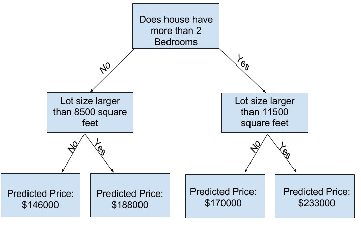
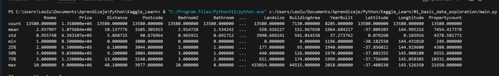
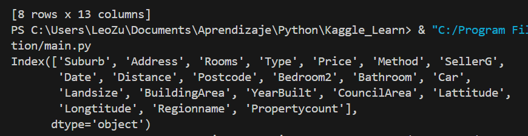
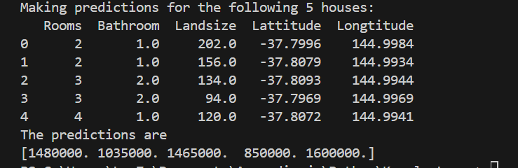

# Machine Learning

El machine learning, o aprendizaje automático, es un campo de la inteligencia artificial (IA) que permite a las computadoras aprender de los datos y mejorar con la experiencia sin ser programadas explícitamente. 

El machine learning se basa en el desarrollo de algoritmos y modelos estadísticos que permiten a las computadoras realizar tareas basándose en patrones e inferencias. Los modelos aprenden utilizando métodos iterativos para ajustar los parámetros y mejorar su rendimiento con el tiempo. 

El machine learning se utiliza en una gran variedad de ámbitos, como: Reconocimiento facial, Detección de spam, Reconocimiento de voz, Segmentación de clientes. 


## How Models Work

Considerando el siguiente caso:

> Su primo ha hecho millones de dólares especulando en bienes raíces. Se ha ofrecido a convertirse en socios de negocios contigo por tu interés en la ciencia de datos. Suministrará el dinero, y suministrarás modelos que predicen cuánto valen varias casas. Le preguntas a tu primo cómo ha predicho valores inmobiliarios en el pasado, y dice que es sólo una intuición. Pero más cuestionamientos revelan que ha identificado patrones de precios de casas que ha visto en el pasado, y usa esos patrones para hacer predicciones para nuevas casas que está considerando.

Para comenzar con un modelo simple se puede utilizar un arbol de decision.


**Decision tree.** Un árbol de decisiones es una herramienta visual que se utiliza para tomar decisiones de manera estructurada, al representar los posibles resultados y consecuencias de una serie de decisiones. Se le llama así por su similitud con un árbol con muchas ramas.

**fitting or training the model**. Se refiere a la captura de datos para capturar patrones. Los datos utilizados para esto, reciben el nombre de **training data**

> El siguiente es un ejemplo de un arbol de decision, se recorre el arbol segun las caracteristicas y se obtiene el resultado hasta llegar a la parte final del arbol. El punto final de la rama es conocida como hoja (**leaf**)
> 
> 

El primer paso es familiarizarse con los datos, para esto en python existe una libreria llamada Pandas para explorar y manipular los datos. El tipo de datos **dataframe** de esta libreria representa los datos como una tabla. Es similar al relacionarlo con una hoja en excel o una tabla dentro de una base de datos SQL. 

---

**Utilizando pandas**

Uso de **describe** para mostrar informacion general sobre determinados datos leidos de un conjunto de datos 

[**Descarga dataset melb_data.csv**](../kaggle/01_basic_data_exploration/melb_data.csv)

```py
import pandas as pd 

# save filepath to variable for easier access
melbourne_file_path = './01_basic_data_exploration/melb_data.csv'

# read the data and store data in DataFrame titled melbourne_data
melbourne_data = pd.read_csv(melbourne_file_path) 

# print a summary of the data in Melbourne data
melbourne_data.describe()
print(melbourne_data.describe())

# print dataset columns
print(melbourne_data.columns)

# drop not available values in the dataset  axis 0 = rows  1 = columns
melbourne_data = melbourne_data.dropna(axis=0)

# Extract a column from the dataframe
y = melbourne_data.Price

# Extract features from dataframe (its like a subset)
melbourne_features = ['Rooms', 'Bathroom', 'Landsize', 'Lattitude', 'Longtitude']
X = melbourne_data[melbourne_features]
print(X.describe())

```






### Building a model

> **scikit-learn** its a library to create models using the types of data stored in dataframes.
>
> **The steps to building models**
> 1. Define. The type of model
> 2. Fit. Capture patterns from provided data
> 3. Predict. 
> 4. Evaluate. Accurate of the model predictions.


**Decision tree with scikit-learn**

```py
from sklearn.tree import DecisionTreeRegressor
import pandas as pd 

# save filepath to variable for easier access
melbourne_file_path = './01_basic_data_exploration/melb_data.csv'

# read the data and store data in DataFrame titled melbourne_data
melbourne_data = pd.read_csv(melbourne_file_path) 

# Extract a column to predict
Y = melbourne_data.Price

# Extract features from dataframe (its like a subset)
melbourne_features = ['Rooms', 'Bathroom', 'Landsize', 'Lattitude', 'Longtitude']
X = melbourne_data[melbourne_features]

# Define model. Specify a number for random_state to ensure same results each run
melbourne_model = DecisionTreeRegressor(random_state=1)

# Fit model
melbourne_model.fit(X, Y)

# Predict
print("Making predictions for the following 5 houses:")
print(X.head())
print("The predictions are")
print(melbourne_model.predict(X.head()))
```



---

### Model Validation

Measure the quality of your model. Measuring model quality is the key to iteratively improving your models.

There are many metrics for summarizing model quality. **Mean Absolute Error (also called MAE)**:

The prediction error for each house is: 

```
error=actual−predicted
```

So, if a house cost $150,000 and you predicted it would cost $100,000 the error is $50,000.

```py
from sklearn.metrics import mean_absolute_error

predicted_home_prices = melbourne_model.predict(X)
mean_absolute_error(y, predicted_home_prices)
```

> Es buena practica dividir la data en dos partes, una que servira para la creacion del modelo y la otra para someterlo a pruebas. Existen funciones para conseguir este comportamiento **train_test_split**

```python
from sklearn.model_selection import train_test_split

# split data into training and validation data, for both features and target
# The split is based on a random number generator. Supplying a numeric value to
# the random_state argument guarantees we get the same split every time we
# run this script.
train_X, val_X, train_y, val_y = train_test_split(X, y, random_state = 0)
# Define model
melbourne_model = DecisionTreeRegressor()
# Fit model
melbourne_model.fit(train_X, train_y)

# get predicted prices on validation data
val_predictions = melbourne_model.predict(val_X)
print(mean_absolute_error(val_y, val_predictions))
```

### Underfitting and Overfitting

- **Overfitting**. When a model matches the training data almost perfectly, but does poorly in validation and other new data
- **Underfitting**. When a model fails to capture important distinctions and patterns in the data, so it performs poorly even in training data

In the case of a decission tree, as the tree gets deeper, the dataset gets sliced up into leaves with fewer houses. If a tree only had 1 split, it divides the data into 2 groups. If each group is split again, we would get 4 groups of houses.

When we divide the houses amongst many leaves, we also have fewer houses in each leaf. Leaves with very few houses will make predictions that are quite close to those homes' actual values, but they may make very unreliable predictions for new data (because each prediction is based on only a few houses).

#### Example

The max_leaf_nodes argument provides a very sensible way to control overfitting vs underfitting. We can use a utility function to help compare MAE scores from different values for max_leaf_nodes

```py
from sklearn.metrics import mean_absolute_error
from sklearn.tree import DecisionTreeRegressor

def get_mae(max_leaf_nodes, train_X, val_X, train_y, val_y):
    model = DecisionTreeRegressor(max_leaf_nodes=max_leaf_nodes, random_state=0)
    model.fit(train_X, train_y)
    preds_val = model.predict(val_X)
    mae = mean_absolute_error(val_y, preds_val)
    return(mae)
```

We can use a for-loop to compare the accuracy of models built with different values for max_leaf_nodes.

```py
# compare MAE with differing values of max_leaf_nodes
for max_leaf_nodes in [5, 50, 500, 5000]:
    my_mae = get_mae(max_leaf_nodes, train_X, val_X, train_y, val_y)
    print("Max leaf nodes: %d  \t\t Mean Absolute Error:  %d" %(max_leaf_nodes, my_mae))
```

**Of the options listed, 500 is the optimal number of leaves.**

```
Max leaf nodes: 5  		     Mean Absolute Error:  347380
Max leaf nodes: 50  	 	 Mean Absolute Error:  258171
Max leaf nodes: 500  		 Mean Absolute Error:  243495
Max leaf nodes: 5000  		 Mean Absolute Error:  254983
```


### Random Forests

The random forest uses many trees, and it makes a prediction by averaging the predictions of each component tree. It generally has much better predictive accuracy than a single decision tree and it works well with default parameters

We build a random forest model similarly to how we built a decision tree in scikit-learn - this time using the **RandomForestRegressor** class instead of DecisionTreeRegressor.

```py
from sklearn.ensemble import RandomForestRegressor
from sklearn.metrics import mean_absolute_error

forest_model = RandomForestRegressor(random_state=1)
forest_model.fit(train_X, train_y)
melb_preds = forest_model.predict(val_X)
print(mean_absolute_error(val_y, melb_preds))
```