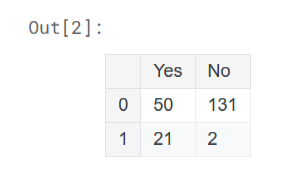
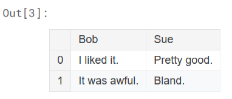
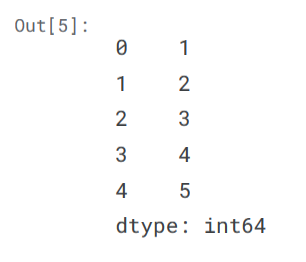
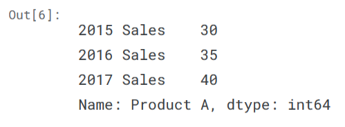
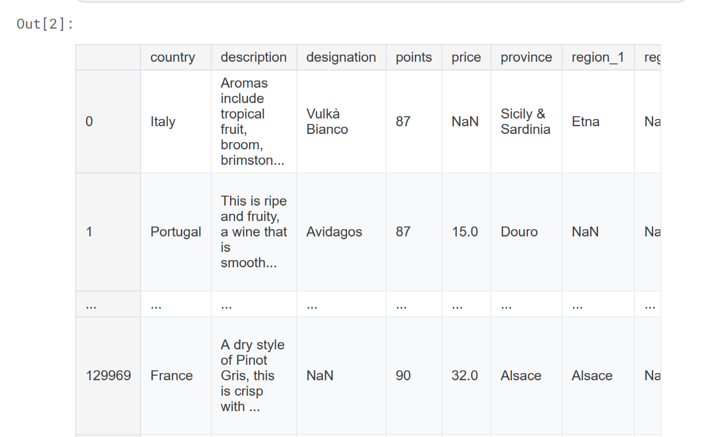
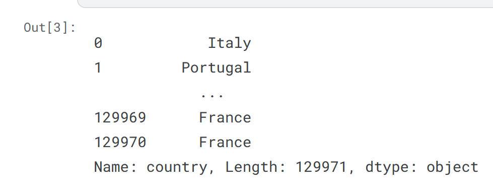
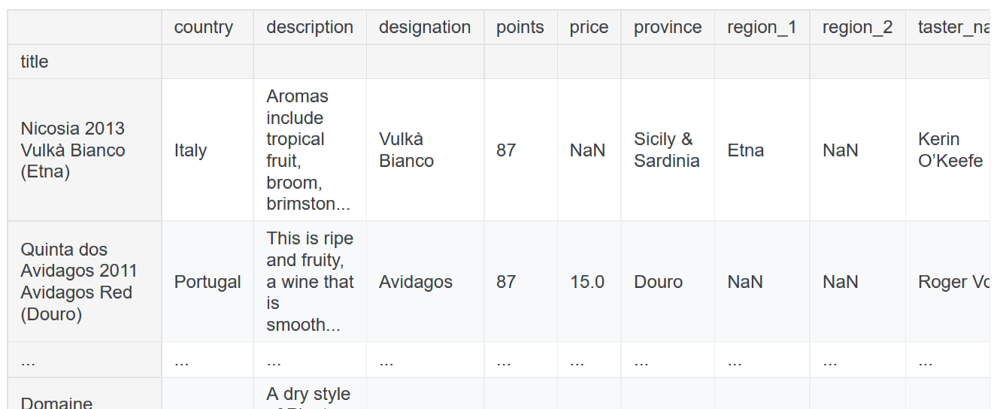
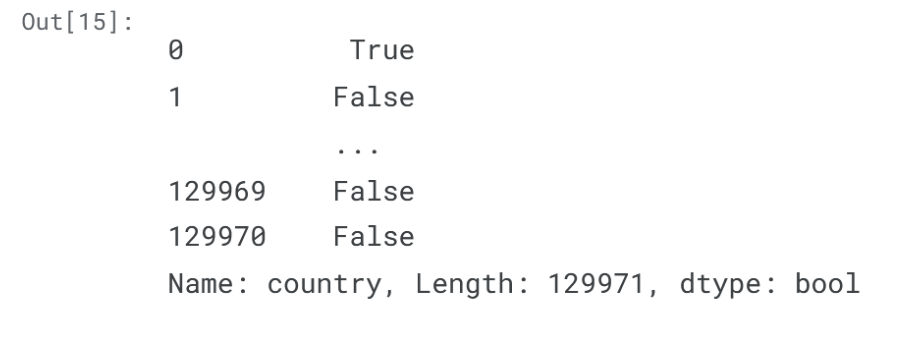
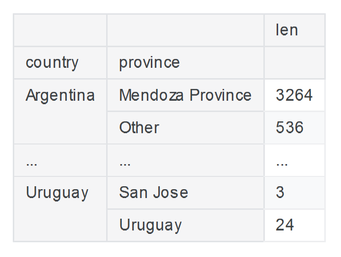
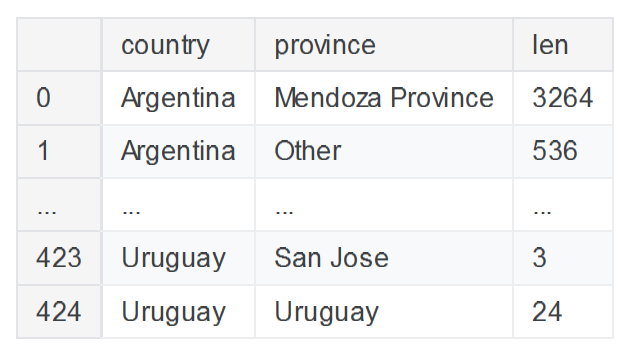

# Pandas

To use pandas, you'll typically start with the following line of code.

```py
import pandas as pd
```

There are two core objects in pandas: the **DataFrame** and the **Series**.

## Dataframe

A DataFrame is a table. It contains an array of individual entries, each of which has a certain value. Each entry corresponds to a row (or record) and a column.

```py
pd.DataFrame({'Yes': [50, 21], 'No': [131, 2]})
```



> DataFrame entries are not limited to integers.

```py
pd.DataFrame({'Bob': ['I liked it.', 'It was awful.'], 'Sue': ['Pretty good.', 'Bland.']})
```




## Series

A Series, by contrast, is a sequence of data values. If a DataFrame is a table, a Series is a list. And in fact you can create one with nothing more than a list:

```py
pd.Series([1, 2, 3, 4, 5])
```



> A Series is, in essence, a single column of a DataFrame. So you can assign row labels to the Series the same way as before, using an index parameter. However, a Series does not have a column name, it only has one overall name

```py
pd.Series([30, 35, 40], index=['2015 Sales', '2016 Sales', '2017 Sales'], name='Product A')
```




---

## Indexing, Selecting & Assigning

Selecting specific values of a pandas DataFrame or Series to work on is an implicit step in almost any data operation you'll run, so one of the first things you need to learn in working with data in Python is how to go about selecting the data points relevant to you quickly and effectively.

### Selecting

**reviews** dataframe:




**These are the two ways of selecting a specific Series out of a DataFrame:**

Columns in a pandas DataFrame works like a property of an object by accessing it as an attribute

```py
reviews.country
```

An alternative:

```py
reviews['country']
```





To drill down to a single specific value, we need only use the indexing operator []:

```py
reviews['country'][0] #Italy
```

### Indexing

Indexing a pandas dataframe means selecting particular subsets of data (such as rows, columns, individual cells) from that dataframe. Pandas has its own accessor operators, `loc` and `iloc`

---

`iloc` - **Index-based selection**. selecting data based on its numerical position in the data. To select the first row of data in a DataFrame:

```py
reviews.iloc[0]
```

> Both `loc` and `iloc` are row-first, column-second. This is the opposite of what we do in native Python, which is column-first, row-second. This means that it's marginally easier to retrieve rows, and marginally harder to get retrieve columns. To get a column with iloc:

```py
# All rows with only the first column
reviews.iloc[:, 0]

# select just the second and third entries
reviews.iloc[1:3, 0]

# It's also possible to pass a list:
reviews.iloc[[0, 1, 2], 0]

# the last five elements of the dataset
reviews.iloc[-5:]
```

---

`loc` - **Label-based selection**. It's the data index value, not its position, which matters.

```py
# First row only with column country
reviews.loc[0, 'country']

# One operation that's much easier using loc: Get a subset of all rows only with some specific columns
reviews.loc[:, ['taster_name', 'taster_twitter_handle', 'points']]
```

---

#### Choosing between `iloc` and `loc`

Its important consider some aspects of each method:

`iloc` uses the Python stdlib indexing scheme. The range may have exclusion details to consider: `iloc` range `0:10 includes 0,...,9` and `loc` range `0:10 includes 0,...,10`

> If we have a DataFrame with index values `Apples`, ..., `Potatoes`, ..., and we want to select "all the alphabetical fruit choices between `Apples` and `Potatoes`", then it's a lot more convenient to index `df.loc['Apples':'Potatoes']` than it is to index something like `df.loc['Apples', 'Potatoet']` (t coming after s in the alphabet).


#### Manipulating the index

 Critically, the index we use is not immutable. The `set_index()` method can be used to change it. This is useful if you can come up with an index for the dataset which is better than the current one

```py
reviews.set_index("title")
```




#### Conditional Selection

 To do interesting things with the data, we often need to ask questions based on conditions.

This operation produced a Series of True/False booleans based on the country of each record:

 ```py
 reviews.country == 'Italy'
 ```

 


This result can then be used inside of loc to select the relevant data:

```py
# Return all data where country is italy
reviews.loc[reviews.country == 'Italy']

# Evaluating two conditions with amperson (&)
reviews.loc[(reviews.country == 'Italy') & (reviews.points >= 90)]

# OR Evualuating with pipe |
reviews.loc[(reviews.country == 'Italy') | (reviews.points >= 90)]

#select data whose value "is in" a list of values
reviews.loc[reviews.country.isin(['Italy', 'France'])]

# isnull and notnull
reviews.loc[reviews.price.notnull()]
```

### Assigning data

```py
# Create or modify values in column name `critic` with a default value
reviews['critic'] = 'everyone'

# With an iterable of values
reviews['index_backwards'] = range(len(reviews), 0, -1)
```

## Summary Functions and Maps

The data does not always come out of memory in the format we want it in right out of the bat. Sometimes we have to do some more work ourselves to reformat it for the task at hand.

### Summary function

```py
# high-level summary of the attributes of the given column
reviews.points.describe()

# Get the mean of the column values
reviews.points.mean()

# To see a list of unique values 
reviews.taster_name.unique()

# To see a list of unique values and how often they occur in the dataset
reviews.taster_name.value_counts()
```

### Maps

A `map` is a term, borrowed from mathematics, for a function that takes one set of values and "maps" them to another set of values

Affects each value from the Series and return a transformed version of that value. Returns a new Series where all the values have been transformed by your function.

```py
# Returning each value substracting 1
reviews.points.map(lambda n: n - 1)
```

`apply()` is the equivalent method if we want to transform a whole DataFrame by calling a custom method on each row.

> If we had called `reviews.apply()` with `axis='index'`, then instead of passing a function to transform each row, we would need to give a function to transform each column.

```py
# Function to access columns of a row and change the values
def edit(row):
    row.col1 = row.col1 - 1
    row.col2 = row.col2 + 1
    return row

# Return all dataset with the modifications
dataset.apply(edit, axis='columns')
```

**Note that map() and apply() return new, transformed Series and DataFrames, respectively.**

Pandas provides many common mapping operations as built-ins. 

```py
# Substracting 1 directly 
reviews.points - 1

# Combining two cols
reviews.col1 + " - " + reviews.col2
```

> These operators are faster than `map()` or `apply()` because they use speed ups built into pandas. All of the standard Python operators(>, <, ==, and so on) work in this manner. 
> However, they are not as flexible as `map()` or `apply()`, which can do more advanced things, like applying conditional logic, which cannot be done with addition and subtraction alone.


## Grouping and Sorting

Maps allow us to transform data in a DataFrame or Series one value at a time for an entire column. However, often we want to group our data, and then do something specific to the group the data is in.


### Groupwise analysis

```py
# Take all distinct points that appears and count the number of coincidences
reviews.groupby('points').points.count()

# To get the cheapest wine in each point value category
reviews.groupby('points').price.min()

# We can access the original dataframe after we grouped a slice of the original dataframe
reviews.groupby('winery').apply(lambda df: df.title.iloc[0]) # get a column of the original dataframe based on the agrupation values

# group by more than one column
# best wine by country and province
reviews.groupby(['country', 'province']).apply(lambda df: df.loc[df.points.idxmax()])

# agg - aggregation functions
# lets you run a bunch of different functions on your DataFrame simultaneously
# generate a simple statistical summary of the dataset 
reviews.groupby(['country']).price.agg([len, min, max])
```

### Multi-indexes

A multi-index differs from a regular index in that it has multiple levels. They require two levels of labels to retrieve a value.
For example:

```py
countries_reviewed = reviews.groupby(['country', 'province']).description.agg([len])

# Getting the datatype
myIndex = countries_reviewed.index
type(mi) # pandas.core.indexes.multi.MultiIndex
```




**converting back to a regular index:**

```py
countries_reviewed.reset_index()
```




### Sorting

we can see that grouping returns data in index order, not in value order.

```py
countries_reviewed = countries_reviewed.reset_index()
# Order by column 'len'
countries_reviewed.sort_values(by='len')
countries_reviewed.sort_values(by='len', ascending=False)

# Order by index
countries_reviewed.sort_index()

# Order by more than one column
countries_reviewed.sort_values(by=['country', 'len'])
```