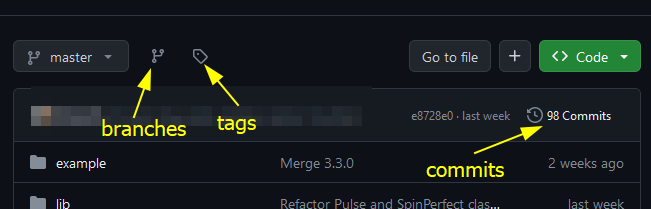
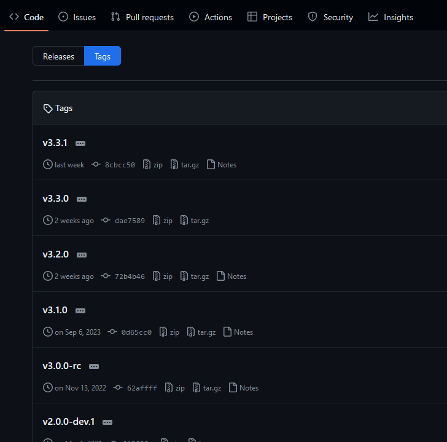
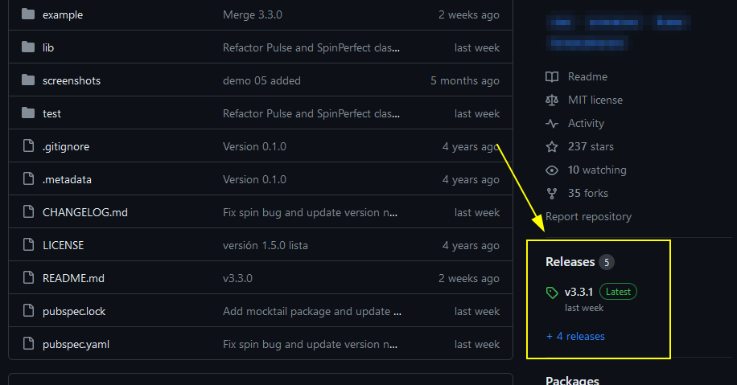

# GITHUB

Es una plataforma para mantener repositorios git con código fuente en la nube.

Lo anterior permite que tengamos una copia local del historial de cambios y que estos sean integrados posteriormente con la copia principal en la nube a través de un PUSH de cambios.


- **PUSH:**  Es el proceso de enviar los cambios realizados a un repositorio remoto
- **PULL:**  Es el proceso de descargar o actualizar los archivos del proyecto desde un repositorio remoto (bajar cambios)

## GIT REMOTE

Permite interactuar con los repositorios remotos. Al utilizar github y crear un repositorio en la plataforma, se muestran opciones para enlazar el repostitorio local con uno remoto (plataforma de git)

**Ver los remotos configurados**

```bash
git remote -v
```

**Agregar un remoto**
La dirección/url
```bash
git remote add https:/github.com/usuario/repositorio.git
```
**PUSH al remote**
```bash
git push -u origin master
```
> Lo anterior indica  que se va a subir todo lo que hay en la rama `master` al repositorio en github. Se utilizan las credenciales de github para que los cambios sean aplicados.

### PULL

Se utiliza para traer los cambios mas recientes del origin configurado con el `remote`. Es decir, que la versión de la rama sea la más actualizada según la que se encuentra en github

Pull por defecto al origen configurado:

```bash
git pull
```

Se puede especificar la rama:
```bash
git pull origin main
```
#### PULLING STRATEGY

Existen estrategias distintas a la hora de unir los cambios del remoto con el local a través de un PULL, esto se le conoce como **PULLING WITHOUT RECONCILE STRATEGY**.

Entre las estrategias para el pull:

- pull.rebase false - MERGE
- pull.rebase true - rebase
- pull.ff only - fast-forward only

Es muy común utilizar la estrategia del fast-forward, en caso contrario existirán conflictos que resolver

Para establecer la estrategia del pulling en la configuración global:

```bash
git config --global pull.ff only
```
En caso de querer ver el archivo de la configuración
```bash
git config --global -e
```

## GIT PUSH
Una vez que se terminen los cambios locales para actualizar el repositorio remoto se utiliza el **push**

```bash
git push
```

Existe la posibilidad de que lleguen a haber conflictos si hay cambios en el origin que choquen con los locales. Si colocamos la estrategia del pull solo para fast-forward no podríamos actualizar la rama con solo **git pull**

Para que exista la posibilidad de atender los conflictos se puede configurar la estrategia del pull solo para el local

```bash
git config pull.rebase true
git pull
```


## GITHUB TAGS

Por defecto las tags agregadas en el repositorio de forma local, no se suben automaticamente a GitHub. Para que se envíen a GitHub es necesario actualizarlas cada cierto tiempo de ser necesario con:

```bash
git push --tags
```



Se puede descargar el código como se encuentra en cada tag (versión)




### RELEASE TAGS

Desde la sección de tags se selecciona uno que represente una versión de lanzamiento o pre-lanzamiento. En la información del tag se puede pulsar en editar

En la edición se puede describir la versión así como agregar otra clase de recursos que se quieran asociar a la descarga de ese release.

Una vez configurado la sección de releases del repositorio lo contendrá




## GIT FETCH

Sirve para actualizar las referencias en base al repositorio remoto sin la necesidad de bajar los cambios mas actuales y crear un merge o rebase

Es decir, se puede hacer primero un `fetch` para ver si hay actualizaciones en el remoto y posteriormente hacer el `pull` de los cambios

```bash
git fetch
```

```bash
git pull
```

## FLUJOS DE TRABAJO

- En base a forks. Nos permite que cada cambio que se quiera integrar al repositorio principal tenga que ser revisado y aprobado. Esto puede ser tedioso de implementar cuando se trabaja con muchos desarrolladores
- En base a ramas. Cada desarrollador puede crear su propia rama, esta se conoce como **feature branch**
    ```bash
    git fetch
    git branch -a
    git checkout nombre-rama
    ```
- Trabajar con ramas y hacer pull request. Se puede trabajar mediante ramas y una vez se actualicé la feature-branch desde github se puede hacer un pull request para que el equipo de trabajo revise los cambios antes de ser integrados.


## GITHUB FORK

Git clone es para clonar un repositorio publico a tu repositorio local (Es como descargar el proyecto en tu computadora)

`GIT FORK` es para darle seguimiento al proyecto, es decir Haciendo un fork puedes contribuir a un repositorio que no es tuyo mediante pull requests, internamente un fork hace una copia exacta del repositorio original en tu cuenta github (con una url diferente a la del fork) y luego puedes usar clone para llevarlo a tu repositorio local, así tu trabajas en una copia exacta del proyecto original y ya en tu repositorio podrás hacerle los cambios que quieras sin afectar el repositorio original.
Usualmente Fork se usa en proyectos Open Source. Donde no se le puede dar acceso a todo el mundo, pero si alguien quiere contribuir lo puede hacer de esta manera.


### SE NECESITA APROBACION PARA INTEGRAR CAMBIOS

> Con el fork se necesita hacer un pull request para que los cambios sean integrados en el origen (repositorio base de donde se realizó el fork)

Se puede hacer un fork del repositorio remoto principal(convencionalmente llamado **upstream** u **origin**), esto creará una copia en el github personal, posteriormente lo clonamos de forma local y se empiezan a crear commits para afectar la versión clonada

Si se requiere bajar los cambios pero del **upstream** para actualizar nuestro fork, se debe agregar la referencia.

```bash
git remote -v
```

>  Con lo anterior se visualiza de que remoto se hace el **fetch** y en cual un **push**

#### UPSTREAM
Si se va a agregar un remoto del cual solo bajaremos información usualmente se le conoce como **upstream**

```bash
git remote add upstream [url/path del remoto]
```

Ahora se pueden bajar cambios de nuestro fork remoto

```bash
git pull
```

Y bajar los últimos cambios en el upstream

```bash
git pull upstream master
```

#### PULL REQUEST

Una vez hemos realizado commits se pueden llevar los cambios mediante un pull request ya que se trabajó sobre un fork y no sobre el repositorio origen

Es decir, no se pueden subir los cambios directamente al upstream al menos que sean aprobados para integrarse

Github proporciona la opción de pull request desde su interfaz en el repositorio fork, y sabe la relación que tiene con el origen para crear una solicitud y que nuestros cambios sean integrados una vez aceptados.

## RAMAS EN GITHUB

Desde nuestra copia local se puede crear una rama y trabajar sobre esta. Si intentamos subir los cambios con ```git push``` ocurrirá un error, la rama no existe en el remoto y por lo tanto no puede actualizarla. Git te da la solución

```bash
git push --set-upstream origin nombre-rama
```

Despues desde github se puede solicitar el pull request de la rama-feature al main del remoto principal, y si los cambios son integrados se puede eliminar la rama desde github de ser necesario

Desde la copia local del fork tambien se puede eliminar la rama

```bash
git branch -d nombre-rama
```

> Si hay cambios no aplicados y se intenta eliminar la rama ocurrirá un error, para forzar la eliminación de la rama se agrega `-f` para forzar

**Para eliminar una rama remota desde el local**

```bash
git push origin --delete nombre-rama
```

### PULL --ALL

Puede darse el caso de que nuestro equipo de trabajo este trabajando en ramas y subiendo actualizaciones de estas al remoto principal. Puede haber casos donde un **pull** solo se dedique a traer cambios de la rama en la que se está trabajando. Si se requiere estar actualizando la copia local junto con todas las ramas del remoto principal:

```bash
git pull --all
```

### PRUNE

Si borramos ramas en el origin se debe actualizar ese status en local, por lo que se podaran las referencias de las ramas en el local

```bash
git remote prune origin
```