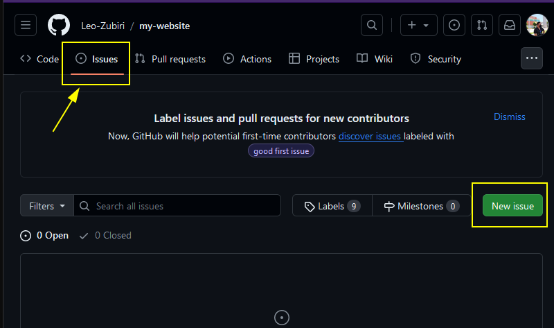
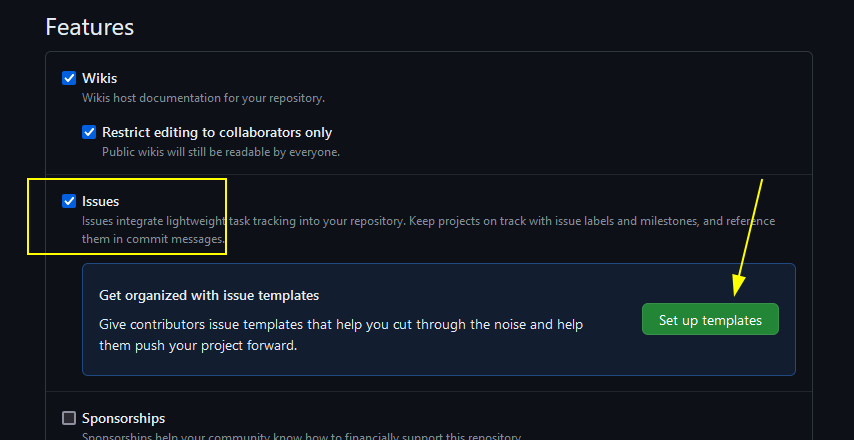
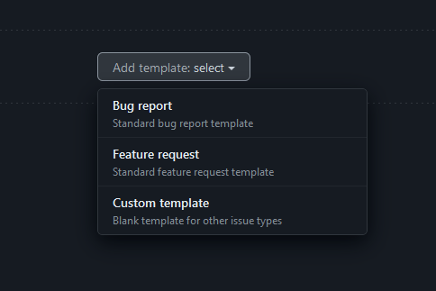
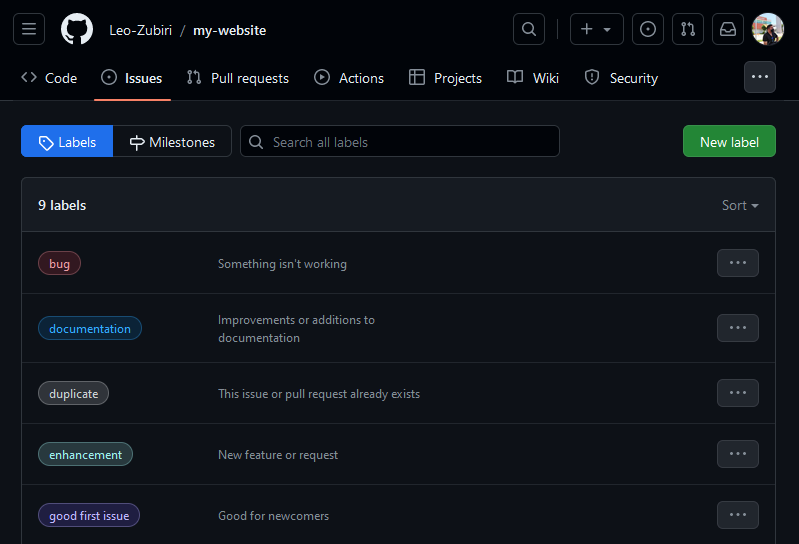
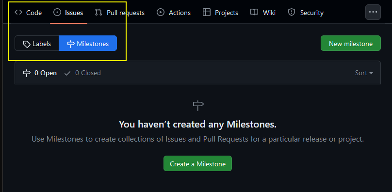
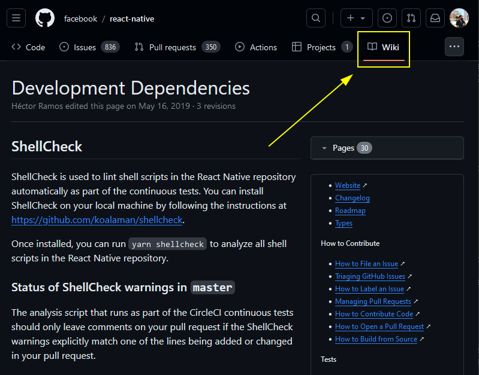
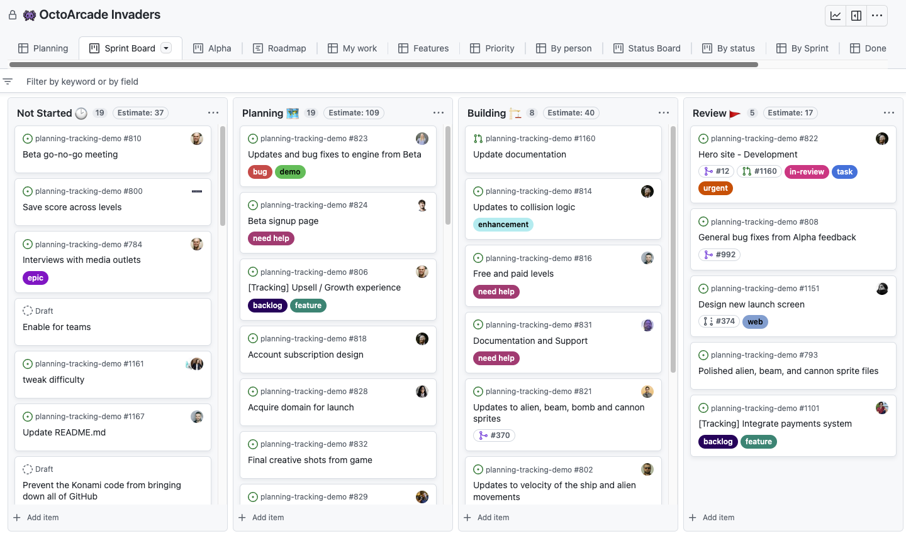

# Github Issues

Las personas pueden crear preguntas o incógnitas, reportar errores y solicitar nuevas funciones en el repositorio de GitHub del proyecto.

La opción de Issues puede ser desactivada desde la configuración del repositorio



Un issue se puede relacionar a un pull request para indicar que esta fue resuelta en alguna integración de cambios

## Cerrar Issue

Se puede cerrar el issue desde github para marcar que ya no es necesario seguirlo. Se pueden crear referencias donde un commit resuelve un issue y posteriormente desde la interfaz de github cerrarlo

Existe la posibilidad de **Cerrar issues mediante un commit**

Desde el local al momento de crear un commit hay ciertas palabras clave: 

- **Fixes** y el número correspondiente del issue

```bash
git commit -am "Fixes #5: Solucionado esta situacion"
```

> Desde github aparece el issue como cerrado e indica el commit relacionado


## Issue templates

Desde la configuración del repositorio en github existe la opción para crear plantillas para los issues.

Entonces podemos establecer algún formato para describir los bugs, solicitar características entre otras cosas.
Cuando algún usuario intente crear un nuevo issue se le cargará el formato para que intente seguir las buenas prácticas para la descripción del issues





## Labels

Al crear un issue se le pueden asignar labels para indicar de que se trata. Mas adelante se pueden filtrar los issues a través de las etiquetas para dar seguimiento de forma mas ordenada




## Milestones

Sirven como un agrupador de issues, sirve como si agregaramos una categoría a los issues que se crean.
Se pueden establecer metas con los milestones, por ejemplo, crear uno para lograr el primer lanzamiento de la aplicación, según vayan saliendo issues se les agrega este milestone y a través de este se pueden ver la cantidad de issues que deben ser atendidos antes de cumplir con esa meta.



# Wiki

Cada repositorio en GitHub viene equipado con una sección para alojar documentación, llamada **wiki**. Puede utilizar la wiki de su repositorio para compartir contenido extenso sobre el proyecto, cómo usarlo, cómo se diseñó o sus principios básicos. Un archivo README indica rápidamente qué puede hacer su proyecto, mientras que una wiki p proporcionar documentación adicional.



Se puede utilizar markdown para crear el contenido y las respectivas páginas de la wiki

## Projects

Un proyecto es una colección adaptable de elementos que se pueden ver como una tabla, un panel kanban o un mapa de ruta y que permanece actualizado con los datos GitHub. Tus proyectos pueden realizar el seguimiento de incidencias, solicitudes de incorporación de cambios e ideas que anotes.

Puede crear y personalizar varias vistas mediante el filtrado, la ordenación y la agrupación de las incidencias y solicitudes de incorporación de cambios, visualizar el trabajo con gráficos configurables y agregar campos personalizados para realizar el seguimiento de metadatos específicos del equipo. En lugar de aplicar una metodología específica, un proyecto proporciona características flexibles que puedes personalizar en función de las necesidades y los procesos del equipo.

