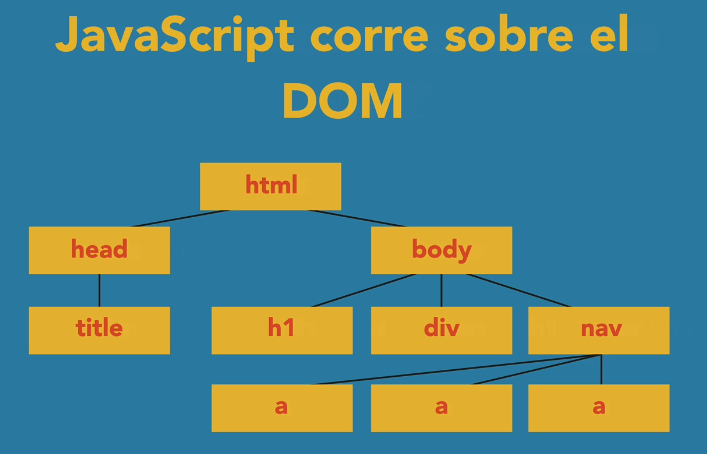

# DOM 

El DOM es un modelo de documento que se carga en el navegador web y que representa el documento como un árbol de nodos, en donde cada nodo representa una parte del documento



**Document Object Model** <br/>


**Formas de enlazar código JS en hmtl**

```html
<body>
    <!-- Al final del body del documento-->
    <p id='parrafo'> Párrafo <p>
    <script>
        // código js
        console.log('Hola mundo');
    </script>
</body>
```
---

**getElementById**

```JS
    let parrafo = document.getElementById('parrafo');
    let parrafoContent = parrafo.innerHTML;
    parrafo.innerHTML = 'Nuevo contenido párrafo';
```

**getElementsByTagName**

```html
    <p> Párrafo 1 </p>
    <p> Párrafo 2 </p>
    <p> Párrafo 3 </p>

<script> 
 let parrafos = document.getElementsByTagName('p'); // []

 for(let i=0; i<parrafos.length; i++){
    console.log(parrafos[i].innerHTML);
 }
</script>

```

**getElementsByClassName**

```html
<p class='azul'> Párrafo 1 </p>
<p> Párrafo 2 </p>
<p class='azul'> Párrafo 3 </p>

<script> 
 let parrafos = document.getElementsByClassName('azul'); // []

 for(let elemento of parrafos){
    console.log(elemento.innerHTML);
 }
</script>
```

**querySelectorAll**

```js
// Para recuperar elementos indicando el tipo y clase
let elementos = document.querySelectorAll('p.azul');
```

### **Acceder a formulario**
```html
<form id='formulario1'> 
    Nombre: <input type='text' name='nombre' value=''/>
</form>

<script> 
    let formulario = document.forms['formulario1'];
    let nombre = formulario['nombre'];

    console.log(nombre.value);

    for(let elemento of formulario){
        console.log(elemento.value);
    }
</script>
```

**document.write**
```js
// El contenido dentro de body lo sobreescribe
document.write('Hola')
```

**Cambiar estilo css con JS**
```js
document.getElementById('parrafo').style.color = 'blue';
```

---

## Manejo de eventos

**onClick**

```html
<h1 onClick="this.innerHTML = 'Nuevo Título'"> Titulo </h1>

...

<h1 onClick="funcion(this)"> Titulo </h1>

<script> 
    function funcion(elemento){
        elemento.innerHTML = 'Nuevo título'
    }
</script>

...

<script> 
function funcion(){}
document.getElementById('btn').onclick = funcion;
</script>
```

**onLoad** <br/>

Durante la carga...

```html
<body onload='checkCookies()'>

<script> 
    function checkCookies(){
        if(navigator.cookieEnabled){
            alert('Cookies habilitadas');
        } else{
            alert('Cookies no habilitadas');
        }
    }
</script>
```

**onChange**

```html
<input type='text' onchange='handleChange(this)'>

<script> 
    function handleChange(elm){
        elm.value = elm.valu.toUpperCase();
    }
</script>
```

**Hover effects**

- onmousedown - Mientras se mantenga presionado click 
- onmouseup - cuando se suelta el click
- onmouseover - cuando el puntero está por encima
- onmouseover - cuando el puntero sale de estar por encima anteriormente.
- onfocus - mientras se esté sobre el elemento
- onblur - cuando se quita el focues

```html
<h1 onmousedown='' onmouseup='' onmouseover='' onmouseout=''> Pruebas </h1>
<input type='text' onfocus='' onblur=''>
```

**Agregar eventos desde JS**

```js
// El evento se coloca sin el on, onfocus = focus
document.getElementById('elemento').addEventListener('focus',handleFocus);

function handleFocus(event){
    let elemento = event.target;
    elemento.style.background = 'yellow';
}
```
---

## Delegación de eventos / useCapture  (herencia)

```js
// Los hijos heredan el metodo
elementoPadre.addEventListener('click',()=>{},useCaptureValue)
```

```html
<form id='forma'> 
    <input />
    <input />
</form>

<script> 
const forma = getElementById('forma');

// El evento se aplica a los elementos hijos de tipo input
forma.addEventListener('focus',()=>console.log('focused'),true);
</script>
```

---

### classList.toggle
Se obtienen todos los atributos css de un elemento. Después con toggle el atributo que coloques, si existe lo quitará y si no, lo agregará.

```js
document.getElementById('contenedor').classList.toggle('animar');
```
---