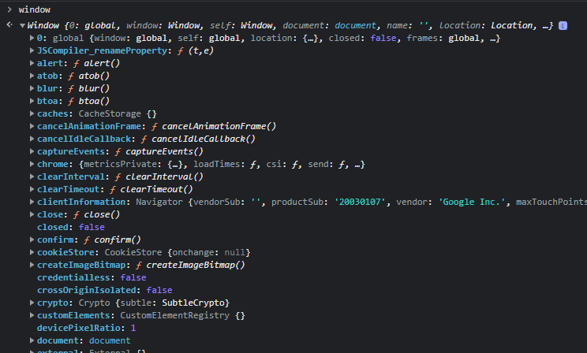

# Ventana Global

Desde la terminal del navegador se puede colocar el comando `window`

Se desglosan todos los métodos de javascript disponibles en el navegador



Por ejemplo desde la consola se puede acceder a:

```js
window.Math.random()
```

O bien:

```js
Math.random()
```