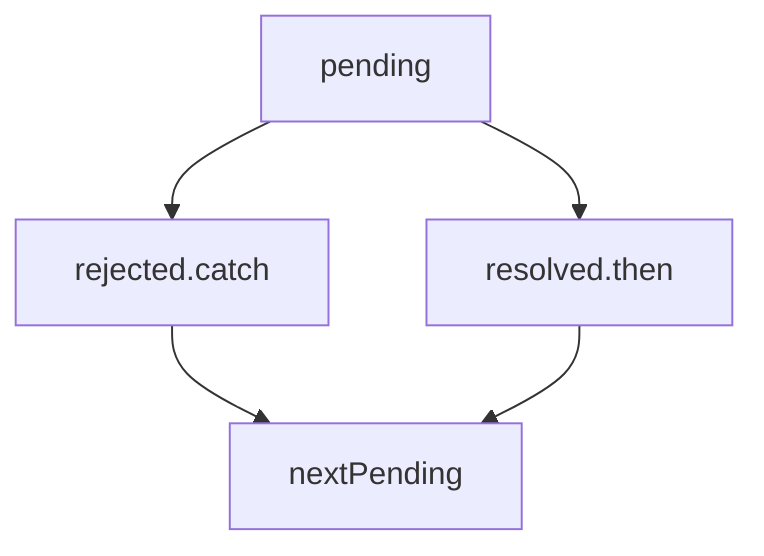

# Apuntes JavaScript

> **Nota:** Estos apuntes son una recopilación de características del lenguaje javascript poco convencionales, no se considera todas las sentencias y características básicas o generales que sean comúnes en distintos lenguajes.

---

## Arrays

```javascript
let arreglo = new Array('Hedson');
// ['Hedson'];    <-- typeof object

// Para preguntar si es un arreglo
if(Array.isArray(arreglo)){}
if(arreglo instanceof Array){}

// Agregar elementos a un arreglo
arreglo.push('Leoziel') // ['Hedson', 'Leoziel']

// Si haces agregas un elemento en un index no válido
arreglo[4] = 'Elideth'; // ['Hedson', 'Leoziel','','','Elideth']

```
---

## Functions

> Las funciones pueden referenciarse incluso antes de ser declaradas debido al "Hoisting". Javascript alza todas las declaraciones.

> A las funciones se le pueden pasar argumentos incluso aunque no esten especificados en los parametros de su declaración

```javascript
// arguments es un arreglo que contiene todos los argumentos que lleguen a la funcion.
function sumarTodo() = {
    let suma=0;
    for(let i = 0; i<arguments.length; i++){
        suma += arguments[i];
    }
    return suma
}
```

> **Paso por valor** en los valores que toman los argumentos, todos los datos primitivos pasan una copia pero no altera la variable origen.

> **Paso por referencia** se puede modificar la variable origen dada como argumento pero solo funciona con objetos.

---

## Objetos

> Se pueden crear objetos de dos formas

```javascript
const objeto1 = {
    nombre: 'Leo',
    apellido: 'Zubiri'
}

// ----------------------
let objeto2 = new Object();
objeto2.nombre = 'Leo';
objeto2.apellido = 'Zubiri';
```
<br/>

> Para borrar la propiedad (llave:valor) de un objeto

```javascript
delete objeto1.apellido;
```
<br/>

> Método **Get** y **Set** es mas recomendable para utilizar objetos.

```javascript
let persona = {
    nombre: 'Leo',
    get miFuncion(){
        console.log('Hola');
    },
    set Nombre(nom){
        this.nombre = nombre.toUpperCase();
    }
}

persona.miFuncion;  // No es necesario persona.miFuncion();
persona.Nombre = 'hedson'; //  nombre: 'HEDSON'
```
<br/>

> **Prototype**, para colocar valores por defecto 

```javascript
function PersonaConstructor(nombre, edad){
    this.nombre = nombre;
    this.edad = edad;
}


PersonaConstructor.prototype.edad = -1;

let persona = new PersonaConstructor('Hedson');}
// {nombre: 'Hedson', edad: -1}

```
<br/>

> **CALL** para llamar una funcion de un objeto con los datos de otro para reutilizar

```javascript
let persona1 = {
    nombre: 'Leo',
    apellido: 'Zubiri',
    nombreCompleto: function(){
        return this.nombre + ' ' + this.apellido;
    }
}

let persona2 = {
    nombre: 'Carlos',
    apellido: 'Estrada'
}

// Se colocan argumentos si la funcion los requiere
persona1.nombreCompleto.call(persona2,'param1','param2') // Llamas la funcion de persona 1 con los datos de la persona 2


// De forma similar se puede utilizar apply
let params = ['param1', 'param2'];
persona1.nombreCompleto.apply(persona2, params);
```
---

## Clases

```javascript 
class Persona{
    constructor(nombre,apellido){
        this._nombre = nombre;
        this._apellido = apellido;
    }

    get nombre(){
        return this._nombre;
    }

    set nombre(nombre){
        this._nombre = nombre;
    }

    funcionGeneral(){
        // Procedimiento 
    }
}

let persona1 = new Persona('Leo','Zubiri');

// Para usar el get y set
console.log(persona1.nombre)
persona1.nombre = 'Hedson';
```

> **HERENCIA**

```js
class Empleado extends Persona {
    constructor(nombre,apellido,departamento){
        super(nombre,apellido); //Constructor clase padre
        this._departamento = departamento;
    }

    get departamento(){
        return this._departamento;
    }
    
    set departamento(dep){
        this._departamento = dep;
    }

    //Sobrecarga de metodos 
    funcionGeneral(){
        super.funcionGeneral() //Llamar un método de la clase padre
        // Procedimiento adaptado para esta clase
    }
}

let empleado1 = new Empleado('Hedson','Zubiri','Desarrollo');
```

---

## Static

**Métodos Estáticos** <br/>

Los métodos estáticos se asocian a la clase pero no a los objetos. Por ejemplo: ```persona1.saludar();``` no es válido según lo siguiente:

```js
class Persona{

    // Tambien se dispone el método en herencia
    static saludar(){
        console.log('Metodo estatico de la clase');
    }
}

...

 const persona1 = new Persona();
 persona1.saludar();  // No es correcto

 // El método static es perteneciente a la clase, por lo tanto:
 Persona.saludar();

```

**Atributos Estáticos** <br/>

```js
class Persona(){
    static contadorObjetosPersona = 0;

    constructor(nombre,apellido){
        this._nombre = nombre;
        this._apellido = apellido;
        contadorObjetosPersona += 1;
    }
}

...

const persona1 = new Persona("Elideth","Zubiri");
const persona2 = new Persona("Leoziel","Zubiri");
const persona3 = new Persona("Leo","Zubiri");

Persona.contadorObjetoPersona; // 3 objetos Persona
```

**Constantes Estáticas** <br/>

No se puede utilizar la palabra reservada const e indicarle static para conseguir el resultado de constante estática.

```js
// Se debe crear un metodo get estático:

class MyMath {
    static get pi() { return 3.141516; }
}

console.log(MyMath.pi); // Se accede a la constante de la clase
```

---

## Modo Strict

Javascript permite utilizar variables que no han sido declaradas, para evitar eso se usa el modo estricto.

```js
"use strict"
x = 10; // Marcará error 

// En su lugar
let x;
x=10;
```

---

## Instance of

```js
function esEmpleado(obj){
    if(obj instanceof Empleado){

    }
}
```

---

## Manejo de errores

### TryCatch

```js
try{}catch(error){}
```

Agregar bloque finnally
```js
try{
    doSomething();
}catch(error){
    console.log(error);
}finally{
    // Se ejecuta siempre, independiente a si hubo o no hubo error.
    doSomethingElse();
}
```

### Claúsula Throws

Sirve para arrojar nuestros propios errores

```js
try{
    let num = -10;

    if(num < 0) throw 'num no debe ser negativo';
}catch(error){
    //console.log(error);
    console.log(error.name);
    console.log(error.message);
}
```
---

## Funciones flecha

### Hoisting

- **HOISTING** . Se puede utilizar un método o variable incluso antes de su declaración.

```js
// Funcion estándar - aplica el concepto de hoisting
miFuncion(); 
function miFuncion(){}

// Funcion Flecha - No aplica el concepto de hoisting
let miFuncion2 = () => {}
miFuncion2();

```

## Función CALLBACK

De una función vuelves a llamar otra a través de referencia. El uso de funciones callback esta destinado a propositos asíncronos.

```JS
// Funcion de tipo CALLBACK 
function imprimir(mensaje){
    console.log(mensaje);
}

function sumar(op1,op2, funcionCallback){
    let result = op1 + op2;
    funcionCallback(result);
}

sumar(8,8,imprimir);

```

## setTimeout

Ejecutar algo despues de que pase un lapso de tiempo

```js
// Llamadas asíncronas con uso de setTimeout
function miFuncionCallback(){console.log('Mensaje después de cierto tiempo')}

setTimeout(miFuncionCallback,3000); // Despues de 3 segundos imprime mensaje
```

## setInterval

Repetir algo cada cierto intervalo de tiempo
```js
let reloj = () => {
    let fecha = new Date();
    const {getHours,getMinutes,getSeconds}
    console.log(`${getHours()}:${getMinutes()}:${getSeconds()}`)
}

setInterval(reloj,1000); // Cada segundo se muestra los cambios en la hora de forma asíncrona
```

---

## Promesas

La promesa pendiente es resuelta o rechazada, se atiende según el caso y posteriormente se pasa a las siguientes promesas pendientes <br/>

```pending ->  resolved( .then() )/rejected( .catch() ) ->   pending```



```js
let miPromesa = new Promise((resolved,reject) => {
    let expression = true;
    if(expression){
        resolved('Succesfull');
    } else {
        reject('Error');
    }
});

// Ejecutar la promesa
//                resolve                             reject
miPromesa.then((resuelto)=>console.log(resuelto) , (error) => console.log(error));

miPromesa
    .then( resuelto => console.log(resuelto))
    .catch(error=>console.log(error));
```

### Async Promises

> Al colocar la palabra reservada **async**  a una función, la función retorna una promesa
```JS
async function miFuncionPromesa() {
    return 'Esto equivale al resolve-> .then()';
}

// Entonces se puede llamar como a una promesa
miFuncionPromesa().then((returned) => console.log(returned));
```

---

## Formato tipo Moneda en Javascript (toLocaleString)

```js
const formatoMoneda = (valor) => {
    // en-US  es-MX
    return valor.toLocaleString('en-US',{
        style: 'currency',
        currency: 'USD',
        minimumFractionDigits: 2
    })
}
```
```js
formatoPorcentaje = valor => {
    return valor.toLocaleString('en-US',{
        style: 'percent',
        minimumFractionDigits:2
    })
}
```
---

### Iconos del proyecto

### [**Ionicons**](https://ionic.io/ionicons/usage)

> Para importar el icono

```html
 <ion-icon name="close-outline"></ion-icon>
```

> Colocar antes de cerrar el /body

```html
<script type="module" src="https://unpkg.com/ionicons@5.5.2/dist/ionicons/ionicons.esm.js"></script>
<script nomodule src="https://unpkg.com/ionicons@5.5.2/dist/ionicons/ionicons.js"></script>
```

---

## Creando "Componentes" con JavaScript

```js

const elms = [
    {
        id: 1,
        descripcion: 'desc',
        valor: 1000
    },
    {
        id: 2,
        descripcion: 'desc2',
        valor: 2000
    },
];

const cargarElementos = () => {
    let componentesHTML = '';

    for(let elm of elms){
        componentesHTML += crearIngresoHTML(elm);
    }

    document.getElementById('container').innerHTML = componentesHTML;
}

const crearIngresoHTML = (elm) => {

    let componenteHTML = `
    <div class="elemento limpiarEstilos">
        <div class="elemento_descripcion">${elm.descripcion}</div>
        <div class="derecha limpiarEstilos">
            <div class="elemento_valor">${formatoMoneda(elm.valor)}</div>
            <div class="elemento_eliminar">
                <button class="elemento_eliminar--btn">
                    <ion-icon name="close-circle-outline"></ion-icon>
                </button>
            </div>
        </div>
    </div>
    `;

    return componenteHTML;
}
```

---

## findIndex y método Splice para eliminar de un arreglo

```js
    const elmIndex = ingresos.findIndex((elm)=> elm.id === id);
    
    // Cuantos elementos se eliminaran a partir del indice.
    arreglo.splice(elmIndex,1);
```

---

## Convertir string a number

```js
Number(variable);

+variable;
```