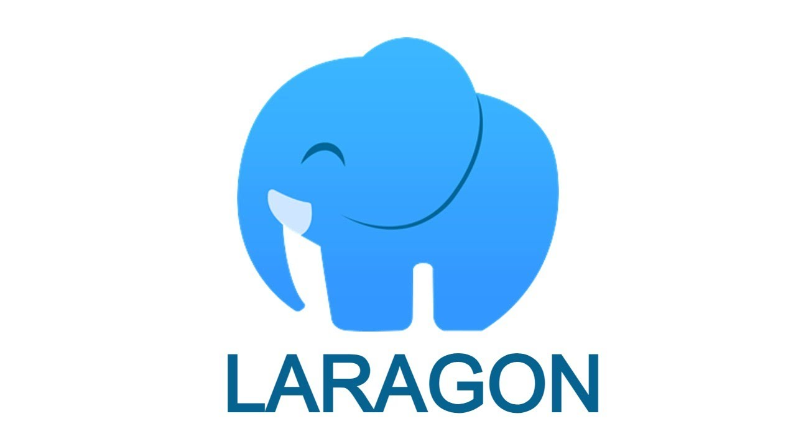
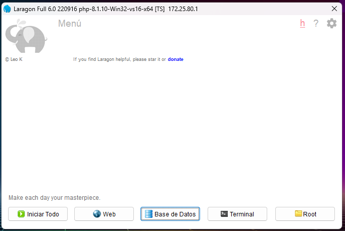
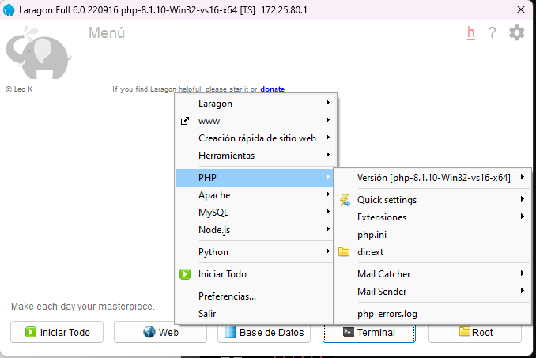

# Laragon

Laragon es un entorno de desarrollo Web que mediante un único instalador nos instala PHP, Apache, MySQL y Node.js, ahorrándonos una gran cantidad de tiempo al no tener que instalar y configurar todos estos paquetes por separado.
Brinda todo lo necesario para iniciar el desarrollo en el menor tiempo posible sin necesidad de establecer emulación de sistemas operativos



Esta herramienta cuenta con características como:

- Viene con MySQL integrado en la instalación
- Cuenta con PHPMyAdmin y HeidiSQL en la instalación
- Cambio de dominio rápido y sencillo
- Utilizar diferentes versiones de PHP
- Git
- Node.js
- Composer
- Una basta galería de extensiones de PHP.
- Entre muchos más.


## Instalacion

Se descarga el instalador desde su pagina official `https://laragon.org/download/` 



---

### Configurar para Laravel 11 

Se debe cumplir con los requisites para Laravel 11:

- PHP >= v8.2
- Ctype PHP Extension
- cURL PHP Extension
- DOM PHP Extension
- Fileinfo PHP Extension
- Filter PHP Extension
- Hash PHP Extension
- Mbstring PHP Extension
- OpenSSL PHP Extension
- PCRE PHP Extension 
- PDO PHP Extension
- Session PHP Extension
- Tokenizer PHP Extension
- XML PHP Extension
- Composer
- Nginx | Apache
- MySQL | Postgres | SQLite
- Gestor DB
- Editor de codigo
- Terminal
- Node

> De preferencia, previamente se tiene que tener git instalado y configurado

---

#### Actualizar version de PHP

Desde la pagina official se descarga la version mas actualizada de PHP, en este caso la version 8.3

`https://windows.php.net/download#php-8.3`

Despues de extraer el zip con el contenido de la version, se copia el directorio en donde laragon coloca las versions de PHP

`C:\laragon\bin\php` 

Desde laragon al hacer click derecho sobre la Ventana principal y desplegar el menu, se puede seleccionar la nueva version de PHP



---

#### Actualizar NodeJS

Desde la pagina oficial en lugar de descargar el instalador se descargan los **prebuilt binaries** para descargar un zip

Se extra el contenido en su respectiva carpeta y se mueve al directorio de node de laragon

```C:\laragon\bin\nodejs```

Desde laragon se selecciona la nueva version a traves de su menu al dar click derecho sobre la Ventana principal

---

#### Instalador de Laravel

Se coloca el instalador de forma global para crear proyectos y configuraciones de laravel.
Se abre la Terminal que viene en la aplicacion de **Laragon** y se ejecuta el siguiente commando

```bash
composer global require Laravel/installer
```

---

## Crear nuevo Proyecto de Laravel

Dentro de Laragon se abre la Terminal y se ejecuta lo siguiente:

```bash
laravel new myprojectname
```

> Se siguen las indicaciones para la configuracion del nuevo Proyecto, se selecciona el stack deseado, la base de datos, ejecutar las migraciones, entre otras cosas.