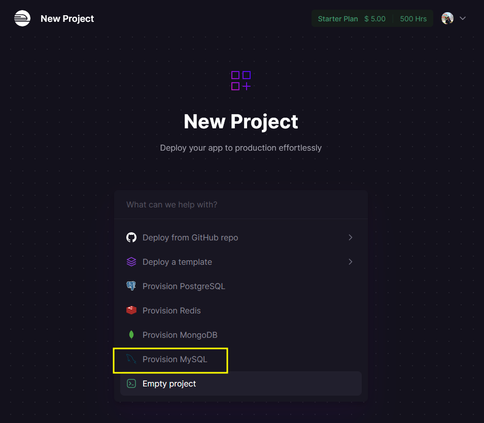
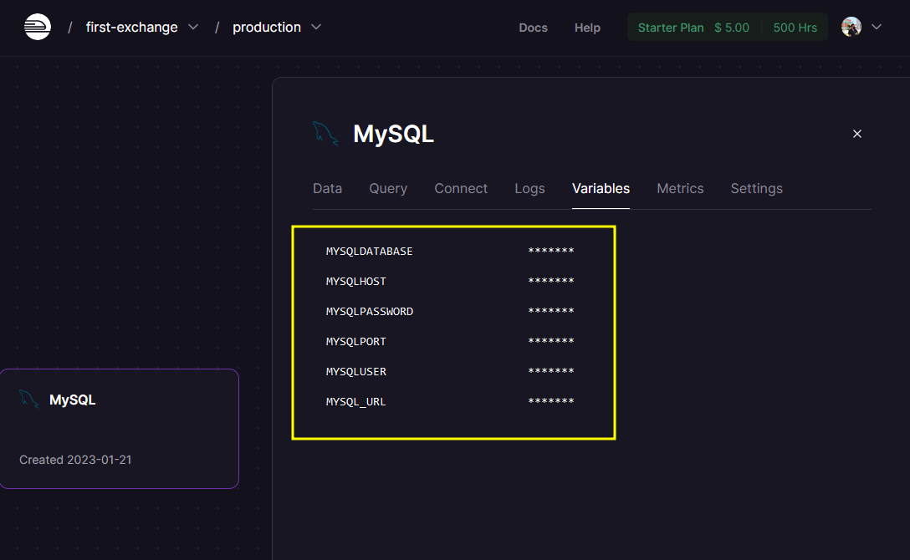
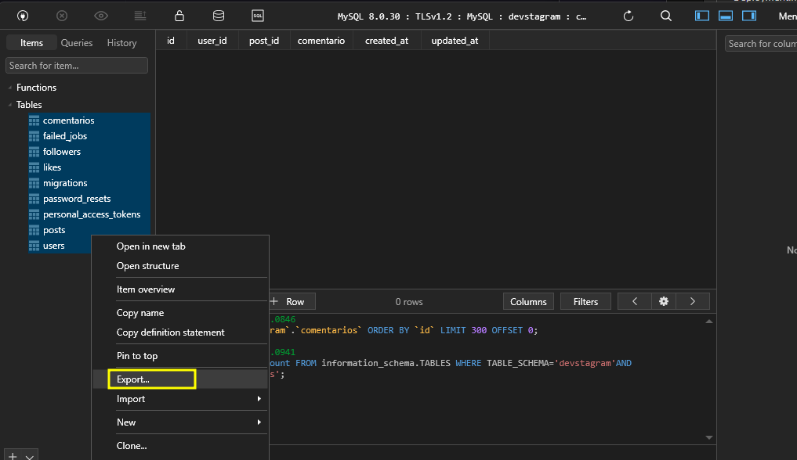
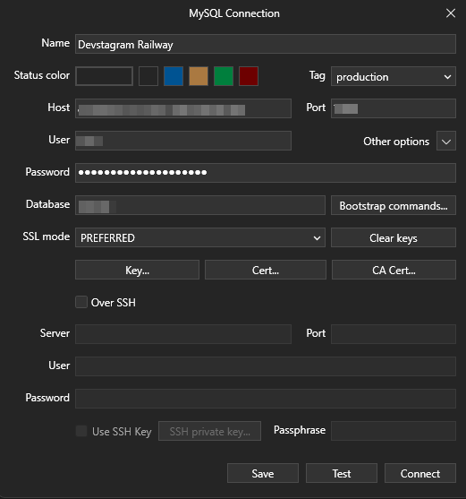
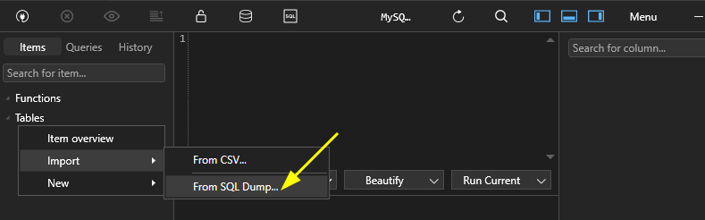
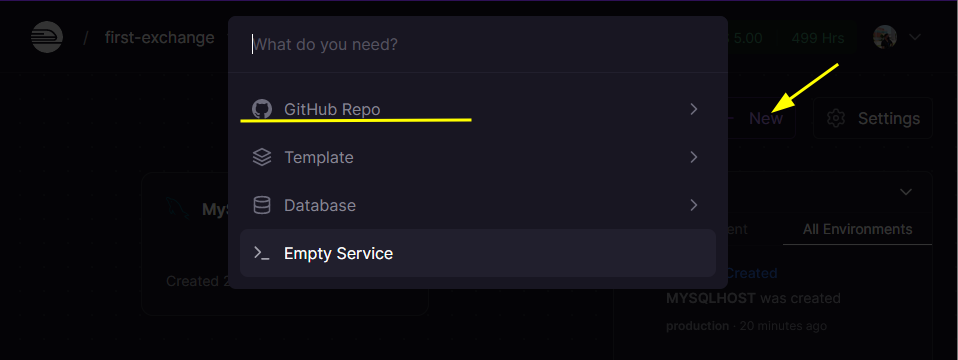
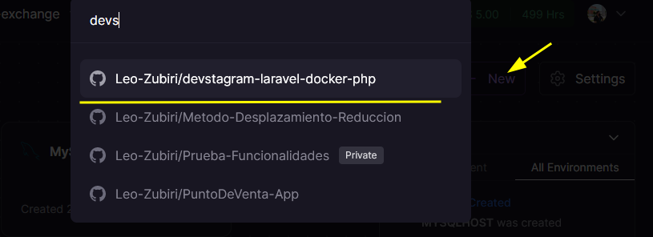

# Deployment

Para desplegar la aplicacion primero se genera la build

```npm run build```

## Crear Rama Main

```git add .```

```git commit -m "creando main"```

```git branch -M main```    

```git push -u origin main```

## Crear rama deployment

```git switch -c deployment```

Desde el archivo AppServiceProvider para el caso del deployment se debe tratar los certificados para HTTPS

```php
    public function boot()
    {
        if($this->app->environment('production')){
            URL::forceScheme('https');
        }
    }
```

## HTACCESS

Posteriormente crear un archivo **.htacces** en la raiz del proyecto con:

```php
<IfModule mod_rewrite.c>
RewriteEngine On
RewriteBase /
RewriteCond %{REQUEST_URI} !/public
RewriteRule ^(.*)$ public/$1
</IfModule>
```
> Manda al usuario a public y ahi hay otro htaccess que se encarga de mostrar las paginas al usuario


## Procfile

Se crea el archivo **Procfile** en la raiz del proyecto

```php
web: cp .env.example .env && php artisan key:generate && heroku-php-apache2
```

## Railway

[Sitio aqui->>>](https://railway.app/)

En este caso se proporciona a partir de la base de datos en mysql



Se deben ubicar las variables para la conexion de la base de datos



> Se exporta la data de las tablas de la base de datos local




Con las credenciales de la base de datos de Railway se puede acceder desde una nueva conexion en TablePlus



Importar la data generada anteriormente de la base de datos



Desde railway se carga el github repo:



