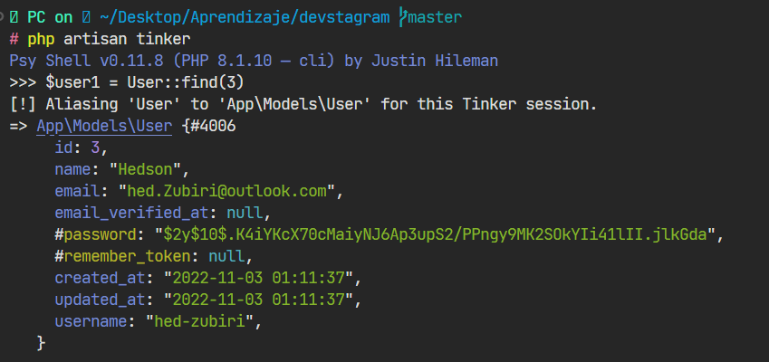
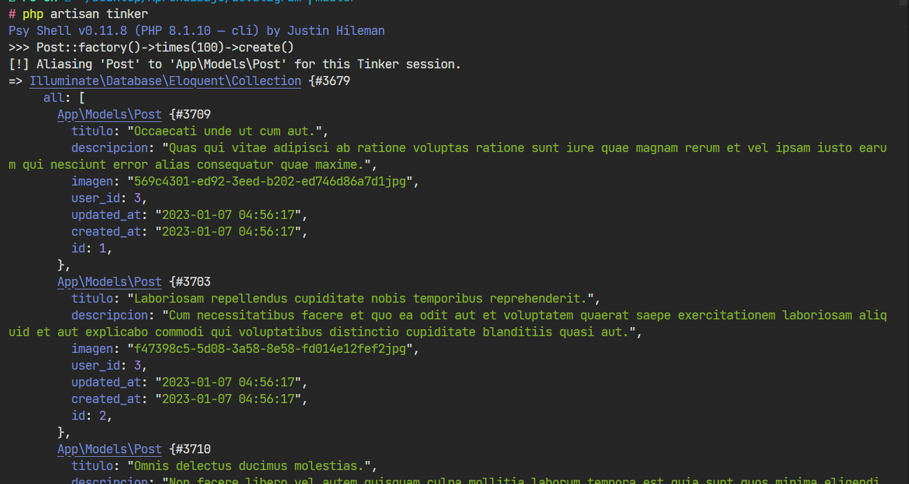

# Factories

Un factory permite hacer testing a la base de datos durante el 

```php artisan make:factory```

Desde el archivo correspondiente al factory se establecen los campos que se desea probar de la base de datos para rellenar con información

Se utiliza la librería incorporada llamada **faker** para generar información aleatoria.

```php
    public function definition()
    {
        return [
            'titulo' => $this->faker->sentence($nbWords = 5),
            'descripcion' => $this->faker->sentence(20),
            'imagen' => $this->faker->uuid().'jpg',
            'user_id' => $this->faker->randomElement([2,3,8])
        ];
    }
```

# Probar Factory

Para probar una factory se debe utilizar Tinker (CLI)

```php artisan tinker```



Para probar factory

```Post::factory()->times(200)->create()```



En caso de algun test que no funcionó como esperabamos:

## Retornar el factory

```php artisan migrate:rollback --step=1```

```php artisan migrate```

Se ejecuta nuevamente el factory

> Lo ideal es hacer factories para la base de datos local