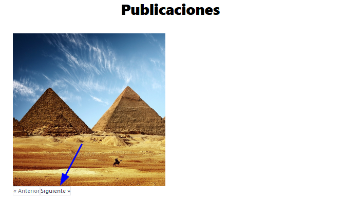
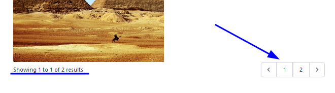

# Acceder a registros

Existen varias formas para obtener distintos registros según se necesite a través de los modelos

---

## Model::where()

```php
    $posts = Post::where('user_id',$user->id)->get();
```

**Para mostrar desde una vista:**

```php
@foreach ($posts as $post )
    <div>
        <a>imagen }}" alt="Imagen Post {{ $post->titulo }}"></a>
    </div>
@endforeach
```

## Paginate

Para retornar solo 5 registros y conseguir paginar los resultados

```php
$posts = Post::where('user_id',$user->id)->paginate(5);
```

Desde la vista se puede mostrar un componente para recorrer las imagenes:

```php
<div>
    {{ $posts->links() }}
</div>
```


**Para mejorar el diseño se puede utilizar:**

```php
<div>
    {{ $posts->links('pagination::tailwind') }}
</div>
```
> Se puede utilizar boostrap entre otras configuraciones

> Para el caso de tailwind a pesar de especificarlo no funciona por que el archivo del paginador se enecuentra en **vendor/laravel/framework/src/Illuminate/Pagination/resources/views**, entonces la configuracion de tailwind tambien debe tener acceso a la ruta "./vendor/laravel/framework/src/Illuminate/Pagination/resources/views/*.blade.php"



### **Otro estilo de paginador**

```php
$posts = Post::where('user_id',$user->id)->simplePaginate(5);
```