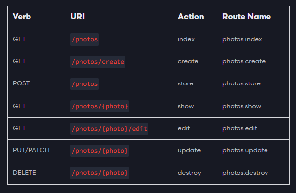

# Routing
> Al acceder a una dirección web carga una vista, es decir la parte visual de la página correspondiente.

En la carpeta resources:

views. Creamos los archivos plantilla ahí.
routes. Archivos correspondientes al acceder a una determinada dirección para cargar la respectiva vista.

En **routes/web.php** para cargar una vista:

```php
Route::get('/ruta',function () { return view('pagina')});

// Hace referencia a pagina.blade.php
```

## Recomendación Estándar


## Layouts

Para crear layouts, templates, o paginas maestras, dentro de la carpeta **views** se crea una carpeta **layouts** y se crea el archivo correspondiente **pagina.blade.php**

Para importar el layout desde otro archivo php:
- Se utiliza la siguiente instruccion, la ruta apunta a partir de la carpeta views, posteriormente la ruta. layouts.pagina es equivalente a layouts/pagina
```@extends('layouts.pagina')```

### **Agregar contenido dinámico al layout**
Desde la plantilla debemos agregar las partes que serán dinámicas con ```@yield('')```.

Por ejemplo:
```php
   <h1> @yield('titulo')</h1>
```
Y desde el archivo donde se importa el layout se utiliza **@section**:

```php
@section('titulo')
    Título de la página
@endsection
```

---

## Rutas Dinámicas

Route Model Binding

```Rutas relacionadas a los modelos```

```php
// /{modelo:atributoDB}
Route::get('/{user:username}',[PostController::class,'index'])->name('posts.index');
```

> Lo anterior hace que la url sea personalizada **/nombreUsuario**

```php
// Enviar informacion a la vista

public function index(User $user) {
    return view('dashboard',[
        'user' => $user
    ]);
}

// Recibir la informacion desde la vista
<div>
    <p> {{ $user->username }}</p>
</div>
```

---

# Routes with Closures

En lugar de utilizar las rutas apuntando a controladores

```php
Route::get('/', function () {
    return view('principal');
});
```