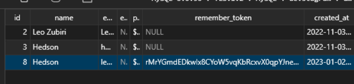

## Sessions

### Iniciar Sesión

Para iniciar sesión por convención se utiliza un formulario para el login

```html
<form method='POST' action="{{route('login')}}" novalidate>
```

La ruta a la que apunta:
```Route::post('/login',[LoginController::class,'store']);```


El método store que confirma las credenciales:

```php
    $this->validate($request,[
        'email' => 'required|email',
        'password' => 'required'
    ]);

    if(!auth()->attempt($request->only('email','password'))){
        return back()->with('mensaje','Credenciales incorrectas');
    }

    return redirect()->route('posts.index');
```

El retorno de error de credenciales se captura desde el formulario:

```php
@if (session('mensaje'))
    <p> {{ session('mensaje') }} </p>
@endif
```

### Verificar inicio de sesión

**Con directiva if**

```php
    @if (auth()->user())
        <p>Autenticado</p>
    @else
        <p>No autenticado</p>
    @endif
```

**Con directiva auth**

```php

    @auth
        <p>Autenticado</p>
    @endauth

    @guest
        <p>No autenticado</p>
    @endguest
```

### Cerrar sesión

Forma insegura:

```php
    auth()->logout();
    return redirect()->route('login');
```

Forma segura para evitar ataques:

```php
// La ruta debe ser POST para cerrar sesion, se utiliza como formulario

<form method='POST' action="{{route('logout')}}"> 
    @csrf
    <button type="submit">
    Cerrar Sesion
    </button>
</form>

```

### Mantener Sesion Iniciada

```php
// Desde el formulario
<div class="mb-5 ">
    <input type="checkbox" name="remember">
    <label>
        Mantener mi sesión abierta
    </label>
</div>
// Se agrega un nuevo parametro
auth()->attempt($request->only('email','password'),$request->remember)
``` 

> Lo anterior mantiene la sesion iniciada con token en la base de datos y es guardado desde las cookies del navegador



---

