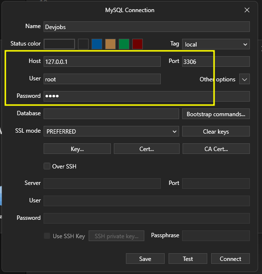
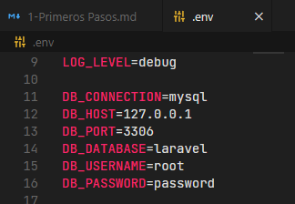

# Devjobs

## Creación del Proyecto

```composer create-project laravel/laravel devjobs```

## Ejecutar el proyecto

```php artisan serve```

## Conexión a Base de Datos

Crear una nueva conexion a la base de datos e identificar el Host, puerto, usuario y contraseña



Despues se configura el archivo .env con los respectivos datos:



> Al modificar las variables de entorno se debe reiniciar el servidor