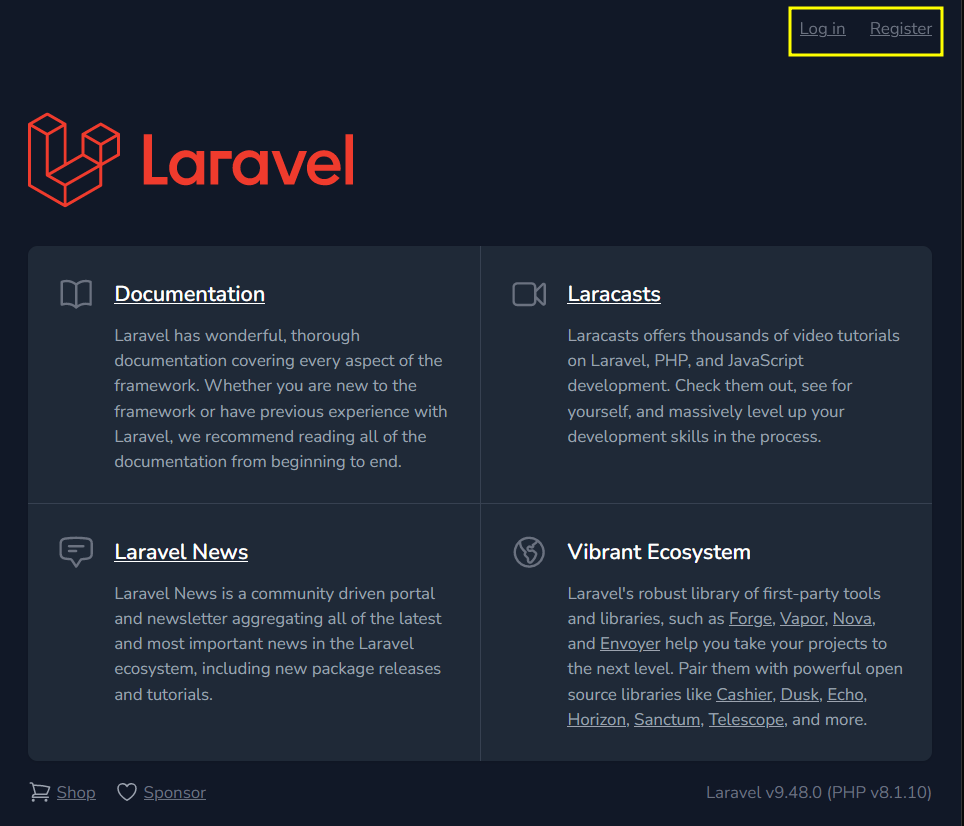

## Laravel Breeze

Paquete de autenticación hecho por los creadores de laravel. Hecho con Blade y Tailwind css

Incluye funciones para:

- Crear cuenta
- Autenticar
- Resetear password
- Confirmar cuenta
- Verificar email

Existen disintas alternativas como:

1. Fortify. Paquete de autenticacion para el frontend que utiliza toda la implementacion de backend con laravel. Autenticación de dos factores, no incluye GUI pero utiliza los endpoints de Breeze
2. Sanctum. Método de autenticacion para aplicaciones hechas con Angular,Vue,Next.js,Nuxt o React. Utiliza endpoints de breeze pero con nuevos para el uso de tokens para acceder al backend. Puede utilizar Breeze y fortify
3. Jetstream. Interfaz completa ideal para ser utilizada como el inicio de una app de laravel. Hecha con Tailwind css  y puede ser utilizada junto a inertia o Livewire

## Instalación

```composer require laravel/breeze --dev```

```php artisan breeze:install```

```npm run dev```

Lo anterior agrega a la pagina por defecto de laravel la opcion para iniciar sesion o registrarse:



Para agregar los campos de la base de datos que necesita breeze para funcionar:

```php artisan migrate```

> Breeze configura distintas rutas para trabajar con lo agregado en el frontend. Se pueden consultar las rutas con ```php artisan route:list```

## Modificaciones 

En el caso de modificar el diseño:  **resources/views/auth**

En el caso de modificar las rutas: **routes/auth.php**

En el caso de moficar los controladores: **app/Http/Controllers/Auth**