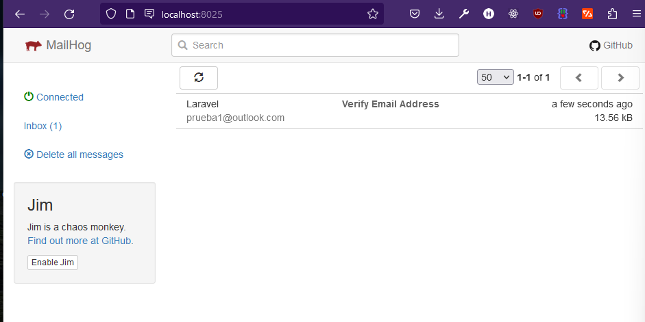
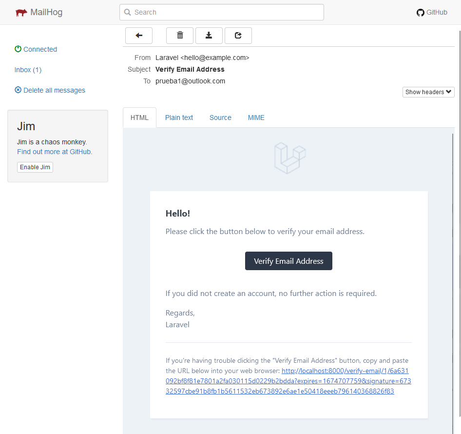

# Verificar nueva cuenta

Por defecto breeze permite crear la cuenta y automaticamente inicia sesión.

Se debe habilitar la funcionalidad para verificar una cuenta a través del correo para poder iniciar sesión:

En las rutas del archivo web.php se debe tener el campo `verified`:

```php
Route::get('/dashboard', function () {
    return view('dashboard');
})->middleware(['auth', 'verified'])->name('dashboard');
```
En el modelo User se debe agregar el implements en la clase:

```php
class User extends Authenticatable implements MustVerifyEmail
```

## Envío de correos

Desde el archivo .env vienen las variables que se utilizan para el servicio de correos:

```php
MAIL_MAILER=smtp
MAIL_HOST=localhost
MAIL_PORT=1025
MAIL_USERNAME=null
MAIL_PASSWORD=null
MAIL_ENCRYPTION=null
MAIL_FROM_ADDRESS="hello@example.com"
MAIL_FROM_NAME="${APP_NAME}"
```
> Se utiliza el servicio de mailhog, se puede descargar un ejecutable desde su repositorio en github o iniciar con los servicios de docker, otra opcion recomendada es instalar con go para ejecutar con la terminal. Para acceder a la interfaz: `localhost:8025` 



Se puede verificar el correo de forma local para dar de alta la cuenta y permitir el acceso.



Desde la base de datos se ve la verificacion.

## Cambiar a español las opciones

Acceder a views/auth/verify-email.blade.php

Cambiar el texto que viene por defecto en los apartados

## Personalizar el diseño del correo

Acceder al archivo app/Providers/AuthServiceProvider.php

```php
    public function boot()
    {
        $this->registerPolicies();

        VerifyEmail::toMailUsing(function($notifiable,$url){
            return (new MailMessage)
                ->subject('Verificar cuenta')
                ->line('Presionar el enlace a continuación para verificar tu cuenta')
                ->action('Verificar cuenta',$url)
                ->line('Si no creaste esta cuenta puedes ignorar este mensaje');
        });
    }
```