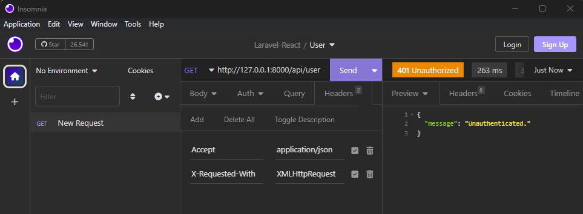
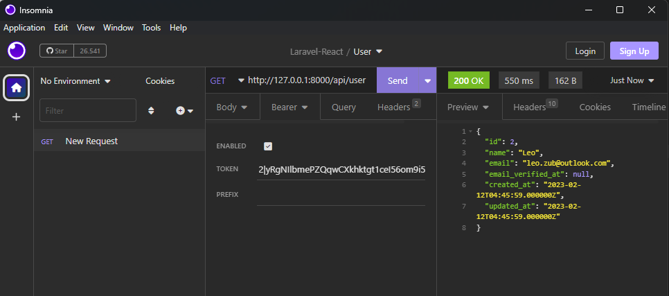

# Autenticación

## Desde laravel

Crear un controlador para la autenticación:

```php artisan make:controller AuthController```


```php
    public function register(Request $request){

    }

    public function login(Request $request){
        
    }

    public function logout(Request $request){
        
    }
```

Crear rutas

```php
//Autenticación
Route::post('/register',[AuthController::class,'register']);
```

### Request Personalizados

Request para validaciones avanzadas. Personalizar las validaciones de la información que ingresa el usuario.

```php artisan make:request NombreRequest```

De esta forma se puede utilizar de forma personalizada el request en los métodos del controlador:

```php
public function register(NombreRequest $request){
    $data = $request->validated();
}
```
La validacion del request personalizado depende del archivo Request creado el cual tiene los siguientes dos métodos:

```php
use Illuminate\Validation\Rules\Password;

...


    public function authorize()
    {   //Por defecto nos deje hacer el request
        return true;
    }

    /**
     * Get the validation rules that apply to the request.
     *
     * @return array<string, mixed>
     */
    public function rules()
    {
        return [
            'name' => ['required','string'],
            'email' => ['required','email','unique:users,email'],
            'password' => [
                'required',
                'confirmed',
                Password::min(8)->letters()->symbols()->numbers()
            ],
        ];
    }

    // Si se desea crear mensajes personalizados
    public function messages(){
        return [
            'name.required' => 'El nombre es obligatorio',
            'email.required' => 'El email es obligatorio',
            'email.email' => 'El correo no tiene un formato válido',
        ];
    }
```

## Desde React

Importar `createRef` y crear una referencia a cada input del formulario:

```jsx
import { createRef,useState } from "react"

...

  const nameRef = createRef();
  const emailRef = createRef();
  const passwordRef = createRef();
  const passwordConfirmationRef = createRef();

...

    <input 
      id="name"
      type="text"
      name="name"
      placeholder="Tu Nombre"
      ref={nameRef}
    />
```

En el formulario agregamos una funcion para el submit:

```js
<form onSubmit={handleSubmit} noValidate/>

...


  const handleSubmit = async (e) => {
    e.preventDefault();

    const datos = {
      name: nameRef.current.value,
      email: emailRef.current.value,
      password: passwordRef.current.value,
      password_confirmation: passwordConfirmationRef.current.value,
    }
    console.log(datos)

    try {
      const response = await clienteAxios.post('/api/register',datos);
      console.log(response);
    } catch (error) {
      console.log(error.response.data.errors);
    }
  }
```

### Mensajes de error

Se recomienda manejar los errores con el state para reflejarlos:

```jsx
  const [errores, setErrores] = useState([]);
```
Cuando se manda el post entonces:

```jsx
    try {
      const response = await clienteAxios.post('/api/register',datos);
      console.log(response);
    } catch (error) {
      setErrores(Object.values(
        error.response.data.errors
      ));
    }
```
> Object.values une todos los valores dentro de un arreglo


```jsx
    {errores ? errores.map(err=> <p>{err}</p>): null}
```

### Componente mensaje error

```jsx
export default function Alerta({children}) {
  return (
    <div className="text-center my-2 bg-red-600 text-white font-bold p-3 uppercase border-l-red-400 border-l-8" >
        {children}
    </div>
  )
}
```

## TOKEN

### Crear un token de usuario

PHP utiliza su propia API de tokens, por lo que al usar el `createToken` se utiliza una tabla llamada `personal_access_tokens` en la base de datos

```php
    public function register(RegistroRequest $request){
        // Validar el registro
        $data = $request->validated();

        // Crear el usuario
        $user = User::create([
            'name' => $data['name'],
            'email' => $data['email'],
            'password' => bcrypt($data['password'])
        ]);

        // Retornar una respuesta
        return [
            'token' => $user->createToken('token')->plainTextToken,
            'user' => $user
        ];
    }
```

### Peticion desde Postman/Insomnia

Desde las rutas dentro de `api.php` existe un endpoint `/user` que se encuentra bajo el middleware de autenticación.

Por lo que desde una peticion dentro de insomnia se deben agregar los siguientes headers:



Se necesita que el usuario esté autenticado para hacer peticiones a un endpoint.

Si utilizamos el token que regresa al usar el usuario se permite hacer la petición:




## Login

Desde el front se envian los datos de email y password hacia la ruta:

```php
Route::post('/login',[AuthController::class,'login']);
```
Desde el método login:

```php
public function login(LoginRequest $request){
    $data = $request->validated();

    // Verificar credenciales
    if(!Auth::attempt($data)){
        return response([
            'errors' => ['El email o password son incorrectos']
        ],422);
    }

    // Autenticar al usuario
    $user = Auth::user();
    
    return [
        'token' => $user->createToken('token')->plainTextToken,
        'user' => $user
    ];
}
```

Se retorna un token en caso de ser válidas las credencias y se almacena en el localStorage del navegador desde el frontend:

```jsx
  const handleSubmit = async (e) => {
    e.preventDefault();

    const datos = {
      email: emailRef.current.value,
      password: passwordRef.current.value,
    }
    //console.log(datos)

    try {
      const response = await clienteAxios.post('/api/login',datos);
      localStorage.setItem('AUTH_TOKEN',response.data.token);
    } catch (error) {
      setErrores(Object.values(
        error.response.data.errors
      ));
    }
  }
```

## useAuth

Mediante un Hook personalizado se puede simplificar la lógica de la autenticación desde react:

```jsx
// useAuth

import clienteAxios from "../config/axios"

export const useAuth = ({middleware,url}) => {

    const login = async (datos,setErrores) => { 
        try {
            const response = await clienteAxios.post('/api/login',datos);
            localStorage.setItem('AUTH_TOKEN',response.data.token);
            setErrores([])
        } catch (error) {
            setErrores(Object.values(
              error.response.data.errors
            ));
        }
    }

    const register = () => { }

    const logout = () => { }

    return {
        login,
        register,
        logout
    }
}
```
Y para consumirlo desde las vistas correspondientes:

```jsx

import { useAuth } from "../hooks/useAuth";

...

  const {login} = useAuth({
    middleware: 'guest',
    url: '/'
  });

...

  const handleSubmit = async (e) => {
    e.preventDefault();

    const datos = {
      email: emailRef.current.value,
      password: passwordRef.current.value,
    }
    
    login(datos, setErrores)
  }

```