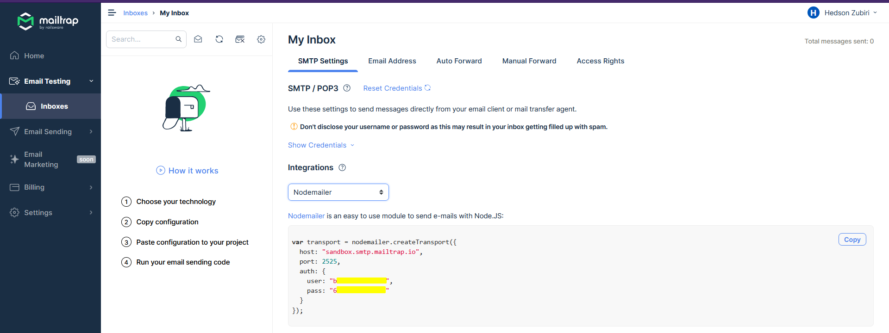

# Bienes Raíces Proyecto

## Primeros pasos

Inicializar el proyecto en un directorio y crear el package.json:

```npm init```

y posteriormente instalar `express`

## Establecer script para iniciar la aplicación

Desde el *package.json* en el apartado de scripts se establece una palabra clave y los códigos de consola que ejecutará:

```json title="package.json"
  "main": "index.js",
  "scripts": {
    "start": "node ./index.js"
  },
  "author": "Leo Zubiri",
```

y para ejecutarlo se utiliza: `npm run start` o `npm start`

## Instalar nodemon

Nodemon se utiliza para el Hot Reload durante el desarrollo y de esta manera reiniciar el servidor al detectar cambios.

El script en el package:

```json
"server": "nodemon index.js"
```

> Se inicializa un servidor con express

## Pug Template Engine

Para instalar el motor de plantilla: ```npm i pug```

```js app="index.js con servidor express"
// Habilitar Pug
app.set('view engine','pug')
app.set('views','./views')
```

### Uso

```js
router.get('/login',function(req,res){
    res.render('auth/login');
});
```

```pug title="./views/auth/login.pug"
h2 Login 
p Inicia Sesión 
```

### Pasar información a las vistas

```js
    res.render('auth/login',{
        autenticado: true,
        user: 'Leo Zubiri'
    });
```

```pug title="./views/auth/login.pug"
h2 Login 

if autenticado
    p= user 
else 
    p No autenticado

```

### Sintaxis pug Ejemplo:

```js title="userController.js"
const formularioOlvidePassword = (req,res)=>{
    res.render('auth/forgot-password',{
        pagina: 'Recupera el Acceso a tu Cuenta'
    });
}
```

```pug title="Layout index.pug"
doctype html
html(lang="es")
    head
        meta(charset="UTF-8")
        meta(http-equiv="X-UA-Compatible", content="IE=edge")
        meta(name="viewport", content="width=device-width, initial-scale=1.0")
        title Bienes Raices | #{pagina}
        link(rel="stylesheet", href="/css/app.css")
    
    body.min-h-screen.bg-gray-50
        main(class="mx-auto container mt-10 px-2")
            block contenido

```

```pug title="forgot-password.pug"
extends ../layouts/index

block contenido
    div.py-10
        h1.text-4xl.my-10.font-extrabold.text-center Bienes
            span.font-normal Raices
        h2.text-center.text-2xl.font-extrabold=pagina
```

## Tailwind CSS

```npm i -D tailwindcss postcss autoprefixer postcss-cli```

```npx tailwindcss init -p```

### Carpeta public (static files)

```js title="index.js"
// Carpeta Pública
app.use(express.static('public'));
```

> La carpeta public tiene el directorio css, img y js. En el css se crea `tailwind.css`

```css
@tailwind base;
@tailwind components;
@tailwind utilities;
```

### Agregar script package.json

```json
  "scripts": {
    "server": "nodemon index.js",
    "css": "postcss public/css/tailwind.css -o public/css/app.css --watch"
  },
```

`npm run css`

> Lo anterior indica donde se encuentra la configuración de tailwindcss y el output, la ruta donde se almacenará el compilado css.


### Crear layout

Se crea un layout principal para que se importe el css

```pug title="./views/layouts/index.pug"
doctype html
html(lang="es")
    head
        meta(charset="UTF-8")
        meta(http-equiv="X-UA-Compatible", content="IE=edge")
        meta(name="viewport", content="width=device-width, initial-scale=1.0")
        title Bienes Raices |
        link(rel="stylesheet", href="/css/app.css")
    
    body.min-h-screen.bg-gray-50
        main(class="mx-auto container mt-10 px-2")
            block contenido

```

Desde el archivo donde se implemente el layout:

```pug
extends ../layouts/index

block contenido
    div
        h2.text-center Mi titulo
```

## Mantener Valores en formulario

Al tener errores se carga la página y se pierden en los inputs

```js
// Al dar error en validación retornar la misma info que llega
res.render('auth/register',{
    pagina: 'Crear Cuenta',
    errores: errores.array(),
    usuario: {
        name: req.body.name,
        email: req.body.email
    }
});
```

Si el objeto usuario existe carga los valores anteriormente mandados

```pug
input(
    placeholder="Tu nombre"
    type="text"
    name="name"
    value=usuario ? usuario.name : ''
)
```

## Evitar correos de cuenta duplicados

```js
// Verificar que no exista un usuario con el mismo correo
    const existeUsuario = await Usuario.findOne({ where: {email:req.body.email}})
    if(existeUsuario){
        res.render('auth/register',{
            pagina: 'Crear Cuenta',
            errores: [{msg: 'Existe un usuario con este correo'}],
            usuario: {
                name: req.body.name,
                email: req.body.email
            }
        });
       
    } else {
        const usuario = await Usuario.create(req.body);
        res.json(usuario)
    }
    
```

## Hash Passwords

```npm i bcrypt```

```js
import bcrypt from 'bcrypt'

const salt = await bcrypt.genSalt(10);
modelo.password = await bcrypt.hash(modelo.password,salt)
```

> Salting is nothing but adding a random string to your password hash. Now when you use salt, it automatically includes in your hashed password. So here for the same password overall hashed value is different and it's not predictable.


## Token Único

1. Crear directorio `./helpers/`
2. Crear `./helpers/tokens.js`

```js
// Generar un token sin una librería
const generarID = () => Math.random().toString(32).substring(2) + Date.now().toString(32);

export {
    generarID
}
```

## Nodemailer - Correos en Node

Para testear los correos que se envíen se puede utilizar la página **mailtrap** y las configuraciones que establece.



```npm i nodemailer```

Colocar las credenciales para el correo como variables de entorno y posteriormente asignarla a la configuración:

```js
 import nodemailer from 'nodemailer'

 const emailRegister = async (datos) => {
    const transport = nodemailer.createTransport({
        host: process.env.EMAIL_HOST,
        port: process.env.EMAIL_PORT,
        auth: {
          user: process.env.EMAIL_USER,
          pass: process.env.EMAIL_PASS
        }
    });
 }

 export {
    emailRegister
 }
```

### Configurar el envío

```js title="./helpers/email.js"
 import nodemailer from 'nodemailer'

 const emailRegister = async (datos) => {
    const transport = nodemailer.createTransport({
        host: process.env.EMAIL_HOST,
        port: process.env.EMAIL_PORT,
        auth: {
          user: process.env.EMAIL_USER,
          pass: process.env.EMAIL_PASS
        }
    });

    const {email,name,token} = datos;

    // Enviar email
    await transport.sendMail({
        from: 'BienesRaices.com',
        to: email,
        subject: 'Confirma tu cuenta en BienesRaices',
        text: 'Da click en el enlace para confirmar tu cuenta',
        html: `
            <p>Hola ${name}, comprueba tu cuenta en Bienes Raices</p>
            <p>Tu cuenta ya esta lista, solo debes confirmarla en el siguiente enlace:
            <a href="">Confirmar cuenta</a></p>

            <p>Si tu no creaste esta cuenta puedes ignorar el mensaje</p>
        `
    })
 }

 export {
    emailRegister
 }
```

### Confirmar cuenta con token

#### Leer el token

El endpoint:

```js title="UserRoutes"
// Routing dinámico
router.get('/confirm/:token',confirmar);
```

El enlace en el correo apunta a: 

```js
<a href="${process.env.BACKEND_URL}:${process.env.PORT ?? 3000}/auth/confirm/${token}">Confirmar cuenta</a>
```

#### Confirmar cuenta token

```js
const confirmar = async (req,res) => {
    const {token} = req.params;
    
    const usuario = await Usuario.findOne({ where: {token} });
    
    // Verificar si el token es válido
    if(!usuario){
        return res.render('auth/confirm-account',{
            pagina: 'Error al confirmar tu cuenta',
            mensaje: 'Hubo un error al confirmar tu cuenta, intenta de nuevo',
            error: true
        });
    }

    // Confirmar la cuenta
    usuario.token = null;
    usuario.confirmed = true;

    await usuario.save();

    res.render('auth/confirm-account',{
        pagina: 'Cuenta confirmada',
        mensaje: 'La cuenta se confirmó correctamente',
    });

}
```