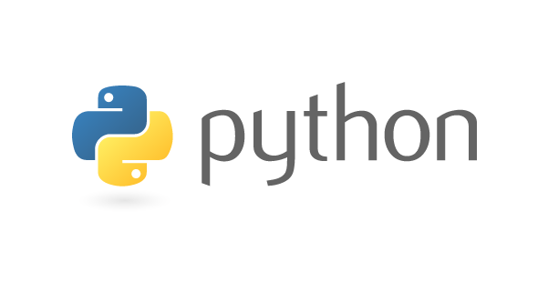

# Python

Python es un lenguaje de programación, creado en 1991, que ocupa un lugar importante en el desarrollo informático actual. Es el lenguaje de la Data Science, del Machine Learning y del Big Data. 

Python permite que el código se ejecute en cualquier ordenador y que los desarrolladores se centren en lo que hacen y no en cómo lo hacen.

Python es un lenguaje de programación interpretado, lo que significa que el mismo código fuente funcionará directamente en cualquier ordenador. A diferencia de un lenguaje compilado.
Es uno de los lenguajes informáticos más versátiles y utilizados en el mundo.