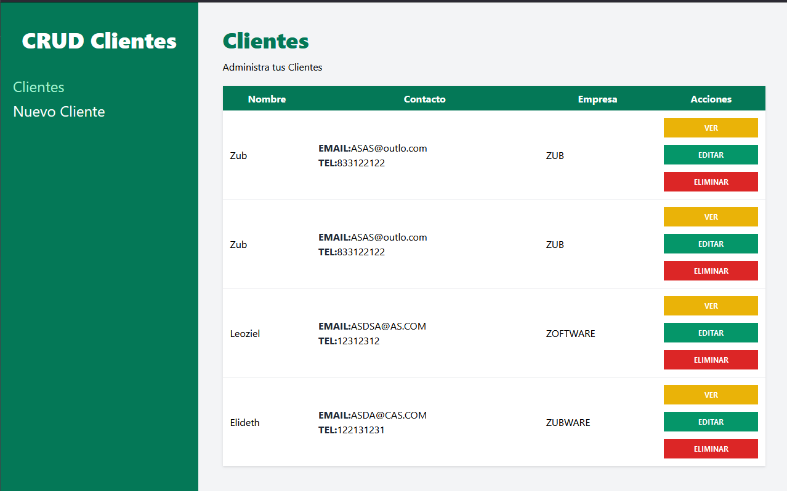
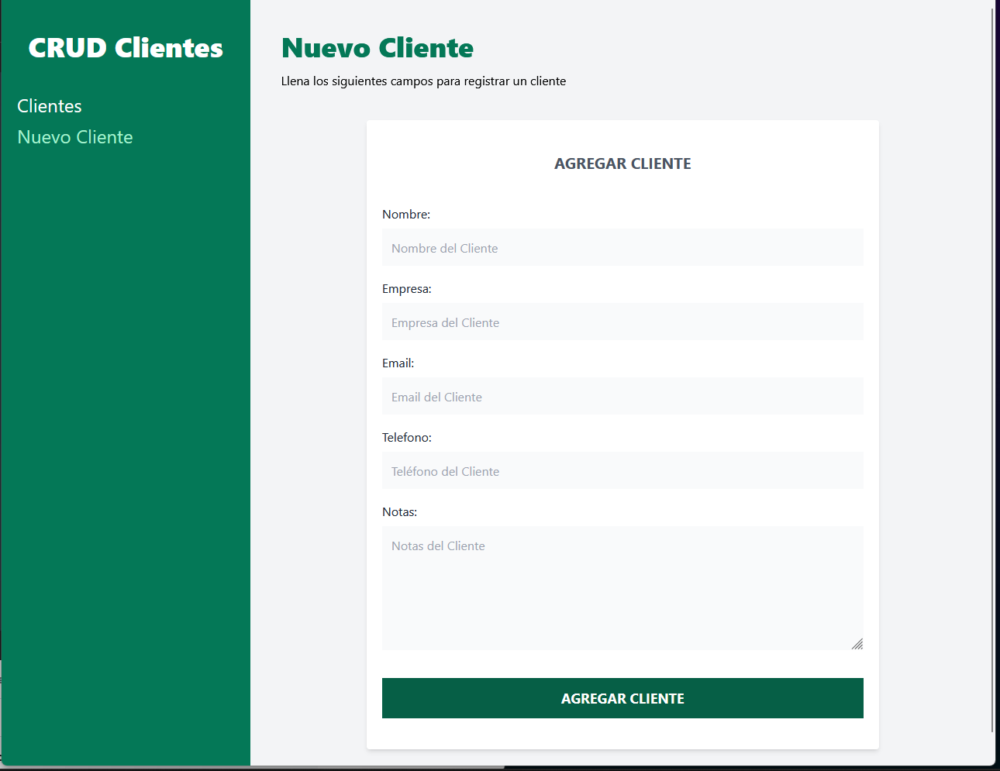
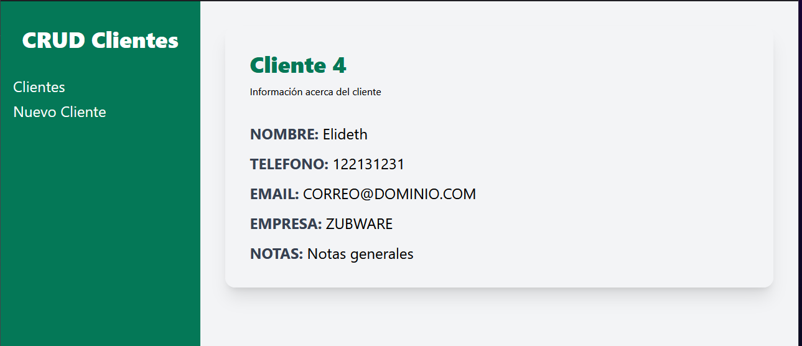

# CRUD Clientes React




---

## **React Router**

``` npm i react-router-dom```

```js
import {BrowserRouter,Routes, Route} from 'react-router-dom';

...

// Desde el componente principal
    <BrowserRouter>
      <Routes>
        <Route>
          <Route path='/' element={<InicarSesion/>}/>

          {/** Usar Master page, para que siempre aparezca cierto componente en esa ruta */}
          <Route path='/clientes' element={<Layout/>}> 
            <Route index element={<Inicio />} />
          </Route>
        </Route>
      </Routes>
    </BrowserRouter>

```

```js
// Nuevo componente de React router
import {Outlet} from 'react-router-dom'

// En Oulet se inyecta el componente que se cargue en base a las routes anidadas
const Layout = () => {
  return (
    <div>Layout
      <Outlet />
    </div>
  )
}

export default Layout
```

## **useLocation** de ReactRouter
```js
import {Outlet,Link,useLocation} from 'react-router-dom'

...

  const location = useLocation();
// Object { pathname: "/clientes/nuevo", search: "", hash: "", state: null, key: "t6feuoku" }

  const urlActual = location.pathname;

```

## **useNavigate** de ReactRouter

```js
import { useNavigate } from 'react-router-dom'

...

const navigate = useNavigate('/clientes') // Redirecciona
```

## **useParams** de ReactRouter

```js
import { useParams } from 'react-router-dom'

...

const params = useParams() // Obtiene los parametros de la url en un objeto {} params.id
```
---

## **Librerías para Formularios**

- Formik con herramienta de validación Yup
  - ``` npm i formik```
- Yup [documentación>>>](https://www.npmjs.com/package/yup)
  - ``` npm i yup```
- React Hook Form

<br/>

**Formik**
```js
import { Formik, Form, Field, ErrorMessage } from 'formik'

...

 <Formik
    initialValues={{
      nombre:''
    }}
    onSubmit={(values) => { console.log('Enviando',values)}}
 >
    {({errors,touched}) => {

      return (<Form>

          <div>
              <label htmlFor='nombre'>Nombre: </label>
              <Field 
                  id='nombre'
                  type='password'
                  className=''
                  placeholder=''
                  name='nombre'
              />

              {/*Posible forma de mostrar error*/}
              <ErrorMessage name='nombre'/>

              {/* Forma incluso para validar en tiempo real sin enviar, al salir del input*/}
              {errors.nombre && touched.nombre ? (
                  <div> {errors.nombre} </div>
                ): null
              }
          </div>
          
      </Form>)
      }}
</Formik>
```

## **Validación con Yup**
```js
import * as Yup from 'yup'

...

const nuevoSchema = Yup.object().shape({
  nombre: Yup.string()
          .min(3,'Demasiado corto')
          .max(20,'too long')
          .required('El nombre es obligatorio'),
})

 <Formik
    initialValues={{ nombre:'' }}
    onSubmit={handleSubmit}
    validationSchema={nuevoSchema}
 >
 ...

 </Formik>
```

### **Para reinicar el formulario al enviar**

```js
<Formik
    initialValues={{
        nombre:'',
        empresa:'',
        email:'',
        telefono:'',
        notas:'',
    }}

    onSubmit={async (values,{resetForm}) => {
        await handleSubmit(values);
        resetForm();
    }}
    validationSchema={nuevoClienteSchema}
>
```
<br/>

---

### **Cargar valores en formulario para editar**
[Nullish coalescing operator (??)](https://developer.mozilla.org/en-US/docs/Web/JavaScript/Reference/Operators/Nullish_coalescing_operator)

```js
<Formik
  initialValues={{
      // Pregunta si cliente existe y tiene la propiedad nombre si es undefined ?? entonces
      nombre: cliente?.nombre ?? "", ...
  }}

  // Habilita el renderizado por si datos tardan en llegar
  enableReinitialize={true}

  ...

Formulario.defaultProps = {
    cliente:{}
}

export default Formulario
```
---

## **JSON Server**
* REST - Representational State transfer
* API - Application programmin interface

Con JSON Server puedes simular la entrada de información para desarrollar el frontend sin la necesidad de que el backend ya se encuentre listo. Actúa como una API real.

[**Instalación JSON server**](https://www.npmjs.com/package/json-server)

Con privilegios de administrador: 
```npm install -g json-server```

- Crear un archivo en la raiz del proyecto llamado **db.json**, aqui colocar los atributos llave valor

```js
// Para ejecutar el archivo en JSON Server

json-server --watch db.json --port 4000

// En este caso la informacion se encuentra en localhost:4000/clientes, depende de las llaves en el archivo json
```

## **POST**
```js
const handleSubmit = async (values) => { 
    try{
        const url = 'http:/localhost:4000/clientes'

        const response = await fetch(url,{
            method: 'POST',
            body: JSON.stringify(values),
            // En el caso de JSON SERVER:
            headers: {
                'Content-Type': 'application/json'
            }
        });

        const result = await response.json(); //Retorna el objeto que agregó

    } catch(error){console.log(error)}
}

```

## **GET**
```js
const obtenerClientesAPI = async () => { 
  try {
    const url = 'http://localhost:4000/clientes'
    const response = await fetch(url);
    const result = await response.json();
    
  } catch (error) {
    console.log(error);
  }
}
```
---

## **PUT**
```JS
const url = `http://localhost:4000/clientes/${cliente.id}`
const response = await fetch(url,{
    method: 'PUT',
    body: JSON.stringify(values),
    headers: {
        'Content-Type': 'application/json'
    }
});

const result = response.json();
```

---
## **DELETE**

```js
const url = `http://localhost:4000/clientes/${id}`;
const response = await fetch(url, {
  method: 'DELETE'
});

await response.json();
```
---
## **Spinner Cargando...**

Elegir el spinner deseado 
[Spinkit --->](https://tobiasahlin.com/spinkit/)

Crear un componente y enlazar los estilos.

---

## **Publicar la API JSON Server**

- Subir el proyecto a github
- [Pagina My JSON Server](https://my-json-server.typicode.com/)
- Pegar al link de My Json Server el repo del proyecto junto con el nombre de usario. Además el endpoint:
  
> https://my-json-server.typicode.com/Leo-Zubiri/CRUD-Clientes-REACT/clientes

Con lo anterior se debe visualizar nuestra API JSON con los datos que vamos agregando. 

<br/>

## **Enlazar el server en la nube**

Se deben crear variables de entorno para indicar que localmente apunte a localhost y en producción apunte a la nube

[Variables de Entorno en Vite](https://vitejs.dev/guide/env-and-mode.html)

En este caso:
1. Crear archivo .env.development.local y env.production.local en la raiz del proyecto
2. Agregar variables con la sintaxis **VITE_** variable=123
3. Para importar las variables de entorno **import.meta.env**

## Para producción

```npm run build```
```npm run preview```  Para visualizar la build de distribución

En el archivo de production:
```VITE_API_URL=https://my-json-server.typicode.com/Leo-Zubiri/CRUD-Clientes-REACT/clientes```

En el archivo de development:
```VITE_API_URL=http://localhost:4000/clientes```

Sustituir los valores de la API en todas las referencias: 
```js
const api_url = import.meta.env.VITE_API_URL
```