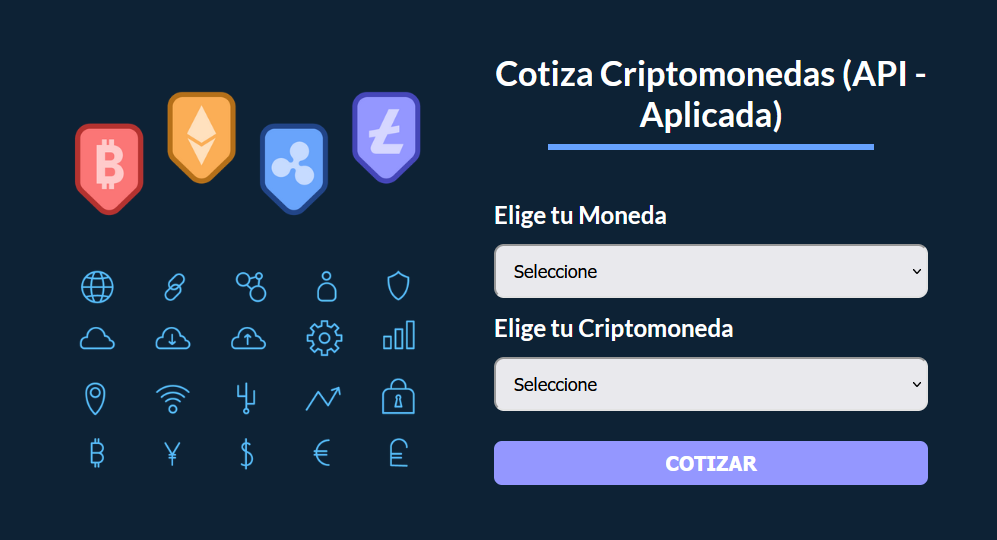
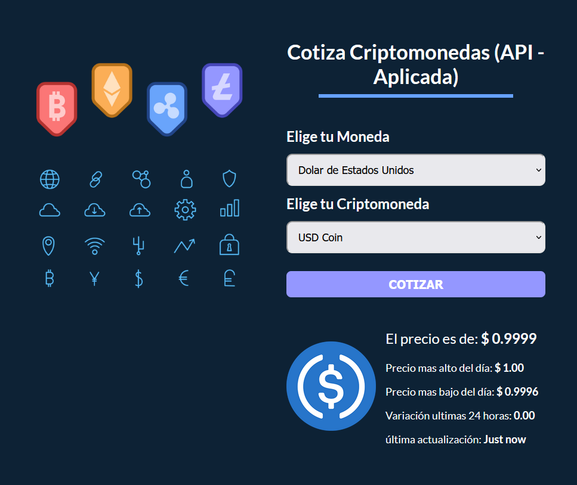

# Cotizador de criptomonedas




---

## **Styled Components**

Se crean componentes de css en lugar de usar una hoja de estilos global

```
npm install @emotion/react @emotion/styled
```

[**Instalar extension Styled Components >>>**](https://marketplace.visualstudio.com/items?itemName=styled-components.vscode-styled-components)

### **Sintaxis**

```js
import styled from '@emotion/styled';

...

// Mayuscula al inicio como un componente
const Heading = styled.h1`
    font-size: 2em;
    text-transform: uppercase;
`;

// const Componente = () => { ....
<Heading> Nuestros Productos </Heading>
```

> Styled soporta pseudo clases, eventos y practicamente las propiedades css en general

```js

// Mediaquerys
const Contenedor = styled.div`
  max-width: 900px;
  margin: 0 auto;
  width: 90%;

  @media (min-width: 992px){
    display: grid;
    grid-template-columns: repeat(2,1fr);
    column-gap: 2rem;
  }
`;

// ::after
const Heading = styled.h1`
  font-family: 'Lato', sans-serif;
  color: white;
  text-align: center;
  font-weight: 700;
  margin-top: 80px;
  margin-bottom: 50px;
  font-size: 34px;

  &::after{
    content: '';
    width: 75%;
    height: 6px;
    background-color: #66A2FE;
    display: block;
    margin: 10px auto 0 auto;
  }
`;

```

---

## **Crear HOOKS propios**

Para reutilizar funciones propias que solucionen algo, pero que tambien incorporen mas hooks y/o mantener un estado, así como otras ventajas de react.
> Crear carpeta en src/hooks/

> Los hooks deben empezar con minúscula y respetar el nombre de use al inicio. Ejemplo useSelectMonedas. Un hook puede retornar un objeto o un arreglo si se requiere.

```jsx

// Hook useSelectMonedas
const useSelectMonedas = (label, opciones) => {
    const [state, setState] = useState('');
    const SelectMonedas = () => (
        <>
        
        </>
    )

    //Retorna JSX y un estado
    return [state,SelectMonedas]
}

export default useSelectMonedas


...

//Desde el archivo donde se import el hook por ejemplo
const [moneda,SelectMonedas] = useSelectMonedas('Elige tu Moneda',monedas);
// Sería muy parecido al hook de useState
```
---

## **Cryptocompare API**

**API** - Aplication Programming Interface

> Una API pone a disposicion recursos que estan alojados en otro servidor sin importar en que lenguaje fue escrito. Lo que importa es la respuesta de recursos que normalmente está en formato JSON.

[**GO TO API**>>>](https://min-api.cryptocompare.com/)

[**API DOCUMENTATION**](https://min-api.cryptocompare.com/documentation?key=Toplists&cat=TopTotalMktCapEndpointFull)

```js

// useEffect es un buen lugar para mandar a llamar una API

  useEffect(() => { 
      const consultarAPI = async () => {  
          const url  = 'https://min-api.cryptocompare.com/data/top/mktcapfull?limit=10&tsym=USD';
          const response = await fetch(url);
          const result = await response.json();
      }

      consultarAPI();

  },[]);
```

---

## **Spinner Cargando...**

Elegir el spinner deseado 
[Spinkit --->](https://tobiasahlin.com/spinkit/)

Crear un componente y enlazar los estilos.